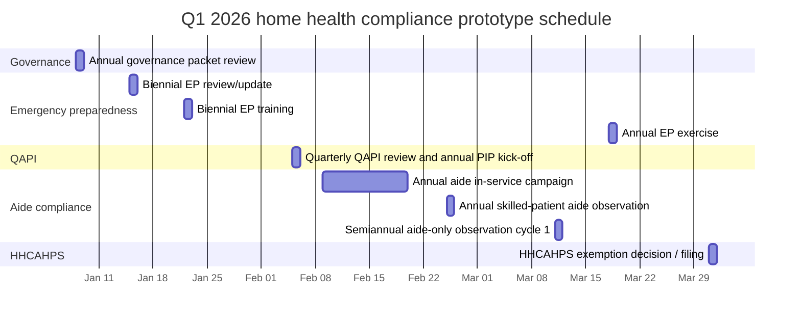
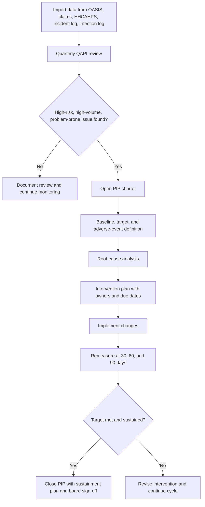
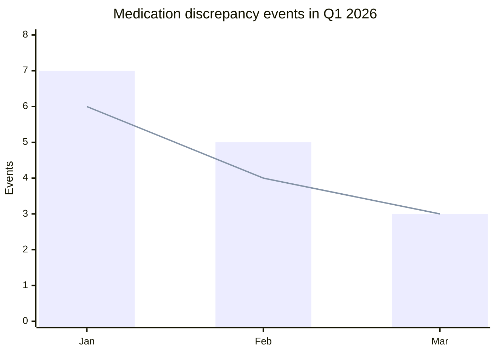

# Strategic Blueprint for a Home Health Mandated-Events Compliance App

## Executive summary

For a Medicare-certified home health agency, the cleanest federal recurring-compliance events are mostly annual, semiannual, or biennial rather than quarterly. The strongest fixed-frequency federal requirements are: at least one QAPI performance improvement project each calendar year; annual home health aide in-service training; annual onsite observation of each aide serving a patient who is also receiving skilled services; semiannual onsite observation of each aide serving an aide-only patient; annual emergency-plan testing; biennial emergency-program review and emergency-preparedness training; annual governance reviews of plan/budget, acceptance-to-service policy, and public-facing service information; and an annual HHCAHPS low-volume exemption process when the agency has fewer than 60 eligible unique patients. The QAPI rule itself is ongoing and data-driven, but it does **not** impose a universal federal quarterly meeting requirement. citeturn19view0turn12view0turn4view0turn12view2turn9view0turn8view0turn11view0turn20view0

For the prototype, the best strategy is to build a rules-based compliance engine rather than a generic calendar. Each event should generate a survey-ready evidence bundle containing the regulation, the mapped internal policy/procedure, required form(s), owners and approvers, due-date logic, status, attachments, immutable audit trail, and next due date. That aligns to what surveyors actually review: documentary evidence that the program operates, authenticated records, and documented follow-through when a deficit or unsafe condition is found. citeturn19view0turn28view0turn4view0

Because no agency-specific policy library or connected internal documents were available, the policy references in this report are proposed placeholders. The right implementation path is to launch the prototype against the federal floor now, then map each event template to your controlled policy set once your internal sources are available.

| Frequency bucket | Best app output |
|---|---|
| Annual | Signed packet, evidence bundle, next due date, survey-ready PDF, corrective-action log if needed |
| Semiannual | Observation record, competency disposition, next-cycle date |
| Biennial | Versioned emergency-program update packet, training roster, change log, next 2-year due date |
| Quarterly policy control | Dashboard, minutes, action log, PIP status, escalations |

I use **semiannual** for twice-yearly items and **biennial** for every-two-year items because the current federal text uses both patterns; treating them as the same thing is one of the easiest ways to schedule the wrong event. citeturn4view0turn9view0turn16view0

## Regulatory baseline and source hierarchy

The primary legal baseline is 42 CFR Part 484 and the survey/manual guidance published by entity["organization","Centers for Medicare & Medicaid Services","us health payer regulator"]. For this use case, the most important sections are the HHA rules on OASIS reporting, QAPI, infection control, aide services, emergency preparedness, organization and administration, clinical records, and HH QRP participation. citeturn25view0turn19view0turn24view0turn4view0turn9view0turn8view0turn28view0turn11view0

Because no state was specified, this report does **not** apply any one state’s home health licensure overlay as if it were universal. Federal rules still require compliance with applicable federal, state, and local laws, and state licensing remains mandatory where the state licenses HHAs. In practice, the app should therefore have a configurable “state overlay” layer, but the event logic below is the federal floor. The fastest official starting point for the state overlay is the CMS state survey agency contacts page. citeturn27search0turn10search1

| Primary source | Why it matters |
|---|---|
| 42 CFR 484.45, 484.60, 484.65, 484.70, 484.80, 484.102, 484.105, 484.110, 484.245. citeturn25view0turn29search0turn19view0turn24view0turn4view0turn9view0turn8view0turn28view0turn11view0 | Core legal rules for OASIS, plan-of-care review, QAPI, infection control, aide training/supervision, emergency preparedness, governance, records, and HH QRP participation. |
| State Operations Manual Appendix B for HHAs. citeturn12view0turn12view2turn15search5 | Current interpretive guidance and survey focus for QAPI and aide supervision. |
| State Operations Manual Appendix Z and the 2021 emergency-preparedness fact sheet. citeturn15search1turn16view0 | Explains the burden-reduction changes that made several HHA emergency-preparedness activities biennial rather than annual, while retaining annual testing. |
| HH QRP Quick Reference Guide and Home Health Quality Measures pages. citeturn20view0turn23view0turn11view2 | Gives operational submission deadlines, HHCAHPS timing, OASIS timing, and the quality-measure data sources you need for dashboards and compliance validation. |
| CMS State Survey Agency contacts page. citeturn10search1 | Best official source to route state-specific licensure/survey overlays once the agency’s state is known. |

A current design nuance that matters in Q1 2026 is that OASIS all-payer collection and submission is already mandatory for non-exempt patients whose start of care is on or after July 1, 2025, while the federal quality-measure framework still distinguishes between operational all-payer collection and the specific payer cohorts used for HH QRP measurement. Your dashboard therefore needs separate views for “all operational patients” and “CMS measure cohort.” citeturn11view2turn23view0

## Mandated recurring events matrix

The table below lists the recurring events that are strongest candidates for a mandated-events prototype. The quarterly QAPI row is intentionally labeled as a **policy-driven control** because there is no universal federal calendar-quarter requirement in Part 484; it is included because you asked for annual, biannual, and quarterly outputs, and because it is the most defensible way to operationalize the required ongoing QAPI program. citeturn19view0turn12view0

| Event | Purpose and frequency | Required documents and roles | Successful event criteria and app output | Primary source(s) |
|---|---|---|---|---|
| **Annual governance review packet** | Review/update the annual operating budget and institutional plan, the acceptance-to-service policy, and the public description of services and limitations. Annual. | Budget packet, service-capacity matrix, acceptance-to-service policy version, public service-info sheet, governing body minutes. Owner: administrator and clinical manager. Approver: governing body. | Packet complete; governing body approval recorded; service limitations updated; effective date set; next due date auto-calculated. **Output:** signed annual governance review packet. | 42 CFR 484.105(h)(4), 484.105(i)(1), 484.105(i)(2)(ii). citeturn8view0 |
| **Annual QAPI PIP** | Conduct at least one performance improvement project each calendar year. Annual. | PIP charter, baseline data, minutes, root-cause analysis, action plan, follow-up results. Owner: QAPI lead/clinical manager. Approver: governing body. | Problem statement, baseline, target, actions, and remeasurement documented; results evaluated; sustainment plan recorded. **Output:** annual PIP packet. | 42 CFR 484.65(d); Appendix B §484.65(d). citeturn19view0turn12view0 |
| **Quarterly QAPI governance review** | Review dashboard findings, adverse events, and open action items. **Policy-driven control, not an explicit federal quarterly mandate.** | Quarterly dashboard, meeting minutes, action log, escalation log. Owner: QAPI lead. Approver: governing body/designee. | Metrics reviewed on a governing-body-approved cadence; decisions logged; action owners assigned; PIP status updated. **Output:** quarterly QAPI report-out. | 42 CFR 484.65(b)(3), 484.65(e); Appendix B §484.65. citeturn19view0turn12view0 |
| **Annual home health aide in-service training** | Ensure each aide completes at least 12 hours of in-service training in each 12-month period. Annual per aide. | Curriculum, roster, hour log, RN supervision evidence, certificate/attestation. Owner: staff development RN. | At least 12 hours logged in the correct 12-month window; supervision documented; no gap past due date. **Output:** aide annual training record. | 42 CFR 484.80(d). citeturn4view0 |
| **Annual direct observation of aide serving a skilled patient** | Observe and assess each aide at least annually when the patient is also receiving skilled nursing/PT/OT/SLP. Annual per aide/patient assignment type. | Observation form, competency notes, deficiency log, retraining trigger if necessary. Owner: RN/other appropriate skilled professional. | Direct observation completed and documented against required elements; any deficiency routes to retraining and competency evaluation. **Output:** annual aide observation form. | 42 CFR 484.80(h)(1)(iv); Appendix B §§484.80(h)(1)(iv), (h)(3)-(4). citeturn4view0turn12view2 |
| **Semiannual direct observation of aide serving an aide-only patient** | Observe and assess each aide twice yearly when the patient is not receiving skilled nursing/PT/OT/SLP. Semiannual. | Aide-only observation form, link to 60-day RN visit records, retraining trigger if necessary. Owner: RN. | Observation done every 6 months; notes complete; deficiency routes to retraining/competency evaluation. **Output:** semiannual aide-only observation record. | 42 CFR 484.80(h)(2)(ii); Appendix B §484.80(h)(2)(ii). citeturn4view0turn12view2 |
| **Biennial emergency-program review packet** | Review/update emergency plan, policies/procedures, communication plan, and training/testing program. Biennial, unless changed sooner. | HVA/risk assessment, change log, communications list, policy approvals, version history. Owner: emergency-preparedness coordinator. Approver: administrator/governing body. | All four elements updated, approved, versioned, and archived; if policies materially changed, training event created. **Output:** biennial EP review packet. | 42 CFR 484.102(a)-(d). citeturn9view0 |
| **Biennial emergency-preparedness staff training** | Provide emergency-preparedness training at least every 2 years, plus whenever EP policies are significantly updated. Biennial. | Training roster, role-based curriculum, competency attestation, post-test. Owner: emergency-preparedness coordinator. | Required staff trained; documentation complete; policy-update training triggered when applicable. **Output:** EP training completion packet. | 42 CFR 484.102(d)(1); 2021 fact sheet. citeturn9view0turn16view0 |
| **Annual emergency exercise** | Test the emergency plan at least annually; exercise type varies by cycle year. Annual. | Scenario/exercise plan, attendance, debrief, after-action report/improvement plan, corrective actions. Owner: emergency-preparedness coordinator. | Exercise completed; response analyzed; AAR/IP finalized; plan revision logged as needed. **Output:** exercise evidence packet. | 42 CFR 484.102(d)(2); 2021 fact sheet. citeturn9view0turn16view0 |
| **Annual HHCAHPS participation event** | If the HHA has fewer than 60 eligible unique HHCAHPS patients, submit annual patient count/exemption request; otherwise maintain vendor participation and submission oversight. Annual decision point; monthly vendor process if non-exempt. | Patient-count worksheet, PER confirmation or active vendor record, submission-status checks, preview-report review. Owner: HHCAHPS coordinator/vendor liaison. | Correct exemption decision made; PER filed when low volume; or vendor process actively monitored when non-exempt. **Output:** annual HHCAHPS participation packet. | 42 CFR 484.245(b)(1)(iii)(A)-(B); HH QRP Quick Reference Guide. citeturn11view0turn20view0 |

The app should also track several **continuous dependencies** even if you do not surface them as “annual/quarterly mockup events.” OASIS must be transmitted within 30 days of completing the assessment. The comprehensive assessment/OASIS cycle recurs at the required time points, including the last five days of every 60 days. The plan of care must be reviewed and revised at least every 60 days. HHCAHPS vendor files are submitted monthly for four consecutive quarters for participating agencies. Aide supervisory loops also continue outside the annual/semiannual direct-observation events: every 14 days for skilled-patient cases and every 60 days for aide-only cases. citeturn25view0turn20view0turn29search0turn4view0

## Q1 2026 prototype schedule

This schedule is a **prototype allocation**, not a federal calendar that every agency must use. It assumes: a Jan–Dec governance year; 2026 is the biennial emergency-review/training year; the agency has both skilled-patient and aide-only aide assignments; and the agency adopts a quarterly QAPI review cadence by policy in order to operationalize its ongoing QAPI duty. If your agency is off-cycle for the biennial emergency items, move those rows to the correct year and keep the annual emergency exercise in Q1. citeturn9view0turn16view0turn19view0turn4view0turn20view0



A compliance app should schedule the quarter with layered reminders, dependencies, and effort estimates so the team sees not only the due date but also the readiness threshold for a “successful” event. The federal rationale for each event is cited in the table below; the actual dates are design choices for the prototype. citeturn8view0turn19view0turn4view0turn9view0turn11view0turn20view0

| Date | Event | Reminder pattern | Dependencies | Estimated effort |
|---|---|---|---|---|
| Jan 8 | Annual governance packet review. | 60/30/14/7/1 days. | FY26 draft budget, staffing/case-mix analysis, service-line limitations, prior-year minutes. | 7 hours total prep + meeting. |
| Jan 15 | Biennial emergency-program review/update. | 60/30/14/7/1 days. | Current HVA, contact tree, patient emergency profiles, prior AAR/IP items. | 8 hours total. |
| Jan 22 | Biennial emergency-preparedness training. | 30/14/7/1 days. | Finalized EP updates from Jan 15. | 90 minutes per staff member + 2 hours admin. |
| Feb 5 | Quarterly QAPI review and annual PIP kickoff. | 30/14/7/1 days. | OASIS quality data, claims/utilization data, HHCAHPS results if available, incident/adverse-event log. | 6 hours prep + 2-hour meeting. |
| Feb 9–20 | Annual aide in-service campaign. | 30/14/7/1 days to campaign start; daily notices during window. | Aide roster, prior completion date, curriculum, RN educator schedule. | 12 hours per aide. |
| Feb 25 | Annual skilled-patient aide direct observation. | 30/14/7/1 days. | Patient assignment must include skilled discipline; plan of care available; aide on schedule. | 45–60 minutes per aide observation. |
| Mar 11 | Semiannual aide-only observation cycle 1. | 30/14/7/1 days. | Patient assignment flagged “aide only”; prior 60-day RN visit documented. | 45–60 minutes per aide observation. |
| Mar 18 | Annual emergency exercise. | 30/14/7/1 days. | Updated EP packet, scenario, participant list, evaluator template, AAR/IP shell. | 2–6 hours depending on tabletop vs functional exercise. |
| Mar 31 | HHCAHPS exemption decision/filing or cycle lock. | 30/14/7/1 days. | Prior Apr–Mar eligible unique patient count; vendor status if non-exempt. | 30–45 minutes if exempt; 60–90 minutes if vendor review. |

## Event implementation blueprints

The table below translates the regulatory events into app-ready workflows, data fields, validation logic, and synthetic filled examples. The policy IDs are placeholders because no internal policy library was available; the regulatory anchors come from the federal QAPI, aide, emergency-preparedness, governance, records, and HH QRP rules and guidance. citeturn19view0turn24view0turn4view0turn9view0turn8view0turn28view0turn20view0

| Event | Proposed policy / procedure refs | Step-by-step workflow | Required data fields | Validation rules | Synthetic completed example |
|---|---|---|---|---|---|
| Annual governance packet | GOV-100 Institutional Planning; OPS-110 Acceptance-to-Service; PUB-120 Service Offerings Disclosure | Draft budget and service-capacity summary → compare staffing/case mix to referral scope → update public service limits → route packet to governing body → approve and publish → archive. | Cycle year; meeting date; budget version; staffing levels; case-mix summary; services offered; services limited/not offered; approval date; approver names; next review date. | Cannot close unless budget attachment, acceptance-to-service policy version, public services sheet, and approved minutes are attached; approval date cannot precede meeting date; next due date = approval date + 1 year. | `Event ID: GOV-AN-2026-01` • Meeting date: `01/08/2026` • Budget version: `FY26-v3` • Acceptance policy: `OPS-110 rev 4 approved` • Public limitation noted: `No pediatric trach cases` • Status: `Successful` • Next due: `01/08/2027`. |
| Annual QAPI PIP + quarterly review | QAPI-100 QAPI Program; QAPI-110 Performance Improvement Projects; SAF-120 Adverse Event Review; IPC-130 Infection Control in QAPI | Import OASIS/claims/HHCAHPS/incident data → quarterly review → select priority problem → create charter → perform RCA → assign interventions → remeasure at 30/60/90 days → document sustainment or continue open. | Quarter; indicator source; baseline numerator/denominator; target; adverse-event category; RCA findings; intervention list; owner; due dates; remeasurement result; governing-body review date; closure reason. | Annual rule: at least one PIP must exist per calendar year; baseline and target required before sign-off; adverse-event field mandatory; closure blocked until post-intervention result entered; sustainment field required if marked successful. | `Event ID: QAPI-Q1-2026` • PIP: `Medication reconciliation follow-up` • Baseline: `89%` • Target: `>=97%` • Q1 result: `97%` • Medication discrepancy events: `7 -> 3` • Governing body reviewed: `02/05/2026` • Status: `Successful; continue sustainment through Q2`. |
| Annual aide compliance packet | AIDE-100 Training & Competency; AIDE-110 Skilled-Patient Supervision | Identify aides due in next 60 days → assign 12-hour curriculum → complete RN-supervised modules → record hours and attestations → schedule annual direct observation for aides serving skilled patients → document result → launch retraining if deficient. | Aide ID; hire date; last completion date; hour total; module titles; RN educator; patient assignment type; observation date; observed elements; deficiency found yes/no; retraining status; next due dates. | 12 hours minimum required; RN supervision evidence required; if assignment type includes skilled service, annual observation becomes mandatory; deficiency auto-creates retraining + competency-eval task; event cannot close while deficiency actions are open. | `Aide ID: HHA-204` • Training window: `02/01/2025–01/31/2026` • Hours completed: `12.5` • Observation date: `02/25/2026` • Patient ID: `PT-018` • All six supervision elements satisfactory: `Yes` • Status: `Successful` • Next training due: `01/31/2027`. |
| Semiannual aide-only observation | AIDE-120 Aide-Only Supervision; AIDE-121 60-Day RN Review Linkage | Classify active aide-only patients → generate 6-month due date → confirm latest 60-day RN assessment exists → perform onsite observation of non-skilled care → document → escalate retraining if needed. | Patient type flag; last skilled-service date; RN observer; observation date; non-skilled tasks observed; patient/caregiver feedback; deficiency flag; related 60-day RN visit date; next due date. | Event available only when patient type = aide only; due date = last completed observation + 6 months; warning if no linked 60-day RN visit in interval; deficiency auto-creates retraining record. | `Event ID: AIDE-SA-2026-03` • Aide ID: `HHA-119` • Patient ID: `PT-022` • Patient type: `Aide only` • Latest 60-day RN visit: `01/09/2026` • Observation completed: `03/11/2026` • Result: `Satisfactory` • Next due: `09/11/2026`. |
| Biennial emergency-program review + training | EP-100 Emergency Plan; EP-110 EP Policies & Procedures; EP-120 Communication Plan; EP-130 Training & Testing Program | Refresh HVA and all-hazards risks → update patient emergency categories and contact tree → revise policies and training/testing plan → route to approval → launch biennial training if due or if policies materially changed → store version diff. | Cycle year; HVA date; hazards; patient emergency categories; continuity/delegation plan; contact tree; policy revisions; communication methods; training roster; training completion rate; final approval date; next due date. | All four EP components required before closure; version number must increase; if “significant update = yes,” training event is mandatory; next due = approval date + 2 years. | `Cycle year: 2026` • HVA updated: `01/15/2026` • Primary hazards: `Wildfire, power failure, infectious-disease staffing shortage` • Contact tree verified: `Yes` • Training completed: `100% by 01/22/2026` • Status: `Successful` • Next due: `01/15/2028`. |
| Annual emergency exercise | EP-140 Exercises & Drills; EP-150 After-Action and Improvement Plans | Choose correct cycle exercise type → publish scenario and objectives → conduct exercise → debrief → complete AAR/IP → assign corrective actions → revise plan if required. | Exercise type; scenario; objectives; participants; communications tested; down-time procedures tested; findings; corrective actions; responsible owners; due dates; AAR approval; plan revision yes/no. | Cannot close without attendance record, debrief notes, and AAR/IP; at least one of “no findings” or “corrective actions assigned” must be true; if plan revision required, linked EP-review task auto-opens. | `Exercise date: 03/18/2026` • Type: `Tabletop, additional-exercise year` • Scenario: `Regional power outage + cellular outage` • Participants: `18` • Findings: `2 moderate gaps` • AAR/IP approved: `03/20/2026` • Corrective actions due: `04/15/2026` • Status: `Successful`. |
| HHCAHPS annual participation event | QRP-100 HHCAHPS Participation; VEND-120 Vendor Oversight; QRP-121 Submission Status Review | Count prior Apr–Mar eligible unique patients → if count ≤59, file PER by Mar 31 → if count ≥60, verify approved vendor and monthly submission status → review latest preview reports → store evidence. | Reporting year; eligible unique patient count; exemption decision; PER filed yes/no; filing confirmation; vendor name; contract term; monthly submission status; preview review date; next annual decision date. | If count ≤59, PER evidence required; if count ≥60, active vendor record required; monthly status checks required for non-exempt agencies; event cannot close without one of those branches satisfied. | `Reporting year: CY APU 2026` • Eligible count: `43` • Exemption decision: `Yes` • PER filed: `03/30/2026 14:18 PT` • Confirmation: `PER-2026-4431` • Status: `Successful` • Next review: `03/31/2027`. |

## Successful QAPI event model

A compliant HHA QAPI program must be ongoing, HHA-wide, data-driven, and supported by documentary evidence. It must use quality-indicator data, including OASIS where applicable, track adverse patient events, analyze causes, implement preventive actions, and evaluate whether the improvement was sustained. The infection-control program is also required to be part of QAPI, which means infection surveillance can be a legitimate QAPI trigger and dashboard line item. HH QRP quality measures draw from OASIS, Medicare claims, and HHCAHPS data, which makes those the best foundational sources for an app dashboard. citeturn19view0turn12view0turn24view0turn23view0

A **successful** QAPI event for the prototype should therefore show five things at once: the problem was selected from real data; the baseline and target were explicit; the intervention was assigned to named owners and dates; the post-intervention result improved; and the improvement was either sustained or routed into another cycle rather than being silently closed. Appendix B is especially useful here because it identifies adverse patient events as negative and unexpected events affecting the plan of care and says the agency should consider near misses as well. citeturn12view0turn19view0

| QAPI metric | Source | Baseline | Q1 2026 target | March 2026 result | Why it belongs |
|---|---|---:|---:|---:|---|
| Drug regimen review with follow-up for identified issues | OASIS/process measure | 89% | 97% | 97% | High-risk medication safety proxy |
| Medication discrepancy events per 100 episodes | Internal incident log | 4.2 | 2.5 | 2.0 | Internal adverse-event control |
| Within-stay potentially preventable hospitalization count | Claims/utilization | 3 | 1 | 1 | Direct patient-safety outcome |
| HHCAHPS communication composite | Patient survey | 86 | 90 | 91 | Patient-reported quality signal |
| Infection event count tied to delayed wound-care follow-up | Infection surveillance | 5 | 2 | 2 | Infection-control integration with QAPI |

The flow below is what the app should model for a successful QAPI event. It is a workflow representation of the federal requirements and the survey guidance described above. citeturn19view0turn12view0turn24view0



This synthetic chart shows what a Q1 2026 “successful” trend could look like for the medication-safety PIP described above. It is illustrative, but it follows the data-driven and remeasurement logic required by the QAPI rule. citeturn19view0turn23view0



A successful QAPI event record in the app should end in exactly this state:

| Gate | Pass condition |
|---|---|
| Trigger validity | Metric or adverse-event signal linked to real source data |
| Scope | Problem tagged high-risk, high-volume, or problem-prone |
| Documentation | Charter, baseline, target, and RCA attached |
| Intervention control | Owner, dates, and action steps assigned |
| Effectiveness | At least one post-intervention measure entered |
| Sustainment | “Keep monitoring” plan or reopened cycle entered |
| Governance | Governing-body review date and decision recorded |

## Product architecture and mockup specifications

From a system-design perspective, the prototype should separate **requirements**, **policies**, **events**, **forms**, and **evidence**. Federal rules allow electronic records, but they also require legible, complete, authenticated, dated, and timed entries; retention for 5 years after discharge unless state law is longer; protection against loss or unauthorized use; and patient record retrieval by the next home visit or within 4 business days. QAPI also requires documentary evidence that the program operates. That means the app cannot stop at task completion; it needs immutable sign-off and exportable evidence bundles. citeturn28view0turn19view0

| Recommended prototype component | What it should do |
|---|---|
| Regulation library | Store regulation text snippet, citation, effective date, mandate type, and applicability notes. |
| Policy map | Link each event template to one or more internal policies/procedures and policy versions. |
| Event engine | Generate date-driven, person-driven, patient-type-driven, and policy-driven events. |
| Form/evidence workspace | Show required forms, attachments, approvals, and completion checklist in one place. |
| CAPA register | Open corrective actions automatically when a deficiency, failed validation, or AAR finding appears. |
| Dashboard and readiness score | Roll up due/overdue/open-deficiency status by quarter, branch, owner, and regulation. |
| Audit trail viewer | Show who created, edited, signed, reopened, or closed the event and when. |
| Survey export center | Produce print-ready PDF packets organized by citation, event, or survey date. |

The event engine should use four scheduling patterns:

| Engine pattern | Example |
|---|---|
| Date-driven | Annual governance packet, annual EP exercise, Mar 31 HHCAHPS filing decision |
| Person-cycle | 12-hour aide in-service and annual aide observation |
| Patient-type conditional | Skilled-patient annual observation vs aide-only semiannual observation |
| Continuous feed | OASIS 30-day submission, 60-day plan-of-care review, HHCAHPS monthly submission checks |

The screen and form mockups should be built around the following minimum set.

| Screen or printable form | Must show | Error state | Success state |
|---|---|---|---|
| Compliance calendar | Quarter view, filter chips, mandate type, due dates, reminders, owner, branch | Missing owner, invalid recurrence, overdue without escalation | All events color-coded by status with next due dates |
| Event detail workspace | Citation badge, policy links, tasks, evidence checklist, signers, audit trail | “Cannot close: missing required attachment / signature / baseline / AAR” | Green completion banner, signed by role, packet ready to export |
| Governance review form | Budget version, acceptance criteria, service limitations, approvers | Approval date missing or service-info sheet absent | Final signed annual packet with version history |
| QAPI dashboard | Metric cards, trend chart, adverse-event counts, RCA links, open CAPAs | No baseline, target missing, stale data feed | PIP marked successful with sustainment monitoring |
| Aide compliance mobile screen | Aide ID, patient type, tasks observed, patient feedback, deficiency toggle | Patient type mismatch or observation attempted without assignment | Observation signed onsite with next due date |
| Emergency-review form | HVA hazards, contact tree, communication plan, change log, approvers | Missing one of the four EP components | Biennial packet versioned and training created if needed |
| Emergency-exercise AAR/IP | Scenario, participants, findings, corrective actions, due dates | No debrief notes or no AAR file | Exercise packet closed with corrective-action owners |
| HHCAHPS participation worksheet | Eligible count, exemption decision, PER evidence or vendor evidence, preview review date | Count entered but no branch logic chosen | Participation packet complete and filed |

Sample UI copy that should appear consistently:

- **Regulatory basis**
- **Linked policy**
- **Required evidence**
- **Ready for sign-off**
- **Deficiency found**
- **Create corrective action**
- **Export survey packet**
- **Next due date**
- **Past due escalation**
- **Successful compliant event**

Accessibility requirements should be explicit in the mockup prompt, not implied. The prototype should use visible text labels in addition to color; keyboard-reachable controls; meaningful error text instead of red-only states; minimum 4.5:1 contrast for body text; predictable heading order; clear focus states; large hit areas for mobile observation screens; and print forms with full labels instead of placeholder-dependent inputs.

A practical Figma/Sketch brief is:

> Design a healthcare enterprise web application and printable form set for tracking mandated home health compliance events in Q1 2026. Create wireframe-level and polished layouts for the eight screens/forms listed above. Use a clean, calm, modern SaaS style with white background, muted blue-gray accents, dense but readable data cards, clear status chips, and print-friendly forms. Distinguish “Federal required,” “Conditional federal,” and “Policy-driven quarterly control.” Show both success and error states. Use only synthetic data and identifiers. Every screen must include regulatory basis, linked policy, due date, owner, approver, evidence completion, and export-ready status.

A concise testing and validation plan for the prototype should cover these cases:

| Test area | Pass condition |
|---|---|
| Recurrence engine | Annual, semiannual, biennial, and policy-quarterly rules calculate correct next due dates |
| Applicability logic | Skilled-patient vs aide-only supervision logic switches the correct template |
| Validation rules | Missing signatures, missing evidence, or missing baseline data block closure |
| Audit trail | Every create/edit/sign/close/reopen action is timestamped and attributable |
| Export | Every completed event can generate a survey-ready PDF packet |
| Reporting | Dashboard filters match source data and branch/owner selections |
| Accessibility | Keyboard navigation, focus order, contrast, and screen-reader labels pass review |
| Regression | Rule changes, especially OASIS or EP-cycle changes, can be versioned without corrupting history |

## Claude prompt and reviewer checklist

Use the prompt below as the ready-to-run input for Claude to generate the mockups and filled forms.

```text
You are a senior healthcare product designer, UX writer, and document designer.

Create a complete mockup set for a Medicare-certified home health agency compliance app prototype called “North Star Home Health.” The app tracks mandated recurring events and survey-ready evidence.

Goal:
Show all mandated recurring home health events scheduled in Q1 2026 and demonstrate a successful compliant event for each. Use only synthetic example data. Do not use real patient data or real staff data.

Important regulatory assumptions to represent in the mockups:
- Annual governance review packet that bundles:
  - annual plan/budget review,
  - annual acceptance-to-service policy review,
  - annual public service information review.
- Annual QAPI performance improvement project.
- Quarterly QAPI governance review as a policy-driven operational control that supports the required ongoing QAPI program.
- Annual home health aide in-service training with at least 12 hours.
- Annual onsite aide observation for aides serving patients who also receive skilled services.
- Semiannual onsite aide observation for aide-only patients.
- Biennial emergency-preparedness program review/update.
- Biennial emergency-preparedness staff training.
- Annual emergency exercise.
- Annual HHCAHPS participation event:
  - if low volume, show an exemption request workflow,
  - if not low volume, show vendor oversight and submission-status review.

Q1 2026 schedule to show in the mockups:
- Jan 8, 2026: Annual governance packet review
- Jan 15, 2026: Biennial emergency-preparedness review/update
- Jan 22, 2026: Biennial emergency-preparedness training
- Feb 5, 2026: Quarterly QAPI review + annual PIP kickoff
- Feb 9–20, 2026: Annual aide in-service campaign
- Feb 25, 2026: Annual skilled-patient aide observation
- Mar 11, 2026: Semiannual aide-only observation
- Mar 18, 2026: Annual emergency exercise
- Mar 31, 2026: HHCAHPS exemption decision / filing

Create these outputs:
1. Low-fidelity wireframe descriptions for each screen.
2. High-fidelity visual mockup descriptions for each screen.
3. Filled printable forms for each event.
4. A QAPI dashboard screen with charts and a successful PIP.
5. Error-state variants and success-state variants.

Screens to create:
- Compliance calendar / quarter planner
- Event list / dashboard
- Event detail workspace
- Governance packet form
- QAPI dashboard and PIP detail
- Aide compliance mobile observation screen
- Emergency-preparedness review and exercise screen
- HHCAHPS participation worksheet
- Audit trail / export packet screen

Printable forms to create:
- Annual governance review packet cover sheet
- QAPI PIP charter
- Quarterly QAPI review minutes
- Annual aide in-service record
- Annual skilled-patient aide observation form
- Semiannual aide-only observation form
- Biennial emergency-preparedness review checklist
- Annual emergency exercise after-action / improvement plan
- HHCAHPS exemption or participation worksheet

For every screen and form, include:
- Screen/form name
- Primary user role
- Goal of the screen
- Exact field labels
- Short sample helper text
- Validation rules
- Error messages
- Success-state wording
- Synthetic completed example values
- Export / print notes
- Accessibility notes
- Alt text description

Use these role labels:
- Governing Body Chair
- Administrator
- Clinical Manager
- QAPI Lead
- Staff Development RN
- RN Supervisor
- Emergency Preparedness Coordinator
- HHCAHPS Coordinator

Use these sample synthetic values:
- Agency name: North Star Home Health
- CCN: 12-3456
- Branch: Main
- QAPI event ID: QAPI-Q1-2026
- Governance event ID: GOV-AN-2026-01
- Skilled aide observation event ID: AIDE-AN-2026-02
- Semiannual aide-only event ID: AIDE-SA-2026-03
- Emergency review event ID: EP-BI-2026-01
- Exercise event ID: EP-EX-2026-01
- HHCAHPS event ID: HHCAHPS-2026-01
- QAPI PIP title: Medication Reconciliation Follow-Up
- QAPI baseline: 89%
- QAPI target: 97%
- Q1 result: 97%
- Medication discrepancy events: 7 to 3
- HHCAHPS eligible count: 43
- HHCAHPS exemption confirmation: PER-2026-4431

Visual style:
- modern enterprise healthcare SaaS
- clean white canvas
- muted blue-gray interface
- clear status chips
- card-based layouts
- printable forms with black text and high contrast
- no decorative clutter
- readable dense data
- professional, compliance-oriented, credible

Accessibility requirements:
- color is never the only status indicator
- minimum 4.5:1 contrast for body text
- keyboard-friendly layout
- clear visible focus states
- plain-language error messages
- labels must remain visible even when fields are filled
- forms must print legibly in grayscale

Content requirements:
- clearly distinguish “Federal required,” “Conditional federal,” and “Policy-driven quarterly control”
- every event must show regulatory basis, linked policy placeholder, owner, approver, due date, next due date, and evidence checklist
- every successful event must visibly show complete evidence, completed signatures, and export-ready status
- every form must look realistically filled out and audit-ready
- include one mobile-friendly field-observation screen and one print-friendly survey packet screen

Output format:
For each screen:
- Wireframe description
- Polished visual mockup description
- Field list
- Error state
- Success state
- Synthetic example content
- Alt text

Then provide:
- a complete set of filled printable forms
- one final summary of how the UI proves compliance
```

Use this reviewer checklist to verify the generated mockups before anyone treats the prototype as survey-ready:

- [ ] Every event is labeled correctly as federal required, conditional federal, or policy-driven quarterly control.
- [ ] Annual, semiannual, and biennial due-date logic is visibly correct.
- [ ] Quarterly QAPI review is not falsely presented as an explicit federal calendar-quarter mandate.
- [ ] The annual QAPI PIP includes baseline, target, intervention, remeasurement, and sustainment.
- [ ] Aide workflows branch correctly between skilled-patient and aide-only scenarios.
- [ ] Annual aide in-service shows at least 12 hours in the valid 12-month window.
- [ ] Emergency-preparedness review/training is shown as biennial, while the exercise is annual.
- [ ] HHCAHPS logic correctly branches between low-volume exemption and active vendor oversight.
- [ ] Every event shows required evidence, owner, approver, signature state, and next due date.
- [ ] Error states block closure when required evidence is missing.
- [ ] Success states show “export-ready” or equivalent survey-packet readiness.
- [ ] Audit-trail, versioning, and print/export elements are visible in the mockups.
- [ ] Accessibility requirements are reflected in both screens and printable forms.
- [ ] All sample values are synthetic and contain no real patient information.