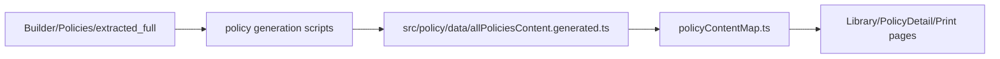
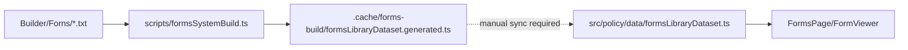
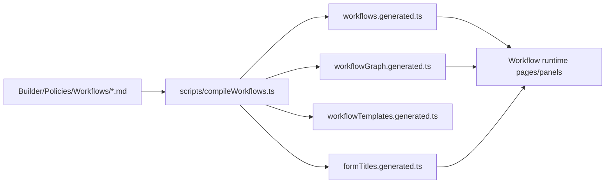
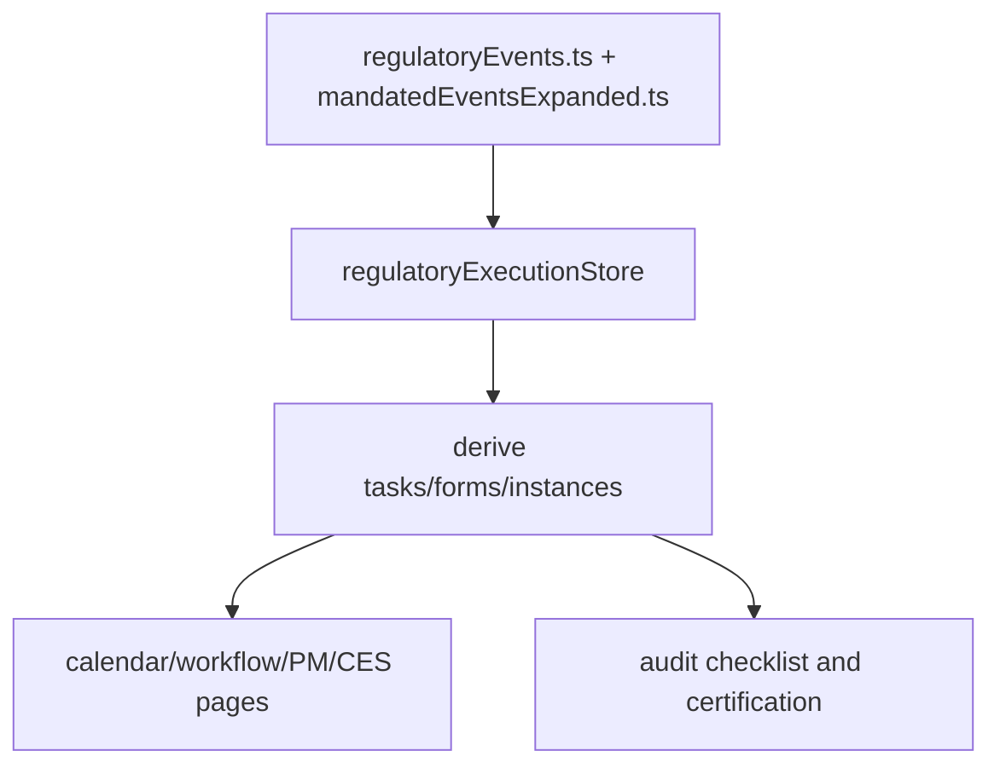
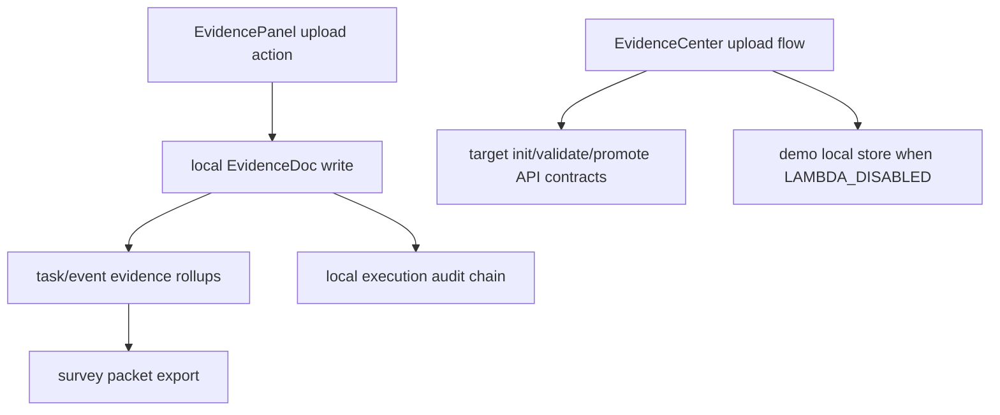
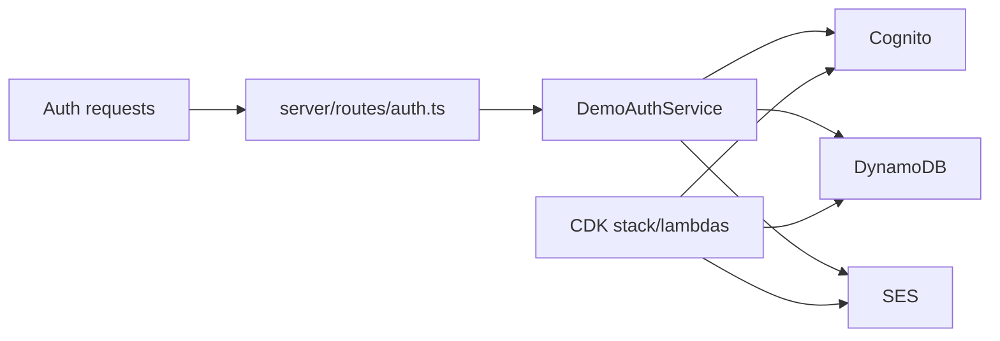
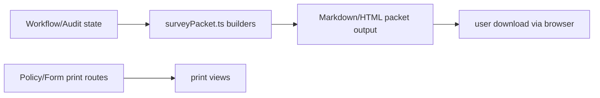

# Dataflow Architecture Review

Review of current dataflow implementation with broken/duplicated/unclear flow markers.

## 1) Policy dataflow



- Broken/unclear:
  - two policy generation scripts overlap responsibilities.
- Duplicated:
  - policy metadata exists in multiple runtime files (`policyCorpus.ts`, `frameworkSeed.generated.ts`).

## 2) Form dataflow



- Broken:
  - no guaranteed automated promotion from `.cache` artifact to runtime dataset.

## 3) Workflow dataflow



- Unclear:
  - `workflowTemplates.generated.ts` active usage scope needs confirmation.

## 4) Event/task dataflow



- Implemented local-first.
- Risk:
  - backend parity with local execution state is partial.

## 5) Evidence dataflow



- Broken:
  - dual store model can diverge.
- Unclear:
  - target endpoint implementation in local backend not found.

## 6) Brad dataflow

```mermaid
flowchart LR
  B1[src datasets: policy/forms/workflows/events/help] --> B2[buildBradAppContext]
  B2 --> B3[iAdministrator frontend runtime]
  B4[Builder selected corpus files] --> B5[server/ia ingest/index]
  B5 --> B6[.cache/ia-index]
  B6 --> B7[/api/ia query responses]
```

- Duplicate/unclear:
  - two knowledge pipelines can return different grounding.

## 7) AWS/serverless dataflow



- Implemented:
  - auth serverless path.
- Not implemented in reviewed local server:
  - full compliance-execution/evidence API route group.

## 8) Print/export dataflow



- Implemented frontend export path.
- Gap:
  - backend immutable export pipeline not confirmed.

---

## Broken, Duplicated, or Unclear Flows Summary

- Broken:
  - awsRemote compliance-execution API flow unresolved in local server.
  - forms `.cache` build output can drift from runtime dataset.
- Duplicated:
  - master control JSON mirrored to three `public` paths.
  - Brad runtime context and IA corpus indexing pipelines.
- Unclear:
  - ownership and runtime necessity of some generated artifacts.
  - canonical policy generation script choice.
