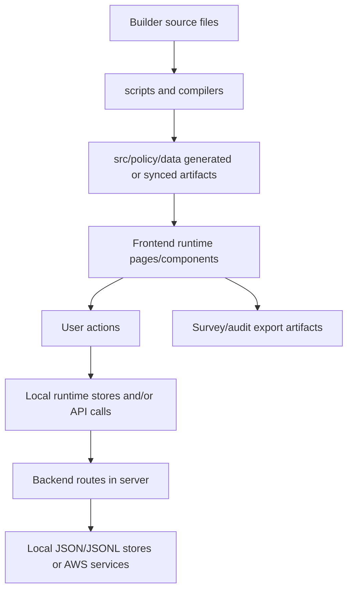
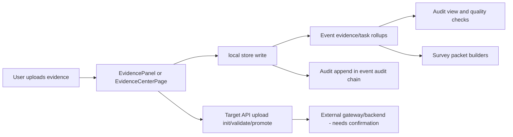

# Current Dataflow

This file documents how data currently moves from source inputs to generated outputs to runtime consumers.

## 1) End-to-End System Dataflow (High Level)

## 2) Domain Flows

## 2.1 Policies flow

Source:

- `Builder/Policies/extracted_full/*.md`

Processing:

- `Builder/Policies/generate_from_extracted.py` (primary generator path found)
- legacy overlap: `Builder/Policies/generate_policy_content.py` (needs confirmation for current usage)

Generated output:

- `src/policy/data/allPoliciesContent.generated.ts`
- `src/policy/data/policyContentMap.ts` merge layer with `specimenContent.generated.ts`

Runtime consumers:

- `src/policy/pages/LibraryPage.tsx`
- `src/policy/pages/PolicyDetailPage.tsx`
- `src/policy/pages/PrintPage.tsx`

User-facing result:

- policy library browsing, detail reads, print views.

## 2.2 Forms flow

Source:

- `Builder/Forns/*.txt`

Processing:

- `scripts/formsSystemBuild.ts` parses/normalizes/links forms.

Generated output:

- `.cache/forms-build/formsLibraryDataset.generated.ts` (build artifact)

Runtime consumer currently:

- `src/policy/data/formsLibraryDataset.ts` (checked-in dataset consumed by runtime pages)
- `src/policy/components/FormViewer.tsx`
- `src/policy/pages/FormsPage.tsx`

Drift risk:

- generated `.cache` output not auto-promoted to checked-in runtime dataset.

## 2.3 Workflows flow

Source:

- `Builder/Policies/Workflows/*-WORKFLOWS.md`

Processing:

- `scripts/compileWorkflows.ts`

Generated output:

- `src/policy/data/workflows.generated.ts`
- `src/policy/data/workflowGraph.generated.ts`
- `src/policy/data/workflowTemplates.generated.ts`
- `src/policy/data/formTitles.generated.ts`

Runtime consumers:

- `src/policy/workflows/WorkflowLibraryApp.tsx`
- `src/policy/components/regulatory/WorkflowExecutionPanel.tsx`
- PM/CES modules and Brad context.

## 2.4 Event/task execution flow

Sources:

- `src/policy/data/regulatoryEvents.ts`
- `src/policy/data/mandatedEventsExpanded.ts`

Runtime processing:

- `src/policy/stores/regulatoryExecutionStore.ts`
- `src/policy/compliance-execution/*`

Outputs:

- event instances, task projections, form instance generation, audit rows in local store.

Consumers:

- dashboard, calendar/mobile execution, workflow panel, CES/PM views, audit mode.

## 2.5 Evidence flow (priority)

Implemented now:

- local execution evidence metadata write and audit append.
- Evidence Center demo-local simulation (`LAMBDA_DISABLED = true`).

Target-coded but not confirmed locally:

- `/uploads/init`, `/uploads/{id}/validate`, `/uploads/{id}/promote`,
- `/events/{event_id}/files`, `/files/{evidence_id}/download`.

## 2.6 Audit flow

Frontend audit sources:

- execution audit chain from `regulatoryExecutionStore`.

Backend audit sources:

- `server/ecign/*` append audit + hash chain.
- `server/audit/*` enterprise audit v2.
- `server/sync/auditLog.ts` calendar sync audit.

User-facing consumers:

- `AuditModePage`
- `WorkflowExecutionPanel` audit tab
- Evidence Center audit panel.

## 2.7 Brad / iAdministrator flow

Primary runtime context builder:

- `src/services/bradAppContext.ts` aggregates policy/forms/workflows/events/help/control inventory.

IA backend flow:

- `server/ia/ingest/sources.ts` scans selected Builder folders,
- index/cache stored under `.cache/ia-index` by default,
- query endpoints under `/api/ia/*`.

Important distinction:

- Brad app context and IA backend index are related but not the same data pipeline.

## 2.8 AWS/backend flow

Local runtime backend:

- frontend calls `/api/*` through Vite proxy to Express (`server/index.ts`).

Auth stack:

- `server/auth/service.ts` and `server/routes/auth.ts` (Cognito/SES/Dynamo).
- mirrored CDK/Lambda implementation in `infra/demo-auth-cdk`.

Gap:

- frontend `awsRemote` compliance execution client targets `/api/compliance-execution/*`, but this route is not mounted in `server/index.ts`.

---

## 3) Source -> Generated -> Runtime -> UI Mapping

| Source | Generated output | Runtime consumer | User-facing page/module |
|---|---|---|---|
| `Builder/Policies/extracted_full/*.md` | `allPoliciesContent.generated.ts` | `policyContentMap.ts` | Policy Library / Policy Detail / Print |
| `Builder/Forns/*.txt` | `.cache/forms-build/formsLibraryDataset.generated.ts` | `formsLibraryDataset.ts` (checked-in runtime file) | Forms Library / Form Viewer |
| `Builder/Policies/Workflows/*` | `workflows.generated.ts`, `workflowGraph.generated.ts`, `formTitles.generated.ts` | workflow/runtime modules | Workflows / Event Execution / PM/CES |
| `Builder/Documentations/MASTER_CONTROL_INVENTORY_DATA_MODEL.json` | copies under `public/*` via sync script | `masterControlInventory.ts` | Master Control Inventory |
| Runtime event definitions in `src/policy/data` | local execution projections | regulatory/compliance stores | Dashboard / Calendar / Audit |
| Evidence upload actions | local metadata and audit rows (implemented) | evidence tabs + packet builders | Evidence panel / Audit / Evidence Center |

---

## 4) Implemented vs Partial vs Planned Flow Notes

- **Implemented:** policy/forms/workflow runtime loading, event/task local execution, eCIGN backend flows, survey packet export generation.
- **Partial:** evidence cloud upload lifecycle, status model harmonization, direct binary download behavior in event panel.
- **Planned/target:** full remote compliance-execution API and cloud evidence chain-of-custody backend for all paths.
- **Needs confirmation:** deployed external backend serving the target evidence endpoints used by UI contracts.
