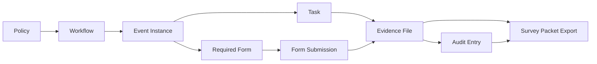

# Evidence System Architecture (Current Implementation)

This is the most detailed current-state evidence document for this repository.  
Scope is implementation as found in runtime code and API code. Unknowns are marked.

---

## 1) Evidence Purpose

In this system, "evidence" is operational and compliance proof attached to a workflow/event lifecycle.  
Evidence is used to support:

- compliance execution progress,
- certification/lock decisions,
- audit trail reconstruction,
- survey packet generation,
- defensible chain-of-custody narratives.

### Why the policy/workflow/event triplet matters

- `policy_id` binds evidence to the governing policy obligation.
- `workflow_id` binds evidence to a specific process path and required steps/forms.
- `event_id` binds evidence to the actual execution instance in time.

Without all three, event-level packet reconstruction and cross-audit traceability become unreliable.

### Chain-of-custody and audit defensibility

- Local execution model keeps event-scoped evidence rows and append-style audit events.
- Certification snapshots capture evidence references at lock time.
- Survey packet export renders evidence/form/approval state into static artifacts.
- Current implementation has partial chain-of-custody hardening (details below), with cloud pipeline mostly target/stubbed.

---

## 2) Current Evidence Data Model

## 2.1 Confirmed implemented objects

### A) `EvidenceDoc` (execution-layer canonical evidence row)

Location: `src/policy/stores/regulatoryExecutionStore.ts`

Confirmed fields:

- `id` (evidence identifier)
- `eventId`
- `taskId`
- `policyIds` (array)
- `workflowId`
- `formIds` (array)
- `folderPath`
- `objectPath`
- `createdAt`
- `createdBy`
- `status` (`active | deleted | superseded` type; delete path currently removes rows)
- `checksum` (non-cryptographic hash helper)
- `fileSize`
- `mimeType`
- `name`
- `kind` (`minutes | report | form | attachment | other`)
- `uploadedAt`
- `uploadedBy`
- `sizeLabel`
- `linkedFormId` (optional)
- `note` (optional)

### B) `EvidenceFile` (Evidence Center API row contract)

Location: `src/policy/pages/EvidenceCenterPage.tsx`

Confirmed fields:

- `evidence_id`
- `filename`
- `policy_id`
- `workflow_id`
- `event_id`
- `form_id`
- `status`
- `signature_status`
- `source_system`
- `mime_type`
- `size_bytes`
- `created_at`
- `updated_at`

### C) Evidence-related audit structures

- `taskAuditByEventId` append logic in `regulatoryExecutionStore.ts` with `entityType: 'evidence'`.
- Hash-chain-style fields in execution audit events:
  - `recordVersion`
  - `prevHash`
  - `currentHash`
- Event audit UI consumers:
  - `WorkflowExecutionPanel` audit tabs
  - Evidence Center event audit panel

## 2.2 Requested field-by-field implementation check

- `evidence_id` — Confirmed implemented.
- `event_id` — Confirmed implemented.
- `policy_id` — Confirmed as `policy_id` (Evidence Center) and `policyIds[]` (execution store).
- `workflow_id` — Confirmed implemented.
- `form_id` — Confirmed implemented (`form_id` in center, `formIds[]`/`linkedFormId` in execution store).
- `task_id` — Confirmed implemented (`taskId` in `EvidenceDoc`).
- `file_name` — Confirmed implemented (`name` / `filename`).
- `file_type` — Target field — not confirmed implemented as separate semantic field.
- `content_type` — Confirmed as `mimeType` / `mime_type`.
- `file_size` — Confirmed as `fileSize` / `size_bytes`.
- `s3_bucket or local storage target` — Partially implemented (local storage target confirmed; `s3_bucket` present in target response contracts).
- `s3_key or local file path` — Partially implemented (`objectPath` local logical path; target `s3_key` fields in bridge contracts).
- `status` — Confirmed implemented (different status sets across modules).
- `uploaded_by` — Confirmed implemented (`uploadedBy`).
- `uploaded_at` — Confirmed implemented (`uploadedAt`).
- `validated_at` — Target field — not confirmed implemented.
- `promoted_at` — Target field — not confirmed implemented.
- `locked_at` — Target field — not confirmed implemented for evidence rows.
- `download_url or presigned_url behavior` — Partially implemented (target in Evidence Center; demo mode blocks real download).
- `sha256 / hash / integrity field` — Partially implemented:
  - local `checksum` uses local hash helper (not sha256 digest of file bytes),
  - target bridge responses include `sha256`.
- `version` — Target field — not confirmed implemented.
- `audit_log reference` — Partially implemented (event audit entries exist, explicit foreign key field not confirmed).
- `retention metadata` — Target field — not confirmed for evidence rows (present in eCIGN locked documents, separate model).
- `related form submission reference` — Partially implemented (`linkedFormId`, `formIds`, form evidence bridge contracts).
- `related workflow step reference` — Partially implemented via `taskId` and generated workflow tasks.

---

## 3) Evidence Folder Hierarchy

## 3.1 Current local/dev hierarchy (implemented)

Primary file: `src/policy/compliance-execution/eventFolders.ts`

Logical event tree:

- `/events/{eventId}/metadata.json`
- `/events/{eventId}/tasks/`
- `/events/{eventId}/forms/required/`
- `/events/{eventId}/forms/completed/`
- `/events/{eventId}/evidence/`
- `/events/{eventId}/approvals/`
- `/events/{eventId}/audit/audit-log.jsonl`

Evidence object path builder (logical key):

- `evidence/{policyId}/{workflowId}/{eventId}/{evidenceId}/{filename}`

### Where uploaded evidence is stored now

- Execution layer: in `localStorage` (`reg-execution-v2`) as metadata rows (`EvidenceDoc`), not binary files.
- Evidence Center demo mode: in `localStorage` (`evidence-center-demo-store-v1`) as metadata rows.
- UI explicitly indicates local demo behavior:
  - Evidence Center banner: "Demo Mode: Evidence stored locally".

### Metadata source currently used

- Event workflow/evidence tabs: Zustand/localStorage state (`useRegulatoryExecutionStore`).
- Evidence Center page: demo localStorage store when `LAMBDA_DISABLED = true`; target API calls otherwise.
- No confirmed direct DynamoDB evidence metadata read in runtime app path.

### Related source files/components/services

- `src/policy/stores/regulatoryExecutionStore.ts`
- `src/policy/compliance-execution/eventFolders.ts`
- `src/policy/components/regulatory/EvidencePanel.tsx`
- `src/policy/components/regulatory/WorkflowExecutionPanel.tsx`
- `src/policy/pages/EvidenceCenterPage.tsx`
- `src/policy/services/complianceExecutionApi.ts`
- `src/policy/ecign/hhcEvidence.ts`
- `src/policy/services/hhcFormEvidence.ts`
- `src/policy/services/hhcWorkflowCompletion.ts`

## 3.2 AWS/serverless target hierarchy

Required target hierarchy from request:

- `sandbox/raw/{policy_id}/{workflow_id}/{event_id}/{upload_id}/{filename}`
- `sandbox/validated/{policy_id}/{workflow_id}/{event_id}/{upload_id}/{filename}`
- `production/evidence/{policy_id}/{workflow_id}/{event_id}/{evidence_id}/{filename}`
- `production/forms/{policy_id}/{workflow_id}/{event_id}/{form_id}/{filename}`
- `production/audit/{yyyy}/{mm}/{dd}/{event_id}/{audit_id}.jsonl`
- `production/exports/{yyyy}/{mm}/{dd}/{export_id}.zip`

Status:

- **Implemented now:** Needs confirmation in this repository for actual server code writing to these exact roots.
- **Planned target:** Confirmed in frontend comments/contracts and supporting docs.
- **Needs confirmation:** concrete backend implementation for full hierarchy in this repo.

---

## 4) Evidence Lifecycle Flow

## 4.1 Current implemented local lifecycle (execution store path)

1. User selects event in workspace/panel.
   - Frontend: `WorkflowExecutionPanel`, `EvidencePanel`.
2. System resolves task/form context.
   - `uploadEvidence` requires `taskId` or form-linked generated task.
3. User "uploads" document in panel modal (simulated metadata).
4. Store writes new `EvidenceDoc` with `status: active`, path metadata, checksum helper.
5. Event audit row appended with `entityType: evidence`, `action: evidence.create`.
6. Optional linked form auto-marked complete.
7. Evidence appears in task rollups, evidence tab, and audit views.
8. On certification, mutation is blocked by event lock/certification controls.

Failure mode: if task context cannot be derived, upload returns empty id and no evidence row.

## 4.2 Evidence Center target lifecycle (coded, default-disabled)

When `LAMBDA_DISABLED = false` in `EvidenceCenterPage.tsx`:

1. `POST /uploads/init` — returns upload metadata + presigned PUT.
2. Upload file bytes to presigned URL.
3. `POST /uploads/{upload_id}/validate`.
4. `POST /uploads/{upload_id}/promote`.
5. `GET /events/{event_id}/files` refreshes list.
6. `GET /files/{evidence_id}/download` returns presigned GET.

Default runtime behavior (`LAMBDA_DISABLED = true`) simulates these steps in localStorage and sets status to `EVIDENCE_LOCKED`.

## 4.3 Step mapping with required attributes

| Lifecycle step | Frontend page/component | API/service | Metadata written | Validation | Audit entry | Failure mode | User-facing result |
|---|---|---|---|---|---|---|---|
| Select event | `WorkflowExecutionPanel`, `EvidenceCenterPage` | N/A | selected event/filter ids | event id presence | none | invalid event id filter | empty state/no rows |
| Resolve context | `regulatoryExecutionStore.uploadEvidence` | local store method | task/form/policy/workflow linkage | requires taskId derivation | `evidence.create` on success | returns empty id if no task | upload appears to fail silently unless handled |
| Upload initiate | `EvidenceCenterPage` | target `/uploads/init` | upload id, evidence id, s3 key (target) | triplet required by payload | target audit on backend | network/API error | inline error banner |
| Byte write | `EvidenceCenterPage` | presigned PUT target | object bytes (target) | S3 PUT response | target | PUT fail | inline error |
| Validate | `EvidenceCenterPage` | target `/uploads/{id}/validate` | sha256, mime, size (target) | size/mime/hash (target) | target | validation fail | inline error |
| Promote | `EvidenceCenterPage` | target `/uploads/{id}/promote` | promoted key/bucket/status (target) | promotion checks (target) | target | promote fail | inline error |
| Metadata list | `EvidenceCenterPage` | `/events/{event_id}/files` target or demo store | rows in state | filter/query checks | none (read) | no event partition | empty list |
| Download URL | `EvidenceCenterPage` | `/files/{id}/download` target | URL + expiry (target) | auth/context checks target | target expected | expired/not available | error or blocked message |
| Survey packet include | `WorkflowExecutionPanel` audit export | local packet builders | evidence rows in packet | checklist inclusion | none extra | missing evidence rows | packet highlights deficiencies |

---

## 5) Evidence Statuses

## 5.1 Current statuses implemented

### Execution store (`EvidenceDoc.status`)

- `active`
- `deleted` (type-level; runtime remove path currently hard-removes rows)
- `superseded` (type-level; transition path not fully implemented)

### Evidence Center/status UI vocabulary

- `PENDING_UPLOAD`
- `UPLOADED`
- `VALIDATING` (implied by flow, not persistent in demo)
- `VALIDATED`
- `PROMOTED`
- `EVIDENCE_LOCKED`
- `APPROVED_EVIDENCE`
- `SIGNED`
- `FAILED`

## 5.2 Target statuses requested

- `PENDING_UPLOAD`
- `UPLOADED`
- `VALIDATING`
- `VALIDATED`
- `REJECTED`
- `PROMOTED`
- `EVIDENCE_LOCKED`
- `SUPERSEDED`
- `EXPORTED`
- `DELETED_BLOCKED / RETAINED`

Status label:

- **Implemented now:** mixed subset across execution store and Evidence Center.
- **Target:** full regulated lifecycle list above.
- **Needs confirmation:** backend canonical status enum in deployed API.

---

## 6) Evidence Pipeline (Technical)

## 6.1 Current implemented pipelines

### A) Local execution pipeline (implemented)

Frontend upload modal (`EvidencePanel`)  
-> `useRegulatoryExecutionStore.uploadEvidence`  
-> local metadata row + objectPath/folderPath  
-> event audit append in local store  
-> evidence/task/audit tabs consume row  
-> survey packet builders include row.

### B) Evidence Center mock pipeline (implemented demo mode)

Evidence Center upload button  
-> local mock creation of `EvidenceFile` row (`EVIDENCE_LOCKED`)  
-> local audit row in `evidence-center-demo-store-v1`  
-> filtered table + side panel + audit list render.

## 6.2 Target API pipeline surfaces (coded, backend not confirmed in this repo)

Expected endpoints in UI/service contracts:

- `POST /uploads/init`
- `POST /uploads/{upload_id}/validate`
- `POST /uploads/{upload_id}/promote`
- `GET /events/{event_id}/files`
- `GET /files/{evidence_id}/download`
- `POST /exports/survey-packet` (target, not confirmed in current backend routes)

Current backend reality in `server/index.ts`:

- `/api/compliance-execution/*` not mounted.
- eCIGN endpoints exist under `/api/ecign/*`.
- compliance read endpoints exist under `/api/compliance/*`.

---

## 7) Evidence Relationship Map

### Reverse lookups currently possible

- evidence by `event_id`:
  - execution store map by event key,
  - Evidence Center list by event query.
- evidence by `policy_id`:
  - client-side filters in Evidence Center.
- evidence by `workflow_id`:
  - client-side filters in Evidence Center.
- evidence by `form_id`:
  - linked form ids and filters.
- evidence by `task_id`:
  - task/evidence rollups in dataflow tabs.
- evidence by `status`:
  - Evidence Center table filtering.
- evidence by uploader:
  - available in metadata (`uploadedBy`), no dedicated indexed query API confirmed.
- evidence by audit packet/export:
  - packet generation includes evidence rows; dedicated reverse index not confirmed.

---

## 8) Evidence UI Behavior

## 8.1 Evidence Center page behavior

File: `src/policy/pages/EvidenceCenterPage.tsx`

- Filters:
  - event id,
  - form id,
  - policy id,
  - evidence id,
  - free-text search.
- Event loading:
  - explicit event id loader,
  - query param prefill support.
- Triplet behavior:
  - header/help text enforces policy/workflow/event concept,
  - upload payload uses policy/workflow/event/form values.
- Upload button:
  - demo mode writes local metadata row and audit row.
- Empty state:
  - explicit "no evidence for event" panel.
- Audit log section:
  - event-scoped audit entries shown below table.
- Right-side knowledge/help panel:
  - explains evidence purpose, triplet, audit trail, next steps.
- Download behavior:
  - demo mode blocks with message,
  - live mode opens presigned URL.
- ID click behavior:
  - metadata drawer exposes IDs; dedicated deep-link navigation for each id is limited and needs confirmation.

## 8.2 Event workflow evidence behavior

Files:

- `src/policy/components/regulatory/EvidencePanel.tsx`
- `src/policy/components/regulatory/WorkflowExecutionPanel.tsx`

Behavior:

- Upload is currently simulated metadata capture from modal.
- Remove allowed until event lock/certification.
- Download button in `EvidencePanel` currently emits toast only (no real retrieval).
- Evidence tab shows evidence grouped by task and object path.

---

## 9) Evidence Validation Rules

## 9.1 Rules confirmed in current implementation

- Required context:
  - upload path requires derivable `taskId` in execution store.
- Event lock enforcement:
  - evidence mutation blocked when event is locked/certified.
- Form linkage:
  - linked form can auto-mark form complete.
- Task completion gates:
  - for some task source types, evidence is required before completion.
- Hash chain:
  - event audit entries receive chained hash fields.

## 9.2 Rules not fully implemented / target / needs confirmation

- Allowed file types — Target field/rule, not centrally enforced in local execution upload modal.
- Size limits — Target rule in cloud flow comments; not strongly enforced in local modal.
- Required strict triplet validation on all paths — Partial; target in Evidence Center comments/contracts.
- Required event existence check on upload API — Needs confirmation (cloud backend not in repo).
- Required form/task linkage check in API — Partial/local; full backend enforcement needs confirmation.
- Duplicate filename/version handling — Target behavior; no full versioning strategy confirmed.
- Cryptographic integrity check (sha256 over content) — Target for cloud path; local checksum helper is not equivalent.
- Immutable/locked behavior at evidence-row level — Partial via event lock; dedicated evidence lock state machine not fully unified.
- Delete/edit block after lock — Implemented at event lock level for local mutation paths.
- Supersede creates new version — Target/needs confirmation.

---

## 10) Evidence Audit Trail

## 10.1 Audit events that should exist (target canonical list)

- `UPLOAD_INITIATED`
- `FILE_UPLOADED`
- `FILE_VALIDATED`
- `FILE_REJECTED`
- `EVIDENCE_PROMOTED`
- `EVIDENCE_LOCKED`
- `DOWNLOAD_URL_CREATED`
- `EXPORT_CREATED`
- `EVIDENCE_SUPERSEDED`
- `ACCESS_DENIED`
- `VALIDATION_FAILED`

## 10.2 Current observed events

- Local execution audit actions include:
  - `evidence.create`
  - `evidence.delete`
  - other related task/form/event actions in same chain.
- Evidence Center demo audit action text:
  - "Evidence uploaded (demo mode)".
- eCIGN route audit has rich event names (signature/network/export) in server path.

## 10.3 Audit event payload fields check

- actor — Confirmed (local actor or header actor usage).
- timestamp — Confirmed.
- `event_id` — Confirmed.
- `policy_id` — Partial; present in evidence metadata, not always in every audit row.
- `workflow_id` — Partial; similar note.
- `evidence_id` — Partial/confirmed for evidence actions.
- before/after status — Partial (available for some rows).
- request_id — Target field — not confirmed implemented.
- source_ip — Partial in eCIGN network metadata; not universal.
- hash — Partial (`currentHash`/`prevHash` in execution audits).

---

## 11) Evidence Failure Modes and Remedies

1. File uploaded without valid event context.
   - Current: event id required by context but validation varies by path.
   - Remedy: enforce event existence at API boundary.
2. File uploaded without policy/workflow binding.
   - Current: fallback placeholders (`UNASSIGNED-*`) can be written.
   - Remedy: fail closed for production pipeline.
3. Duplicate row instead of rollup under required form.
   - Current: possible when linkage metadata missing.
   - Remedy: enforce `form_id/task_id` mapping rules.
4. Metadata exists but file missing.
   - Current: possible in target/distributed model; local mode metadata-only by design.
   - Remedy: consistency checks + reconciliation job.
5. File exists but metadata missing.
   - Current: needs confirmation for cloud path.
   - Remedy: promote transaction guard and dead-letter remediation.
6. Missing audit entry.
   - Current: possible in mixed pathways.
   - Remedy: mandatory audit append transaction for each transition.
7. Presigned URL expired.
   - Current: expected runtime risk in target flow.
   - Remedy: refresh endpoint + user messaging.
8. Wrong bucket/region config.
   - Current: target risk via env/config mismatch.
   - Remedy: startup config validation and health checks.
9. Local demo state conflicts with API state.
   - Current: high risk due two local stores and disabled lambdas.
   - Remedy: single source mode switch + data migration/reset UI.
10. Stale generated event/form refs.
    - Current: possible with generator drift.
    - Remedy: CI validation before deploy.
11. Wrong document type uploaded.
    - Current: weak type guard in local upload path.
    - Remedy: type whitelist and server-side MIME verification.
12. Locked evidence editable.
    - Current: protected by event lock, not fully evidence-row lifecycle.
    - Remedy: explicit immutable evidence state machine.
13. Survey packet missing required evidence.
    - Current: packet surfaces deficiencies but ingestion completeness depends on linkage.
    - Remedy: enforce required form/task evidence constraints before certification/export.

---

## 12) Evidence QA Checklist

- [ ] Upload with valid policy/workflow/event triplet.
- [ ] Upload with invalid `event_id` and confirm failure.
- [ ] Upload with missing `policy_id` and verify failure/guardrail.
- [ ] Upload with required form binding and verify rollup linkage.
- [ ] Validate status transition to `EVIDENCE_LOCKED`/equivalent lock state.
- [ ] Verify audit log entry count increments after each evidence action.
- [ ] Verify download URL is short-lived in live mode.
- [ ] Verify survey packet export includes expected evidence rows.
- [ ] Verify locked evidence cannot be edited/deleted.
- [ ] Verify duplicate upload behavior (version/supersession) per intended policy.
- [ ] Verify event drawer shows evidence under correct required form/task.
- [ ] Verify dashboard/audit reads metadata model, not raw object listing.

---

## 13) Evidence Implementation Map

## 13.1 Frontend pages/components/hooks

- `src/policy/pages/EvidenceCenterPage.tsx`
- `src/policy/components/regulatory/EvidencePanel.tsx`
- `src/policy/components/regulatory/WorkflowExecutionPanel.tsx`
- `src/policy/pages/MobileIncidentExecutionPage.tsx` (evidence stage)
- `src/policy/compliance-execution/useEventExecutionDataflow.ts`
- `src/policy/ces/hooks/useEvidenceTracker.ts`

## 13.2 Frontend services/APIs

- `src/policy/services/complianceExecutionApi.ts`
- `src/policy/ecign/hhcEvidence.ts`
- `src/policy/services/hhcFormEvidence.ts`
- `src/policy/services/hhcWorkflowCompletion.ts`
- `src/policy/stores/regulatoryExecutionStore.ts`
- `src/policy/compliance-execution/eventFolders.ts`

## 13.3 Backend routes/services

- `server/index.ts` (mounted APIs)
- `server/routes/ecign.ts` (signature/evidence-adjacent)
- `server/routes/compliance.ts` (compliance read/state)
- `server/routes/audit.ts`
- `server/audit/routes.ts`

## 13.4 Storage/config/infrastructure

- `localStorage` keys:
  - `reg-execution-v2`
  - `evidence-center-demo-store-v1`
- AWS auth infra:
  - `infra/demo-auth-cdk/lib/demo-auth-stack.ts`
  - `infra/demo-auth-cdk/lambda/*.ts`
- Evidence S3/Dynamo canonical schema in this repo:
  - **Needs confirmation** (target contracts exist in frontend comments/types).

## 13.5 Event/task/form references

- `src/policy/compliance-execution/types.ts`
- `src/policy/compliance-execution/stateMachine.ts`
- `src/policy/compliance-execution/eventStateEvaluator.ts`
- `src/policy/compliance-execution/eventTaskAdapter.ts`
- `src/policy/data/regulatoryEvents.ts`

## 13.6 Audit/export modules

- `src/policy/audit/surveyPacket.ts`
- `src/policy/audit/exportReport.ts`
- `src/policy/audit/auditState.ts`

---

## 14) Implemented vs Planned Summary

- **Implemented now:** local evidence metadata model, event-level audit chain, workflow/task/form linkage, certification lock gates, survey packet exports.
- **Partial:** Evidence Center cloud lifecycle (UI wired, default disabled), multi-model status vocabulary alignment, download semantics across pages.
- **Planned/target:** full presigned upload->validate->promote backend, immutable evidence lifecycle states, normalized audit event taxonomy, S3/Dynamo authoritative persistence with strict triplet enforcement.
- **Needs confirmation:** deployed backend that serves the target evidence API surface used by frontend contracts.
