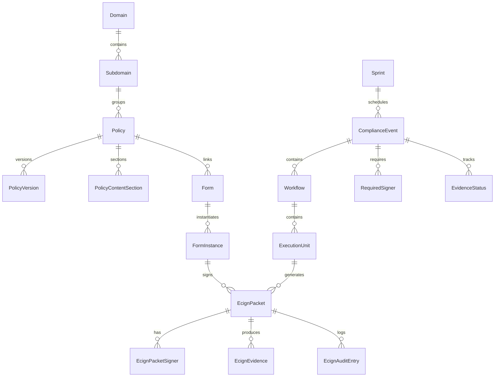

# 05 — Data Model and Types

**Generated:** 2026-05-12

---

## Core Domain Types (`src/policy/types/types.ts`)

### `LifecycleStatus`
```typescript
type LifecycleStatus =
  | 'Draft' | 'Under Review' | 'Revision Requested'
  | 'Approved' | 'Rejected' | 'Published' | 'Archived'
```

### `AccessTier`
```typescript
type AccessTier =
  | 'Tier 1 - Public' | 'Tier 2 - Restricted'
  | 'Tier 3 - Confidential' | 'Tier 4 - Privileged'
```

### `Domain`
| Field | Type | Notes |
|---|---|---|
| `code` | string | Domain code (e.g., "GV", "CL") |
| `name` | string | Display name |
| `ownerSteward` | string | Responsible person |
| `description` | string | Description |

### `Subdomain`
| Field | Type | Notes |
|---|---|---|
| `id` | string | |
| `domainCode` | string | FK → Domain.code |
| `code` | string | |
| `name` | string | |
| `ownerSteward` | string | |
| `reviewCycle` | string | |
| `accessTier` | string | |
| `description` | string | |

### `Policy`
| Field | Type | Notes |
|---|---|---|
| `id` | string | Policy identifier |
| `domainCode` | string | FK → Domain.code |
| `subdomainCode` | string | FK → Subdomain.code |
| `title` | string | |
| `tier` | string | |
| `lifecycleStatus` | LifecycleStatus | |
| `reviewCycle` | string | |
| `ownerSteward` | string | |
| `accessTier` | string | |
| `description` | string | |
| `currentVersion` | string | |
| `sourceType` | 'markdown' \| 'placeholder' \| 'html' | How content is stored |
| `contentRef` | string \| null | Reference to content |
| `isPublished` | boolean | |
| `publishedVersion` | string \| null | |
| `createdAt` | string (ISO) | |
| `updatedAt` | string (ISO) | |

### `PolicyVersion`
| Field | Type | Notes |
|---|---|---|
| `policyId` | string | FK → Policy.id |
| `version` | string | |
| `lifecycleStatus` | LifecycleStatus | |
| `isLocked` | boolean | |
| `effectiveDate` | string \| null | |
| `approvedBy` | string \| null | |
| `approvedDate` | string \| null | |
| `supersedes` | string \| null | |
| `contentRef` | string \| null | |
| `changeSummary` | string | |
| `createdBy` | string | |
| `createdAt` | string (ISO) | |
| `updatedAt` | string (ISO) | |

### `PolicyContentSection`
| Field | Type | Notes |
|---|---|---|
| `id` | string | |
| `title` | string | |
| `level` | number | Heading level |
| `order` | number | Display order |
| `body` | string | Markdown content |
| `scormChunkHint` | string | SCORM integration hint |

---

## CES Types (`src/policy/ces/types.ts`)

### `WorkflowPhase`
```typescript
type WorkflowPhase = 'preparation' | 'documentation' | 'review' | 'signature' | 'audit'
```

### `ComplianceState`
```typescript
type ComplianceState = 'upcoming' | 'ready' | 'in_progress' | 'awaiting_signature' | 'blocked' | 'completed'
```

### `AuditReadiness`
```typescript
type AuditReadiness = 'not_ready' | 'partial' | 'ready'
```

### `ComplianceDomain`
```typescript
type ComplianceDomain = 'clinical' | 'compliance' | 'hr' | 'governance'
```

### `ComplianceEvent`
| Field | Type | Notes |
|---|---|---|
| `id` | string | |
| `title` | string | |
| `category` | EventCategory | |
| `domain` | ComplianceDomain | |
| `complianceState` | ComplianceState | |
| `auditReadiness` | AuditReadiness | |
| `dueDate` | string (ISO) | |
| `workflows` | Workflow[] | Nested workflows |
| `signers` | RequiredSigner[] | Required signers |
| `blockedReasons` | BlockedReason[] | |
| *(more fields detected from partial read)* | | |

### `Workflow`
| Field | Type | Notes |
|---|---|---|
| `id` | string | |
| `title` | string | |
| `phase` | WorkflowPhase | |
| `units` | ExecutionUnit[] | Tasks within workflow |

### `ExecutionUnit`
| Field | Type | Notes |
|---|---|---|
| `id` | string | |
| `title` | string | |
| `type` | string | |
| `status` | ComplianceState | |
| `assignee` | Owner | |
| `evidence` | EvidenceStatus | |
| *(more fields)* | | |

### `Sprint`
| Field | Type | Notes |
|---|---|---|
| `id` | string | Sprint identifier |
| `events` | ComplianceEvent[] | Events in sprint |
| `metrics` | SprintMetrics | |

---

## PM Layer Types (`src/policy/pm/types.ts`)

### `PmTaskType`
```typescript
type PmTaskType = 'workflow_step' | 'form_completion' | 'form_review' | 'evidence' | 'approval' | 'certification' | 'personal'
```

### `PmTaskStatus`
```typescript
type PmTaskStatus = 'todo' | 'in_progress' | 'in_review' | 'blocked' | 'done'
```

### `EcignInternal` (eCIgn state machine values)
```typescript
type EcignInternal = 'none' | 'created' | 'disclosed' | 'verified' | 'reviewed' | 'attested' | 'signed_locked' | 'voided' | 'expired'
```

### `EcignPacketStatus` (UX-friendly)
```typescript
type EcignPacketStatus = 'not_started' | 'draft' | 'submitted' | 'awaiting_signature' | 'awaiting_approval' | 'returned_for_correction' | 'rejected' | 'completed' | 'archived'
```

### `SignerStatus`
```typescript
type SignerStatus = 'not_invited' | 'invited' | 'pending' | 'signed' | 'countersigned' | 'declined' | 'revoked'
```

### `EcignPacketSigner`
| Field | Type |
|---|---|
| `signer_id` | string |
| `display_name` | string |
| `role` | string |
| `status` | SignerStatus |
| `invited_at?` | string |
| `signed_at?` | string |
| `decline_reason?` | string |
| `mfa_verified` | boolean |

### `EcignEvidence`
| Field | Type | Notes |
|---|---|---|
| `evidence_id` | string | |
| `s3_bucket?` | string | S3 storage reference (may be unused in JSONL mode) |
| `s3_key?` | string | S3 key |
| `sha256?` | string | Content hash |
| `status` | string | 'pending' \| 'generated' \| 'stored' \| 'linked' \| 'validated' \| 'archived' |
| `created_at` | string | |

### `EcignAuditEntry`
| Field | Type |
|---|---|
| `audit_id` | string |
| `ts` | string (ISO) |
| `actor_user_id` | string |
| `action` | string |
| `subject_id` | string |

---

## Compliance Execution Extended Types (`src/policy/compliance-execution/complianceExecutionTypes.ts`)

### `ExecutionSource`
```typescript
type ExecutionSource = 'regulatory' | 'ces-seed' | 'autogen' | 'triggered'
```

### `MergedComplianceEvent`
Extends `ComplianceEvent` with:
| Field | Type |
|---|---|
| `source` | ExecutionSource |
| `regulatoryRef?` | RegulatoryEvent |

### `MergedExecutionUnit`
Extends `ExecutionUnit` with:
| Field | Type |
|---|---|
| `source` | ExecutionSource |
| `regulatoryRef?` | RegulatoryEvent |
| `sourceEventId?` | string |
| `taskSourceId?` | string |
| `sourceEvidenceIds?` | string[] |
| `folderPath?` | string |
| `auditReadinessScore?` | number |

### `AuditReadinessRollup`
| Field | Type |
|---|---|
| `notReady` | number |
| `partial` | number |
| `ready` | number |
| `certified` | number |
| `totalOpen` | number |

---

## Auth Types (`src/auth/api.ts` + `src/auth/AuthProvider.tsx`)

### `DemoUser`
| Field | Type |
|---|---|
| `id` | string |
| `email` | string |
| `name` | string |
| `role` | string |
| `firstName` | string |
| `lastName` | string |
| `emailVerified` | boolean |

### `AuthSession` (from api.ts)
| Field | Type |
|---|---|
| `accessToken` | string |
| `refreshToken` | string |
| `expiresIn` | number |

### `StoredAuth` (localStorage shape)
| Field | Type |
|---|---|
| `session` | AuthSession |
| `expiresAt` | number (timestamp ms) |
| `user?` | DemoUser \| null |

---

## Journey Types (`src/policy/journey/types/journey.ts`)

Not fully read — structure inferred from components. Likely includes:
- `TrainingModule` — module definition with id, title, lessons
- `Lesson` — individual lesson unit
- `EmployeeProgress` — per-employee progress tracking
- `GatingRule` — prerequisite/gate logic

---

## Onboarding V2 Types (`src/policy/onboarding-v2/types.ts`)

Not fully read — structure inferred. Likely includes:
- `OnboardingBatch` — batch of employees
- `OnboardingUnit` — individual requirement unit
- `ActivationState` — gate/activation state

---

## Mock / Static Data Files (Key entries in `src/policy/data/`)

| File | Contents | Notes |
|---|---|---|
| `regulatoryEvents.ts` | Array of regulatory event definitions | Primary event source |
| `mandatedEventsExpanded.ts` | Expanded mandated events | |
| `multiYearEvents.ts` | Multi-year event schedule | |
| `masterControlInventory.ts` | Master control inventory data | Synced via `syncMasterControlInventory.mjs` |
| `formsCatalog.ts` | Forms catalog (index) | |
| `formsLibraryContent.ts` | Form content | Large |
| `formsLibraryContentCO_More.ts` | CO/More form content | |
| `formsLibraryContentHR_CL.ts` | HR/CL form content | |
| `formsLibraryContentJD.ts` | JD form content | |
| `formsLibraryDataset.ts` | Forms dataset | |
| `policyCorpus.ts` | Policy corpus (all policies) | |
| `policyContentMap.ts` | Policy ID → content mapping | |
| `allPoliciesContent.generated.ts` | Generated: all policy content | Large generated file |
| `frameworkSeedData.ts` | Framework seed | |
| `frameworkSeed.generated.ts` | Generated framework seed | |
| `workflowTemplates.generated.ts` | Generated workflow templates | |
| `workflows.generated.ts` | Generated workflows | |
| `workflowGraph.generated.ts` | Generated workflow graph | |
| `achcSurveyProjection.generated.ts` | Generated ACHC survey projection | |
| `achcSurveyTags.generated.ts` | Generated ACHC tags | |
| `achcAttachmentCrosswalk.generated.ts` | ACHC attachment crosswalk | |
| `achcPrintCrosswalk.generated.ts` | ACHC print crosswalk | |
| `achcHhEvidenceMap.ts` | ACHC ↔ HHC evidence mapping | |
| `extractedSeedArrays.ts` | Extracted arrays from seed | |
| `helpArticles.ts` | Help article content | |
| `hubstaffTasks.ts` | Hubstaff task data | |
| `auditRegulatoryEvents.ts` | Audit-mode regulatory events | |

---

## Server-Side Persistence (JSONL Files)

`server/ecign/data/` — append-only JSONL flat files:

| File | Contents | Notes |
|---|---|---|
| `form_instances.jsonl` | Form instance state records | |
| `signatures.jsonl` | Signature records | |
| `consents.jsonl` | User consent records | |
| `audit_events.jsonl` | Audit event log | |
| `document_versions.jsonl` | Document version records | |

**Limitation:** JSONL files are not a transactional database. No atomic writes, no concurrent update protection, no backup strategy beyond git.

---

## AWS DynamoDB (server/auth, server/audit)

| Table | Purpose | Notes |
|---|---|---|
| `demo_auth_registrations` | User registration records | Via env `REGISTRATION_TABLE_NAME` |
| Audit events table | Audit trail (v2) | Table name from env |

---

## Data Relationships



---

## Known Type Inconsistencies

| Issue | Detail |
|---|---|
| Duplicate `WorkflowDrawer` type context | Both `ces/components/details/` and `components/regulatory/` have a `WorkflowDrawer` component — likely different props |
| Duplicate `EvidencePanel` | Both `components/regulatory/` and `onboarding-v2/components/` — different contexts |
| Duplicate `KpiTile` | Both `components/regulatory/` and `onboarding-v2/components/` |
| `EcignEvidence.s3_bucket` / `s3_key` | Present in type but backend uses JSONL, not S3 — S3 fields are aspirational |
| `PolicyVersion.contentRef` and `Policy.contentRef` | May reference different storage systems (unclear if consistent) |
| `TaskSource` has both `'CES'` and `'ces'` | Inconsistent casing in the same union type |
| Two `authorize.ts` files | `src/policy/security/authorize.ts` and `src/policy/security/identity/authorize.ts` — potential conflict |
