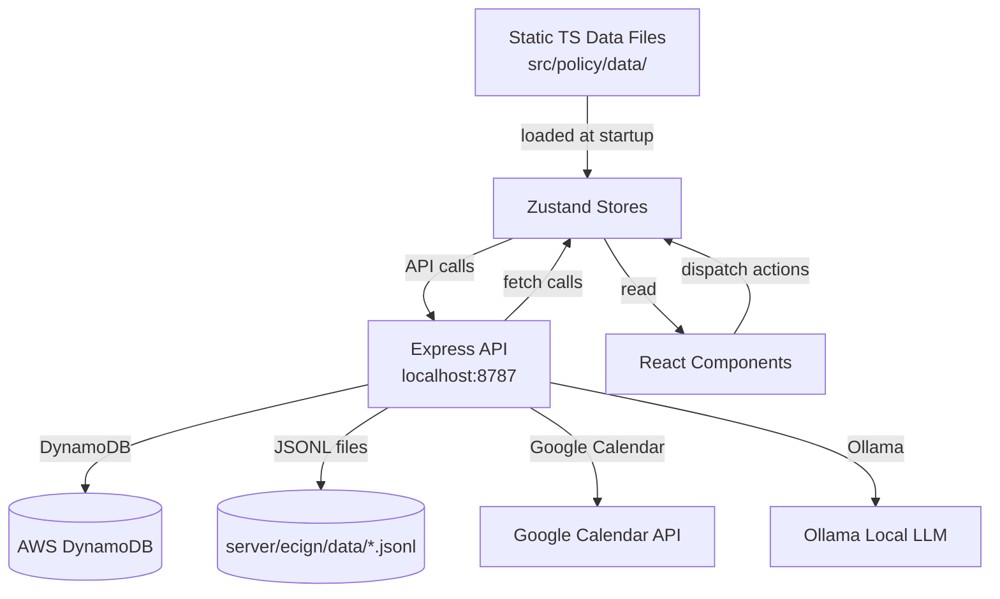
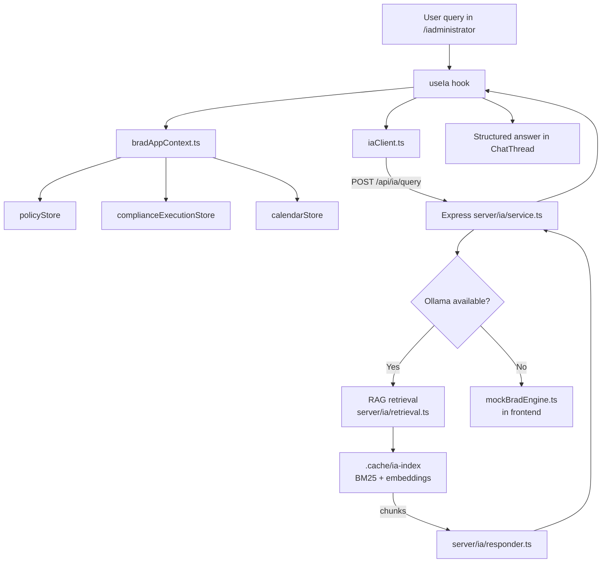
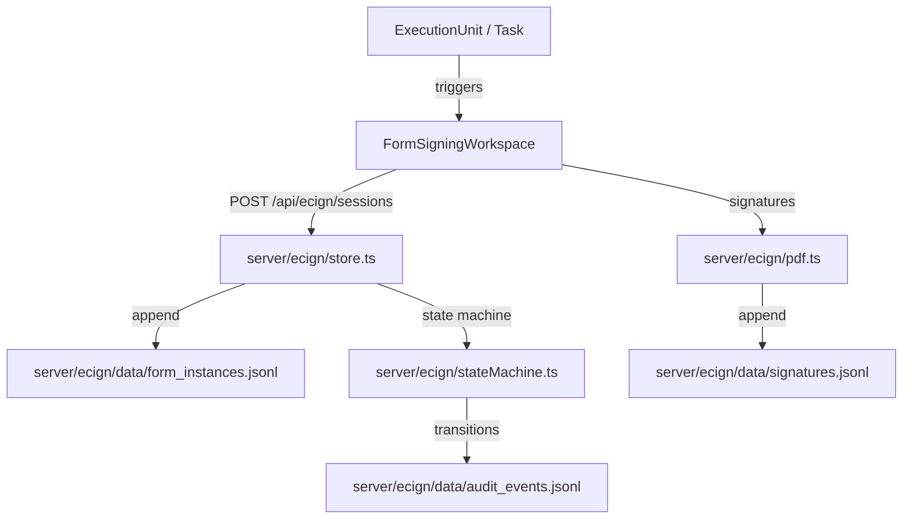

# 06 — Dataflow and State Management

**Generated:** 2026-05-12

---

## Overview

The app uses **Zustand v5** as its primary state management library. There is **no React Query, Redux, or Context-based global state** (only the AuthProvider React Context). Most state is **in-memory only** — data is not persisted to a server on change, and is lost on page refresh unless re-initialized from static data files or the backend.



---

## App Initialization

**File:** `src/policy/utils/appInitializer.ts`

Called on mount in `App.tsx`:
```typescript
useEffect(() => { initializeApp() }, [])
```

This likely:
- Seeds initial Zustand stores from static data files
- Runs the `syncMasterControlInventory` sync (also run as `predev:web` script)
- Initializes feature flags

---

## Auth Context (Only React Context)

**File:** `src/auth/AuthProvider.tsx`

| Key | Value |
|---|---|
| Type | React Context |
| Storage | `localStorage` (key: `ci_demo_auth_v1`) |
| Shape | `{ session: AuthSession, expiresAt: number, user: DemoUser }` |
| Demo mode | `VITE_LOCAL_DEMO_AUTH_BYPASS=true` → hardcodes `TJ Padilla / super_admin` |
| Cross-tab sync | Uses `storage` event to broadcast logout across tabs |
| Session refresh | Auto-refreshes token 60s before expiry |
| Provider | Wraps entire app in `src/main.tsx` |

**Data flow:**
```
localStorage (ci_demo_auth_v1) → AuthProvider state → useAuth() hook → ProtectedRoute / components
```

---

## Zustand Stores Inventory

### Policy / Framework Stores

| Store | File | Contents | Persistence |
|---|---|---|---|
| `policyStore` | `src/policy/stores/policyStore.ts` | Policy list, lifecycle states | In-memory |
| `frameworkStore` | `src/policy/stores/frameworkStore.ts` | Framework seed data | In-memory (from generated data) |
| `autogenStore` | `src/policy/stores/autogenStore.ts` | Auto-generation state | In-memory |
| `lifecycleStore` | `src/policy/lifecycle/lifecycleStore.ts` | Policy lifecycle state machine | In-memory |
| `reviewStore` | `src/policy/stores/reviewStore.ts` | Review queue state | In-memory |

### CES / Compliance Execution Stores

| Store | File | Contents | Persistence |
|---|---|---|---|
| `complianceExecutionStore` | `src/policy/compliance-execution/complianceExecutionStore.ts` | ★ Main CES store: events, sprints, execution units | In-memory |
| `regulatoryExecutionStore` | `src/policy/stores/regulatoryExecutionStore.ts` | Regulatory event execution state | In-memory |
| `enforcementStore` | `src/policy/stores/enforcementStore.ts` | Enforcement state | In-memory |

### Calendar Stores

| Store | File | Contents | Persistence |
|---|---|---|---|
| `calendarStore` | `src/policy/stores/calendarStore.ts` | Calendar events | In-memory; syncs from Google Calendar API |
| `calendarSyncStore` | `src/policy/stores/calendarSyncStore.ts` | Calendar sync status | In-memory |

### Dashboard

| Store | File | Contents | Persistence |
|---|---|---|---|
| `dashboardStore` | `src/policy/stores/dashboardStore.ts` | Dashboard KPIs, widgets | In-memory |
| `ciModeStore` | `src/policy/stores/ciModeStore.ts` | CI mode toggle | In-memory |
| `auditorModeStore` | `src/policy/stores/auditorModeStore.ts` | Auditor view toggle | In-memory |

### Navigation

| Store | File | Contents | Persistence |
|---|---|---|---|
| `navStore` | `src/policy/stores/navStore.ts` | Sidebar nav state | In-memory |
| `uiStore` | `src/policy/stores/uiStore.ts` | UI mode state | In-memory |

### PM Layer Stores

| Store | File | Contents | Persistence |
|---|---|---|---|
| `pmOverlayStore` | `src/policy/pm/pmOverlayStore.ts` | PM overlay state | In-memory |
| `pmViewSprintStore` | `src/policy/pm/pmViewSprintStore.ts` | Sprint view selection | In-memory |
| `selectedTaskStore` | `src/policy/pm/selectedTaskStore.ts` | Currently selected task | In-memory |
| `personalStore` | `src/policy/pm/personalStore.ts` | Personal task list | In-memory |
| `notificationStore` | `src/policy/pm/notificationStore.ts` | Notification state | In-memory |

### eCIgn / Security

| Store | File | Contents | Persistence |
|---|---|---|---|
| `ceuStore` | `src/policy/security/ceuStore.ts` | CEU tracking | In-memory |
| `userAssignmentsStore` | `src/policy/security/identity/userAssignmentsStore.ts` | User-role assignments | In-memory |

### Journey / LMS

| Store | File | Contents | Persistence |
|---|---|---|---|
| `journeyStore` | `src/policy/journey/stores/journeyStore.ts` | Training progress per employee | In-memory |

### Onboarding V2

| Store | File | Contents | Persistence |
|---|---|---|---|
| `onboardingV2Store` | `src/policy/onboarding-v2/store/onboardingV2Store.ts` | Onboarding batch/unit state | In-memory |

---

## Key Hooks

| Hook | File | Purpose |
|---|---|---|
| `useAuth()` | `src/auth/AuthProvider.tsx` | Access auth context |
| `useObligations()` | `src/policy/ces/obligations/useObligations.ts` | CES obligation selectors |
| `useEvidenceTracker()` | `src/policy/ces/hooks/useEvidenceTracker.ts` | CES evidence tracking |
| `useExecutionEnforcement()` | `src/policy/ces/hooks/useExecutionEnforcement.ts` | CES enforcement |
| `useEventExecutionDataflow()` | `src/policy/compliance-execution/useEventExecutionDataflow.ts` | Main event execution data hook |
| `useComplianceMap()` | `src/policy/compliance/useComplianceMap.ts` | Compliance mapping |
| `useEnforcement()` | `src/policy/enforcement/useEnforcement.ts` | Enforcement engine |
| `useEcignInstance()` | `src/policy/ecign/useEcignInstance.ts` | eCIgn instance hook |
| `useEcignSession()` | `src/policy/ecign/useEcignSession.ts` | eCIgn session hook |
| `useBradWorkflow()` | `src/policy/brad/useBradWorkflow.ts` | Brad workflow hook |
| `useIa()` | `src/policy/pages/iAdministrator/lib/useIa.ts` | iAdministrator AI hook |

---

## Services (API Clients)

### Frontend Services

| Service | File | Backend Route | Notes |
|---|---|---|---|
| `AuthApi` | `src/auth/api.ts` | `/api/auth/*` | Login, logout, refresh, getCurrentUser |
| `calendarApi` | `src/policy/services/calendarApi.ts` | `/api/calendar/*` | Google Calendar bridge |
| `complianceExecutionApi` | `src/policy/services/complianceExecutionApi.ts` | `/api/compliance/*` | Compliance data |
| `hhcFormEvidence` | `src/policy/services/hhcFormEvidence.ts` | `/api/ecign/*` | Form evidence submission |
| `hhcWorkflowCompletion` | `src/policy/services/hhcWorkflowCompletion.ts` | `/api/ecign/*` | Workflow completion |
| `policyLinkService` | `src/policy/services/policyLinkService.ts` | (local) | Policy linking utility |
| `ecignApi` | `src/policy/ecign/api.ts` | `/api/ecign/*` | eCIgn signature API client |
| `ecignDemoLocalApi` | `src/policy/ecign/demoLocalApi.ts` | (local mock) | Demo mode fallback |
| `pmApiClient` | `src/policy/pm/api/pmApiClient.ts` | `/api/pm/*` | PM task API |
| `iaClient` | `src/policy/pages/iAdministrator/lib/iaClient.ts` | `/api/ia/*` | iAdministrator AI client |
| `bradAppContext` | `src/services/bradAppContext.ts` | (local) | Builds Brad context from stores |
| `mockBradEngine` | `src/services/mockBradEngine.ts` | (local) | Mock AI engine |

### Backend Services (Express)

| Service | Mount Point | Notes |
|---|---|---|
| `calendarRouter` | `/api/calendar` | Google Calendar integration |
| `hubstaffRouter` | `/api/hubstaff` | Hubstaff proxy |
| `ecignRouter` | `/api/ecign` | eCIgn JSONL operations |
| `auditRouter` | `/api/audit` | Audit logging (v1) |
| `auditV2Router` | `/api/audit/v2` | Audit logging (v2) |
| `ceuRouter` | `/api/ceu` | CEU management |
| `complianceRouter` | `/api/compliance` | Compliance data |
| `authRouter` | `/api/auth` | Cognito auth |
| `pmRouter` | `/api/pm` | PM tasks |
| `iaRouter` | `/api/ia` | Ollama RAG (iAdministrator) |

---

## Mock Data Loading Pattern

Most application data is **static TypeScript files** in `src/policy/data/`. These are bundled into the frontend build and loaded at startup.

```
src/policy/data/regulatoryEvents.ts        → complianceExecutionStore (seeded via useEventExecutionDataflow)
src/policy/data/formsCatalog.ts            → FormsPage (direct import)
src/policy/data/masterControlInventory.ts  → MasterControlInventoryPage (direct import)
src/policy/data/policyCorpus.ts            → policyStore
src/policy/data/frameworkSeedData.ts       → frameworkStore
```

**Generated files** (`.generated.ts`) are produced by scripts in `scripts/` and committed to the repo. They are re-generated by running specific npm scripts.

---

## Brad / iAdministrator Data Flow



---

## eCIgn / Signature Data Flow



**Demo mode:** When `ecign/demoLocalApi.ts` is active, all operations are local in-memory — no server calls.

---

## State Persistence Summary

| Store / Data | Persistence | Recovery on Refresh |
|---|---|---|
| Auth session | `localStorage` | Yes (re-reads on mount) |
| Policy data | Bundle (static TS) | Yes (always re-loaded) |
| CES execution state | In-memory Zustand | No (re-seeded from static data) |
| Form instances | Server JSONL | Yes (fetched from `/api/ecign`) |
| Signatures | Server JSONL | Yes (fetched from `/api/ecign`) |
| Audit log | DynamoDB | Yes (server-side) |
| Calendar events | Google Calendar API | Yes (fetched on load) |
| Journey progress | In-memory Zustand | No (not persisted to server) |
| Onboarding V2 state | In-memory Zustand | No (seed re-applied on mount) |
| User assignments | In-memory Zustand | No (not persisted) |
| iAdministrator sessions | Server session store | Partial (session memory in server) |

---

## Critical Gap: Missing Persistence

The most significant dataflow gap is that **most compliance execution state (CES events, sprint state, task status) is in-memory only**. When a user refreshes the browser:
- Sprint board state resets to seed data
- Task assignments reset
- In-progress workflow states reset

Only eCIgn form instances and signatures are durable (via JSONL backend), but JSONL is itself a risk (see doc 12).
