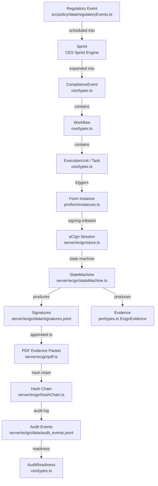

# 08 — CES / Events / Tasks / Forms / Evidence / Signature Architecture Map

**Generated:** 2026-05-12

---

## Overview

This document maps the complete flow from a **Regulatory Event** through **Task assignment** → **Form completion** → **Evidence capture** → **Electronic Signature (eCIgn)** to produce an **Audit-Ready Evidence Packet**.

---

## The Intended Flow



---

## Event Model

**Canonical type:** `ComplianceEvent` in `src/policy/ces/types.ts`

**Source of events (merged):**
1. **Static regulatory events** — `src/policy/data/regulatoryEvents.ts` + `mandatedEventsExpanded.ts` + `multiYearEvents.ts`
2. **CES seed events** — seeded into `complianceExecutionStore`
3. **Autogenerated events** — `src/policy/autogen/` engine
4. **Triggered events** — triggered by other event completions

**Merging logic:** `src/policy/compliance-execution/useEventExecutionDataflow.ts`

**Provenance type:** `ExecutionSource = 'regulatory' | 'ces-seed' | 'autogen' | 'triggered'`

### ComplianceEvent Key Fields
| Field | Type | Notes |
|---|---|---|
| `id` | string | Event ID |
| `title` | string | Event title |
| `category` | EventCategory | Type of compliance event |
| `domain` | ComplianceDomain | clinical / compliance / hr / governance |
| `complianceState` | ComplianceState | upcoming → ready → in_progress → awaiting_signature → blocked → completed |
| `auditReadiness` | AuditReadiness | not_ready / partial / ready |
| `dueDate` | string | Due date |
| `workflows` | Workflow[] | Nested workflow steps |
| `signers` | RequiredSigner[] | Required signers |
| `blockedReasons` | BlockedReason[] | Blocking conditions |

### Event ID Conventions
- Source regulatory event IDs: from `regulatoryEvents.ts` (format varies — e.g., `REG-001`, `MANDATED-*`)
- CES event IDs: generated via `eventInstanceId.ts`
- Sprint IDs: `src/policy/pm/sprintId.ts`

---

## Task Model

**Canonical PM task type:** `PmTask` in `src/policy/pm/types.ts`
**CES execution unit:** `ExecutionUnit` in `src/policy/ces/types.ts`

Both represent the same concept from different layers:
- `ExecutionUnit` = CES layer (compliance-centric view)
- `PmTask` = PM layer (project management view)

These are unified/projected via `taskProjection.ts` and `taskProjectionCore.ts`.

### PmTask Key Fields (from pm/types.ts, partial read)
| Field | Type | Notes |
|---|---|---|
| `id` | string | Task ID |
| `type` | PmTaskType | workflow_step / form_completion / form_review / evidence / approval / certification / personal |
| `status` | PmTaskStatus | todo / in_progress / in_review / blocked / done |
| `priority` | PmTaskPriority | low / medium / high / critical |
| `risk` | PmTaskRisk | low / medium / high / critical |
| `ecignInternal` | EcignInternal | eCIgn state machine value |
| `ecignPacketStatus` | EcignPacketStatus | UX-friendly packet status |
| `signers` | EcignPacketSigner[] | Signer roster |
| `evidence` | EcignEvidence[] | Evidence records |
| `auditLog` | EcignAuditEntry[] | Audit trail |

### Task Identity
**File:** `src/policy/compliance-execution/taskIdentity.ts`

Task IDs are computed deterministically from event + workflow + step + form. This enables idempotent task projection — the same task always gets the same ID regardless of how many times it is projected.

**Verification script:** `scripts/verifyTaskIdentity.ts`

---

## Form Model

**Key files:**
- `src/policy/data/formsCatalog.ts` — form catalog (index)
- `src/policy/data/formsLibraryContent.ts` and related — form body content
- `src/policy/pm/formInstances.ts` — form instance management
- `src/policy/pm/formInstancesCore.ts` — core instance logic
- `src/policy/compliance-execution/cesFormInstanceId.ts` — deterministic form instance ID

### Form Instance Flow
1. Task of type `form_completion` triggers form instance creation
2. Form instance ID is deterministically generated from event + task + form IDs (`cesFormInstanceId.ts`)
3. Form instance is sent to `/api/ecign` → `server/ecign/store.ts`
4. Stored in `server/ecign/data/form_instances.jsonl`

### Form Instance State Machine (server/ecign/stateMachine.ts)
```
created → disclosed → verified → reviewed → attested → signed_locked
                                                      ↘ voided
                                                      ↘ expired
```

---

## Evidence Model

**Key files:**
- `src/policy/evidence/evidenceModel.ts` — evidence model
- `src/policy/evidence/cesEvidenceHierarchy.ts` — hierarchy
- `src/policy/evidence/demoEvidenceRuntimeCache.ts` — demo cache
- `src/policy/pm/types.ts` — `EcignEvidence` type

### EcignEvidence Fields
| Field | Type | Notes |
|---|---|---|
| `evidence_id` | string | |
| `s3_bucket?` | string | Aspirational — S3 not wired in current backend |
| `s3_key?` | string | Aspirational |
| `sha256?` | string | Content hash |
| `status` | string | pending / generated / stored / linked / validated / archived |
| `created_at` | string | |

**Evidence hierarchy:** `cesEvidenceHierarchy.ts` maps evidence to events/workflows/units in a hierarchical structure.

---

## Signature / eCIgn Model

**Server state machine values (`EcignInternal`):**
```
none → created → disclosed → verified → reviewed → attested → signed_locked
                                                              ↘ voided
                                                              ↘ expired
```

**UX packet status (`EcignPacketStatus`):**
```
not_started → draft → submitted → awaiting_signature → awaiting_approval → completed
                                                     ↘ returned_for_correction → rejected → archived
```

**Signer statuses (`SignerStatus`):**
```
not_invited → invited → pending → signed / countersigned / declined / revoked
```

**Key integrity mechanisms:**
- `server/ecign/hashChain.ts` — hash chain ensures audit trail integrity
- `server/ecign/integrity.ts` — integrity verification
- `server/ecign/networkMetadata.ts` — captures IP, user-agent, timestamp for each signing event

---

## What Is Actually Implemented

| Capability | Status | Notes |
|---|---|---|
| Regulatory event sourcing | ✅ Implemented | Static TypeScript files |
| Event-to-sprint mapping | ✅ Implemented | CES sprint engine |
| Sprint kanban board | ✅ Implemented | CesBoardPage |
| Task projection (CES → PM) | ✅ Implemented | taskProjection.ts |
| Form catalog | ✅ Implemented | Static data |
| Form viewer | ✅ Implemented | FormViewer.tsx |
| Form instance creation | ✅ Implemented | cesFormInstanceId.ts + JSONL backend |
| eCIgn state machine (backend) | ✅ Implemented | server/ecign/stateMachine.ts |
| Signature capture (frontend) | ✅ Implemented | FormSigningWorkspace.tsx |
| Signature persistence | ✅ Implemented | JSONL (dev-grade) |
| Hash chain integrity | ✅ Implemented | server/ecign/hashChain.ts |
| Audit event logging | ✅ Implemented | JSONL audit_events |
| Evidence model | Partial | evidenceModel.ts exists; S3 fields aspirational |
| Evidence file storage | ❌ Not implemented | S3 fields in type, not wired |
| PDF evidence packet | Partial | pdf.ts + pdfAppendUtil.ts; completeness unclear |
| Approval flow | Partial | ApprovalFlow.tsx + approvals route |
| Demo mode isolation | ⚠️ Risk | demoLocalApi.ts bypasses all server calls |

---

## Where the Implementation Breaks

| Break Point | Description |
|---|---|
| State persistence | CES sprint/task state is in-memory — refreshing browser resets all progress |
| Evidence file storage | `EcignEvidence.s3_bucket/s3_key` present in type but S3 is not wired — evidence is logical, not file-based |
| Demo mode leakage | `demoLocalApi.ts` can be activated in non-demo environments if env var is set or code path is triggered |
| JSONL concurrency | JSONL files have no concurrent write protection — simultaneous users can corrupt state |
| Form instance sync | Form instances stored in JSONL are not synced back into the CES Zustand store in real-time |
| PDF appending | `pdfAppendUtil.ts` and `buildSignerRosterHtml.ts` suggest PDF manipulation — unclear if final signed PDFs are durably stored |
| Approval chain | Approval flow UI exists but whether approval decisions are persisted to server is unclear |

---

## Duplicate Task / Form / Evidence Paths Detected

| Duplicate | Path A | Path B | Notes |
|---|---|---|---|
| Task display | `src/policy/ces/pages/MyTasksPage.tsx` | `src/policy/components/pm/MyTasksPmPage.tsx` | Two different task views — CES layer vs PM layer |
| Evidence panel | `src/policy/components/regulatory/EvidencePanel.tsx` | `src/policy/onboarding-v2/components/EvidencePanel.tsx` | Different contexts, same name |
| Workflow drawer | `src/policy/ces/components/details/WorkflowDrawer.tsx` | `src/policy/components/regulatory/WorkflowDrawer.tsx` | Same name, different modules |
| Form instances | `src/policy/pm/formInstances.ts` | `src/policy/pm/formInstancesCore.ts` | Core vs full — relationship unclear |
| KPI tiles | `src/policy/components/regulatory/KpiTile.tsx` | `src/policy/onboarding-v2/components/KpiTile.tsx` | Same name, different contexts |

---

## ID Conventions Detected

| Entity | ID Convention | File |
|---|---|---|
| CES form instance | Deterministic hash from event+task+form | `cesFormInstanceId.ts` |
| Event instance | From `eventInstanceId.ts` | `compliance-execution/eventInstanceId.ts` |
| Sprint | From `sprintId.ts` | `pm/sprintId.ts` |
| Task identity | Computed deterministically | `compliance-execution/taskIdentity.ts` |
| eCIgn signer | `signer_id` (format unclear — not inspected) | `ecign/signerIdentity.ts` |

---

## Recommended Cleanup Notes (Not Implemented)

1. **Persist CES execution state to server** — Current in-memory pattern makes the system unable to survive browser refresh or multi-user use.
2. **Decommission JSONL in favor of DynamoDB** — The existing DynamoDB integration for auth should be extended to eCIgn.
3. **Wire S3 for evidence file storage** — The EcignEvidence type already models S3; backend just needs S3 client wiring.
4. **Consolidate duplicate evidence/task paths** — Unify CES MyTasksPage and PM MyTasksPmPage into a single source.
5. **Remove or gate demoLocalApi.ts** — Ensure demo API cannot run in production without explicit flag.
6. **Formalize PDF evidence packet storage** — Signed PDFs should be durably stored and retrievable by auditors.
