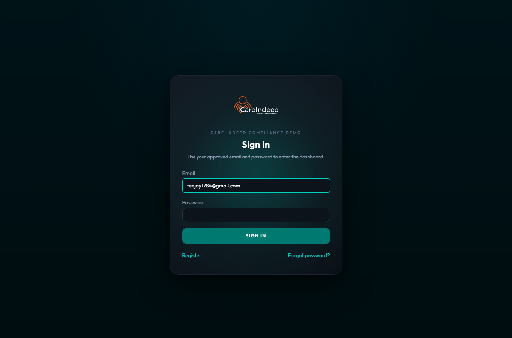
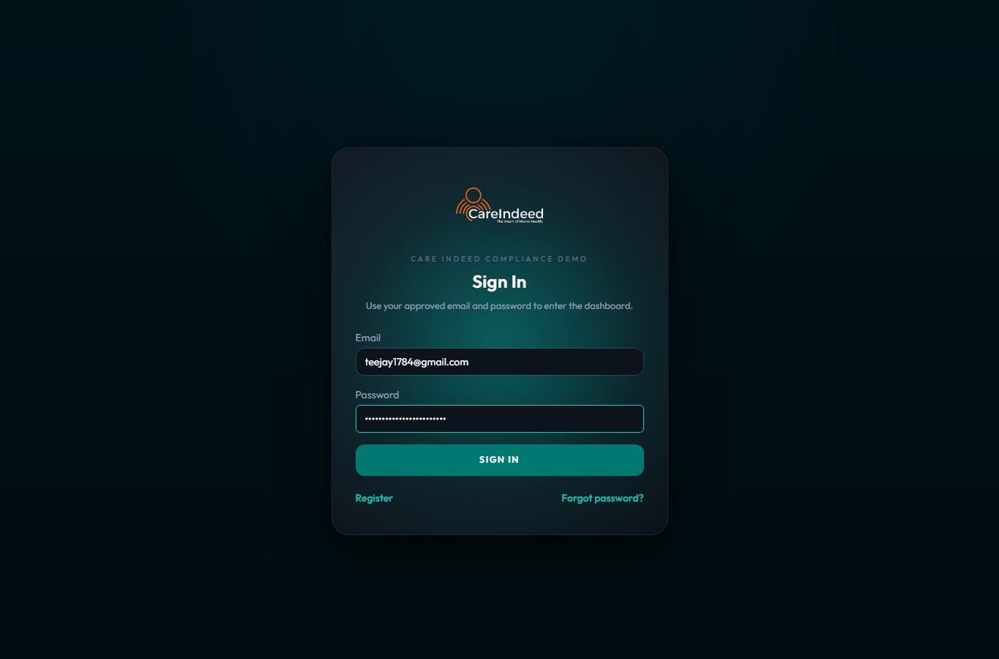
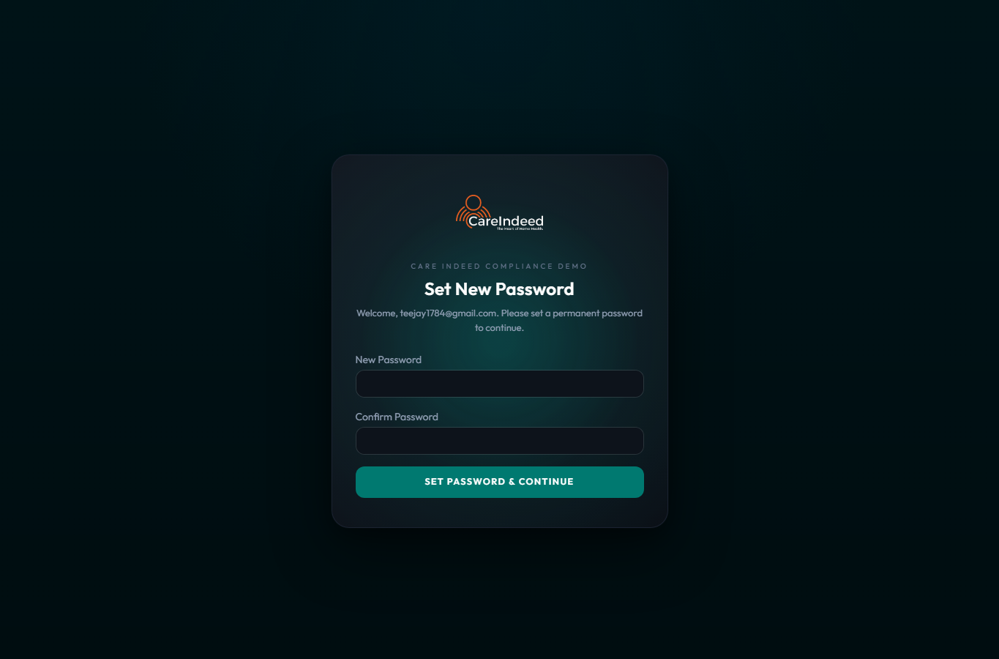
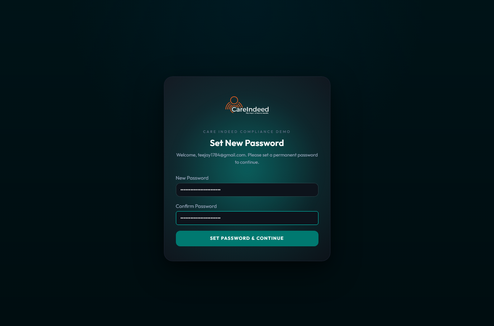
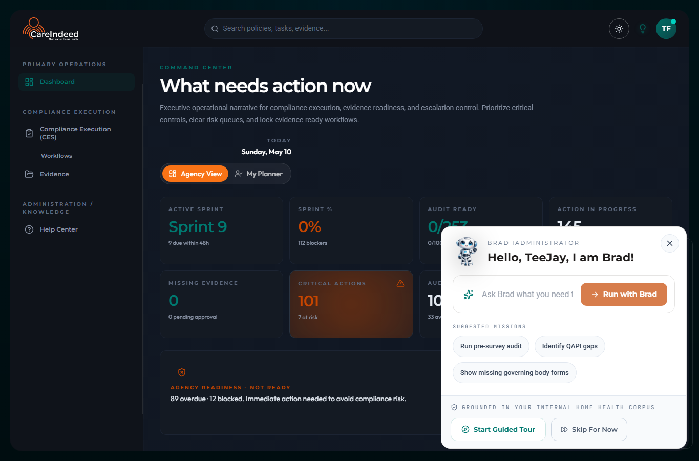

# First Login: Set Your Permanent Password

Use this guide when you receive a one-time temporary password from an administrator. The temporary password is only used for your first sign-in. After you enter it, the system will ask you to create a permanent password.

## Before You Start

- Use the email address your administrator registered for you.
- Use the temporary password provided by your administrator.
- Do not use the forgot-password link for first-time setup.
- Do not share or reuse temporary passwords.

## Step 1: Open The Sign-In Page

Go to the Care Indeed Compliance Demo sign-in page. Enter your registered email address.

## Step 2: Enter The Temporary Password

Enter the temporary password provided by your administrator, then select **Sign In**.

The password field will display dots for security.

## Step 3: Create A Permanent Password

If the temporary password is valid, you will be taken to the **Set New Password** page.

## Step 4: Confirm The New Password

Enter your new permanent password in both fields, then select **Set Password & Continue**.

Your new password must meet the password rules shown by the system. Use a strong password that you do not use for other accounts.

## Step 5: Confirm You Are Signed In

After the password is accepted, the app opens the dashboard.

## Troubleshooting

If sign-in does not continue to the new-password page, confirm that you entered the exact email address and temporary password provided by your administrator.

If the temporary password was already used, expired, or copied incorrectly, ask your administrator to generate a new one-time temporary password.

If the dashboard opens with a welcome assistant panel, you can select **Skip For Now** or continue with the guided tour.

## Support Notes

- This flow does not require email delivery.
- The temporary password is replaced by the permanent password after the first successful setup.
- Administrators should never send old temporary passwords again. Generate a fresh one-time temporary password when needed.
