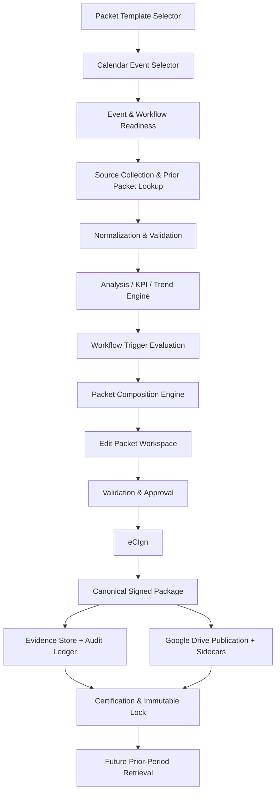

# Universal Mandated-Event Packet Platform
## Product Requirements Document and Implementation Specification

| Field | Value |
|---|---|
| Product | CI-ION Universal Mandated-Event Packet Platform |
| Organization | Care Indeed Home Health / Care Indeed Home Health Care, Inc. |
| Document type | Product Requirements Document (PRD) + implementation specification |
| Version | 1.0 |
| Status | Draft for implementation |
| Date | 2026-07-10 |
| Primary implementation target | Universal Packet Studio, with Quarterly QAPI as the first end-to-end implementation |
| Intended implementer | Product engineering / UltraCode |
| Classification | Internal — Compliance, Quality, Governance, and Engineering |
| Visual source of truth | Patient Admission Packet design system |
| Operational source of truth | CES event and workflow execution state, canonical workflow library, canonical forms library, eCIgn, evidence metadata, and audit ledger |

> **Normative language:** “MUST” and “MUST NOT” are mandatory. “SHOULD” is expected unless an approved exception is documented. “MAY” is optional.

---

# 1. Executive Summary

Care Indeed needs one governed platform that can generate, edit, approve, sign, publish, retrieve, compare, and lock compliance packets for mandated events. The platform must not become a collection of dozens of one-off PDF generators.

The product will provide:

1. A **Packet Template Selector** for choosing a packet archetype or governed template.
2. An embedded **calendar-based Event Selector** for choosing the exact mandated-event occurrence.
3. An event-bound generation engine that resolves the event’s workflow, forms, evidence, approvals, signatures, dependencies, retention, and confidentiality requirements.
4. A universal packet composition system based on **12 reusable packet archetypes**.
5. An **analysis-first Quarterly QAPI packet** with rich KPI dashboards, trend charts, source/form utilization analysis, triggered-workflow analysis, PIP/CAPA/RCA decisions, personnel-review handling, and forms placed after the analytical report as traceable attachments.
6. A governed **editing workspace** that supports direct editing, supplemental-information intake, evidence uploads, and Brad-assisted proposed changes.
7. A complete **eCIgn lifecycle** from readiness review through signer confirmation, signature completion, canonical signed-package creation, publication, certification, and immutable lock.
8. A **Google Drive longitudinal retrieval layer** so each QAPI packet can locate the prior valid packet and structured KPI snapshot for defensible trend analysis.
9. Deterministic identity, provenance, versioning, audit chronology, confidentiality controls, and fail-closed validation.

The first production-quality implementation is the Quarterly QAPI packet. Monthly QAPI must use the same analytical-report archetype. The architecture must then support Governing Body, Annual QAPI, PIP/CAPA, incident/RCA, survey/Plan of Correction, onboarding/competency, policy lifecycle, privacy/breach, emergency preparedness, surveillance, audit, and contract/vendor packets without duplicating the packet framework.

---

# 2. Product Vision

## 2.1 Vision statement

Create one event-driven packet platform that turns each mandated compliance event into a complete, analyzable, reviewable, signable, traceable, and immutable governance record.

## 2.2 Product promise

For any supported mandated event, an authorized user can:

1. Choose a governed packet template.
2. Select the correct event occurrence from the compliance calendar.
3. See whether a packet already exists.
4. Review source and prior-period readiness.
5. Generate an event-bound draft.
6. Understand the analysis, evidence, findings, triggered workflows, decisions, and missing information.
7. Edit directly, add additional information, or ask Brad for specific proposed edits.
8. Resolve blockers and obtain approvals.
9. Route the approved version through eCIgn.
10. Publish the signed artifact and structured sidecars to the governed Google Drive destination.
11. Certify and lock the final record.
12. Retrieve it later for trends, audit, survey, or amendment.

---

# 3. Problem Statement

## 3.1 Current problems to eliminate

The current packet-generation approach is vulnerable to the following failure modes:

- A packet can be generated from the wrong quarter or contain records from multiple quarters.
- Another agency’s data can be presented under Care Indeed branding.
- Missing values can be converted into false zeroes or false “compliant” statuses.
- Malformed text can become malformed KPI calculations or charts.
- Analysis can be buried behind forms or reduced to parser output.
- Forms can be attached as empty shells instead of completed operational records.
- A negative metric can be treated as an automatic PIP without materiality, recurrence, or prior-action analysis.
- Personnel-review triggers can be described as disciplinary actions before authorized HR or management review.
- Triggered workflows can be omitted, duplicated, or invented.
- A packet can be created without being bound to the correct event occurrence and workflow instance.
- Recurring event packets can overwrite one another.
- The prior QAPI packet may not be used, resulting in weak or fabricated trend analysis.
- Edits can invalidate calculations, approvals, signature envelopes, or hashes without clear impact analysis.
- Signed records can be disconnected from evidence, Google Drive publication, or audit history.
- A different renderer can be created for every event, producing visual and behavioral drift.

## 3.2 Business impact

These failures create:

- Survey and accreditation exposure.
- Weak Governing Body evidence.
- Incorrect QAPI decisions.
- Duplicate or missing corrective actions.
- Poor continuity across reporting periods.
- Inability to prove why a workflow or PIP was opened.
- Confidentiality and personnel-record exposure.
- Rework during audit or survey preparation.
- Unreliable signatures and packet versions.
- High engineering maintenance cost.

---

# 4. Goals and Non-Goals

## 4.1 Goals

### G1 — One universal framework

Build one packet composition and lifecycle platform, not a separate generator for every mandated event.

### G2 — Event-bound generation

Every operational packet must be tied to one agency, event family, event occurrence, workflow, workflow instance, reporting period, and packet instance.

### G3 — Analysis before attachments

Analytical and governance packets must explain what happened, why it matters, what evidence was used, what workflows were triggered, and what decisions are needed before presenting forms and attachments.

### G4 — Deterministic workflow orchestration

Resolve triggered workflows from the canonical workflow library and graph. Distinguish candidate, validated, activated, carried-forward, blocked, escalated, sustained, and closed workflows.

### G5 — Defensible longitudinal QAPI trends

Retrieve the prior valid QAPI packet and structured snapshot from the governed Google Drive location, validate comparability, and produce transparent period-over-period trends.

### G6 — Controlled human editing

Allow direct edits and supplemental-information intake while protecting computed values, maintaining provenance, and showing the impact of material changes.

### G7 — Brad as an assistant, not an authority

Brad may analyze and propose changes. Brad may not silently edit, approve, sign, activate a workflow, impose discipline, or certify a packet.

### G8 — Complete eCIgn lifecycle

Support approval readiness, signer confirmation, envelope preparation, sending, tracking, signed-package creation, evidence publication, certification, lock, amendment, and supersession.

### G9 — Reproducibility and auditability

The same validated inputs and rules must produce the same material analytical results, workflow decisions, and structured snapshots.

### G10 — Survey-ready output

Produce polished, readable, branded, paginated PDF packets and machine-readable sidecars with full evidence traceability.

## 4.2 Non-goals

The first release will not:

- Build a bespoke renderer for every mandated event.
- Replace the Master Calendar, CES workflow engine, forms library, or eCIgn engine.
- Make autonomous clinical, HR, legal, disciplinary, or Governing Body decisions.
- Use Google Drive as the sole transactional source of truth for execution state.
- Infer missing data as zero or “none.”
- Use OCR as the primary way to reconstruct a prior packet when structured data exists.
- Rebuild Journey as a second LMS or a separate calendar/task/signature system.
- Fully implement every P0, P1, and P2 packet archetype in the same release.
- Permit direct edits to locked or fully signed packets.
- Permit packet generation without an event occurrence, except for explicitly configured non-event administrative drafts that cannot be certified or locked.

---

# 5. Product Principles

1. **Select the template, then select the event.**
2. **The calendar supplies the occurrence and reporting period.**
3. **The event supplies the workflow, forms, evidence, roles, and gates.**
4. **The archetype supplies the packet structure.**
5. **The source data supplies the facts.**
6. **The rules engine supplies calculations and trigger evaluations.**
7. **Human reviewers supply validation and authority.**
8. **eCIgn supplies controlled signature and lock.**
9. **Evidence metadata and hashes supply provenance.**
10. **Google Drive supplies governed publication and longitudinal retrieval.**
11. **Brad supplies proposed assistance, never silent mutation.**
12. **Missing evidence remains missing.**
13. **Locked records are immutable.**
14. **Configuration is preferred over bespoke code.**

---

# 6. Users, Roles, and Permissions

## 6.1 Primary personas

### Packet Coordinator

Creates drafts, uploads sources, adds information, completes packet sections, coordinates forms, and resolves non-approval issues.

### QAPI Lead / QAPI Committee Chair

Validates metrics, findings, trends, PIP decisions, action items, and QAPI recommendations.

### Director of Nursing / Clinical Manager

Validates clinical findings, clinical risk, PIP recommendations, competency or clinical personnel-review triggers, and clinical sign-offs.

### Administrator

Approves governance content, confirms agency authority, signs required attestations, and certifies final records where assigned.

### Compliance Officer

Validates regulatory, privacy, billing, investigation, workflow-trigger, and confidentiality requirements.

### HR / Restricted Personnel Reviewer

Reviews confidential personnel triggers, investigations, remediation, and discipline. Personnel details remain outside the general packet.

### Governing Body Member / Chair

Reviews packet recommendations, motions, decisions, PIPs, policy approvals, escalations, and governance attestations.

### Signature Coordinator

Confirms signer identity, authority, order, access, due date, and eCIgn envelope readiness.

### Certifier

Verifies the signed package, evidence publication, hashes, and lock readiness.

### Auditor / Surveyor Read-Only User

Reads packets, evidence manifests, Drive artifacts, workflow lineage, signatures, and audit chronology without mutation rights.

### Brad

A restricted AI assistant that may retrieve, explain, compare, summarize, and propose patches within the user’s authorization scope.

## 6.2 Permission model

| Capability | Viewer | Contributor | Reviewer | Packet Owner | Approver | Signature Coordinator | Certifier | Restricted Reviewer |
|---|:---:|:---:|:---:|:---:|:---:|:---:|:---:|:---:|
| View permitted packet content | Yes | Yes | Yes | Yes | Yes | Yes | Yes | Yes |
| Add supplemental information | No | Yes | Yes | Yes | No | No | No | Scoped |
| Upload evidence | No | Yes | Yes | Yes | No | No | No | Scoped |
| Edit authorized narrative | No | Suggest | Yes | Yes | No | No | No | Scoped |
| Validate sources/findings | No | No | Yes | Yes | Yes | No | No | Scoped |
| Confirm workflow trigger | No | No | Yes | Yes | Yes | No | No | Scoped |
| Approve packet content | No | No | No | No | Yes | No | No | Scoped |
| Prepare/send eCIgn | No | No | No | No | No | Yes | No | No |
| Certify and lock | No | No | No | No | No | No | Yes | No |
| View confidential addendum | No | No | Scoped | Scoped | Scoped | Access-dependent | Access-dependent | Yes |
| Create amendment | No | No | Scoped | Yes | Yes | No | Yes | Scoped |

All permissions must be role- and resource-scoped. Brad must never expand a user’s access.

---

# 7. Scope and Release Strategy

## 7.1 Current implementation scope

The current implementation must:

1. Build the universal packet contracts, module registry, rendering framework, and lifecycle foundation.
2. Implement the Packet Template Selector.
3. Integrate the canonical calendar UI as the Event Selector.
4. Implement Quarterly QAPI end to end.
5. Support Monthly QAPI through the same analytical-report archetype.
6. Implement prior-QAPI Google Drive retrieval and structured trend snapshots.
7. Implement direct editing, Add Information, Brad proposal workflow, validation, approval, eCIgn, publication, certification, and lock.
8. Preserve the active quarter/agency parsing fixes.
9. Create the event-to-archetype mapping registry and coverage report.
10. Prove idempotency, versioning, amendment, and no-duplicate behavior.

## 7.2 P0 packet rollout

1. Governing Body Meeting Packet
2. Annual QAPI Evaluation and Plan Packet
3. PIP/CAPA Packet
4. Incident/Adverse Event/RCA Packet
5. Survey, Deficiency, and Plan-of-Correction Packet
6. Employee Onboarding and Competency Packet

## 7.3 P1 packet rollout

1. Policy Lifecycle Packet
2. Privacy, Security Incident, and Breach Packet
3. Emergency Preparedness Packet
4. Infection Prevention and Surveillance Packet
5. Personnel and Credentialing Audit Packet
6. Compliance Committee Packet
7. Risk and Safety Committee Packet
8. Billing, Claims, and Overpayment Audit Packet

## 7.4 P2 packet rollout

- Vendor and Business Associate oversight
- Licensure/accreditation renewal
- Contract review and renewal
- Change of ownership, closure, or branch opening
- Records destruction and legal hold
- Annual enterprise compliance-program evaluation
- Audit-readiness or mock-survey
- Training-program annual evaluation

---

# 8. Existing-System Boundaries and Source-of-Truth Rules

## 8.1 Canonical responsibilities

| System/component | Responsibility |
|---|---|
| CES / regulatory execution | Event occurrence, workflow phase, required forms, dependencies, completion gates, compliance status |
| Canonical workflow library and graph | Workflow definitions, triggers, roles, approvals, forms, policy references, downstream relationships |
| Canonical forms library | Form definitions, versions, required fields, orientation, signature fields, rendering contracts |
| Packet Platform | Packet identity, composition, analytical model, editing, versioning, readiness, manifests, rendering |
| eCIgn | Controlled disclosure, verification, review, attestation, signature, envelope status, signed lock, signature evidence |
| Evidence service / audit ledger | Evidence metadata, hashes, immutable audit events, retention, access classification |
| Google Drive integration | Governed publication copy, sidecars, longitudinal QAPI retrieval, user-facing artifact links |
| Brad / iAdministrator | Retrieval, explanation, analysis, comparison, proposed edits, citations, impact summary |
| PM/My Tasks/Kanban | Read-mostly projections of canonical work; must not independently mark compliance complete |

## 8.2 Prohibited source-of-truth drift

- Packet Studio must not create a second event system.
- Packet Studio must not own workflow completion independently of CES.
- eCIgn must not directly mutate event/workflow status outside the established reconciliation path.
- Google Drive must not be treated as the sole authority for packet status, signatures, or hashes.
- PM views must not mark packets or forms complete.
- Brad must not write directly to authoritative records without a reviewed and accepted patch.

## 8.3 High-level architecture



---

# 9. Universal Packet Archetypes

The product must provide 12 reusable archetypes.

| Archetype ID | Name | Primary uses |
|---|---|---|
| `meeting` | Meeting Packet | Governing Body, Compliance, Risk, Safety, committees |
| `analytical-report` | Analytical Report Packet | Monthly, quarterly, annual QAPI; program evaluations |
| `pip-capa` | PIP/CAPA Packet | PIP, CAP, corrective action, effectiveness and closure |
| `incident-investigation` | Incident/Investigation Packet | Falls, medication events, hospitalizations, near misses, RCA |
| `survey-response` | Survey/Response Packet | ACHC, CMS, CDPH, OSHA, payer audits, plans of correction |
| `employee-competency` | Employee Competency Packet | Onboarding, competency, clearance, annual revalidation |
| `policy-lifecycle` | Policy Lifecycle Packet | Review, revision, approval, publication, acknowledgment |
| `privacy-breach` | Privacy/Breach Packet | HIPAA/CMIA incidents, breach assessments, notification |
| `emergency-drill` | Emergency Drill Packet | Tabletop, community drill, actual activation, annual review |
| `program-surveillance` | Program Surveillance Packet | Infection prevention and other recurring surveillance |
| `audit` | Audit Packet | Personnel, credentialing, billing, claims, documentation, compliance |
| `contract-vendor` | Contract/Vendor Packet | Vendors, BAAs, contracts, renewals, due diligence |

## 9.1 No-bespoke-renderer rule

A new event should normally require configuration, not a new renderer.

Event-specific code is allowed only for:

- A validated source adapter.
- A unique analytical computation.
- A subtype module with genuinely unique semantics.
- A required regulatory transformation.

Even then, the result must conform to universal packet contracts.

---

# 10. Universal Packet Backbone

Unless an archetype marks a section not applicable, every packet must contain:

1. Branded cover
2. Packet identity and status
3. Validation and lock readiness
4. Executive summary or executive analysis
5. Trigger and originating workflow
6. Scope and reporting period
7. Source and required-form completion matrix
8. Analytical findings
9. Risks, gaps, and exceptions
10. Triggered workflows and resulting actions
11. Decisions and approvals
12. Action items, owners, and deadlines
13. Evidence index with Google Drive links
14. Missing-evidence disclosure
15. Signature and attestation page
16. Audit chronology
17. Final certification and lock record
18. Attachment manifest
19. Supporting forms and evidence

Analytical packets must place analysis, dashboards, trends, decisions, and actions before forms.

---

# 11. Core User Journey

```text
Choose packet template
→ Calendar filters to compatible event occurrences
→ Select exact event occurrence
→ Review event identity, existing packet, and prior-period readiness
→ Open existing draft or generate a new draft
→ Add sources and evidence
→ Normalize and validate data
→ Retrieve prior QAPI packet when applicable
→ Generate analysis, KPIs, trends, findings, and workflow trigger evaluations
→ Review and edit packet
→ Add supplemental information or evidence
→ Ask Brad for specific proposed edits when useful
→ Review impact and accept/reject changes
→ Resolve blockers and warnings
→ Approve packet content
→ Confirm signers and access
→ Prepare and send eCIgn envelope
→ Complete required signatures
→ Build canonical signed package
→ Publish artifacts and sidecars to Google Drive
→ Certify and lock
→ Retrieve later for audit, trends, amendment, or supersession
```

---

# 12. Functional Requirements

## FR-001 — Packet Template Selector

The first step in Packet Studio must be a Packet Template Selector.

### Requirements

- Display template cards with title, description, archetype, category, availability, and last-used date.
- Support search, categories, favorites, and recently used templates.
- Show status: `Available`, `Planned`, `Needs configuration`, or `Restricted`.
- Resolve the template’s compatible event families and workflows.
- Filter the calendar to compatible event occurrences.
- Do not create an operational packet from a template alone.

### Template selection output

```text
packet_archetype_id
packet_template_id
compatible_event_family_ids
compatible_workflow_ids
required_modules
required_analyses
required_forms
required_approvers
required_signers
completion_gates
retention_rule
confidentiality_rule
Drive_destination_pattern
```

## FR-002 — Calendar-Based Event Selector

The second step must use the canonical Master Calendar / CES Calendar UI.

### Views

- Month
- Week
- Agenda/list
- Previous/next period
- Today
- Search

### Filters

- Domain
- Event family
- Workflow
- Owner
- Packet status
- Workflow status
- Eligible only
- Existing draft
- Signed/locked
- Blocked
- Past due
- Completed
- Cancelled

### Event card fields

- Event title
- Event date
- Reporting period
- Event-family ID
- Event-instance ID
- Workflow ID
- Workflow-instance ID
- Owner
- Event status
- Packet status
- Required-form completion
- Evidence completeness
- Approval status
- Signature status
- Blocker count

### Selection drawer

The drawer must show:

- Agency
- Event and workflow identity
- Cadence and regulatory driver
- Reporting period
- Selected packet template and compatibility
- Required forms and evidence
- Required approvals and signers
- Open dependencies and blockers
- Existing packet status
- Prior-period packet status
- Trend-comparison readiness
- Drive destination

### Actions

- Generate new packet
- Open existing draft
- Continue review
- Track signatures
- View signed packet
- Open in Google Drive
- Create amendment
- Create superseding version
- Cancel

## FR-003 — Event and Template Binding

A packet must bind to:

```text
agency_id
event_family_id
event_instance_id
workflow_id
workflow_instance_id
packet_template_id
packet_archetype_id
packet_instance_id
reporting_period_start
reporting_period_end
```

The packet must inherit reporting period, forms, dependencies, roles, due dates, approvals, signers, retention, and gates from the selected event/workflow unless an approved mapping rule adds stricter requirements.

The user must not manually select a quarter, meeting date, or workflow that conflicts with the event.

## FR-004 — Existing Packet Detection

Before generation, search by:

```text
agency_id + event_instance_id + workflow_instance_id + packet_template_id
```

### Behavior

- Draft/review packet: open existing packet; do not duplicate.
- Sent for signature: track or void/correct; do not duplicate.
- Signed/published/locked: view or amend; do not overwrite.
- A duplicate-generation attempt must be rejected or idempotently return the existing packet.

## FR-005 — Recurring Event Instances

Each event occurrence must have its own:

- Event-instance ID
- Workflow-instance ID
- Packet-instance ID
- Reporting period
- Forms
- Evidence
- Approvals
- Signatures
- Final artifact

A locked packet must never be overwritten. Revisions after lock require amendment or supersession.

## FR-006 — Source Collection and Dataset Segmentation

The system must accept:

- Files
- Forms
- Spreadsheets
- PDFs
- Images
- Structured exports
- Notes
- Existing evidence references
- Google Drive links to authorized evidence

Before analysis, the system must segment sources by:

- Dataset ID
- Agency ID
- Quarter or period
- Record section boundaries
- Event date
- Source offsets or equivalent segment identifiers

### Hard stops

- Never mix agencies.
- Never mix reporting periods.
- Permit post-period governance dates only when they belong to the selected event, such as a Q1 meeting held in April.
- Reject post-period operational records belonging to the next period.
- Never convert missing values to zero, none, OK, or compliant.
- Use `UNKNOWN — NOT RECOVERED` where evidence is unavailable.
- Do not treat keyword matches as validated findings.

## FR-007 — Source and Form Utilization Analysis

Every analytical packet must include a section titled **Sources and Forms Used in This Review**.

| Form/source | Purpose | Records reviewed | Findings produced | Validation status | Attachment |
|---|---|---:|---|---|---|

The system must also identify:

- Expected but missing forms
- Supplied but unused forms and reason
- Generated forms triggered by findings
- Prior-period forms carried forward
- Forms requiring manual completion
- Conflicts between sources
- Excluded source segments and reason

## FR-008 — KPI Definition and Calculation Engine

Each KPI must have a machine-readable definition:

- Indicator ID and title
- Cohort
- Numerator
- Denominator
- Exclusions
- Measurement period
- Unit
- Formula
- Target
- Threshold
- Threshold direction
- Benchmark source
- Source records
- Definition version
- Validation status

### Rules

- Calculate rates from numeric fields.
- Reject malformed concatenated values.
- Handle zero denominators explicitly.
- Distinguish counts, percentages, rates, days, and currency.
- Show numerator and denominator with each rate.
- Respect higher-is-better, lower-is-better, and range thresholds.
- Reconcile dashboard, analysis, forms, charts, and sidecars.
- Use one shared data object for each chart and its accessible table.

## FR-009 — Rich KPI Dashboard

QAPI and other analytical packets must begin with one or two dashboard pages immediately after executive analysis.

### Minimum QAPI KPI cards

- Patients or episodes in scope
- Active census
- Hospitalizations
- ED use
- Adverse events
- Infection cases
- Documentation-audit compliance
- Medication-reconciliation compliance
- Missed-visit compliance
- Complaints and grievances
- Active PIPs
- Open CAPs or RCAs

Each card must show:

- Current value
- Numerator and denominator
- Target
- Prior-period value
- Direction of trend
- Status
- Source
- Confidence/validation state

### Supported charts

- Monthly performance against target
- Current versus prior period
- Up to four prior quarters or rolling monthly history
- Adverse events by category
- Infection trends and classification
- Documentation deficiencies by type
- PIP/CAP status by stage
- Complaints by category and resolution status

Charts must never be generated from malformed or unvalidated values.

## FR-010 — Executive Analysis

The executive analysis must explain:

- Sources uploaded
- Accepted reporting period
- Included and excluded records
- Forms/logs used
- Missing expected forms
- Unvalidated data
- Major trends
- Measures above and below threshold
- Adverse events, infections, complaints, audit deficiencies, and compliance issues
- Immediate actions
- Continued monitoring
- Governing Body decisions
- Prior-period action status
- Triggered workflows
- PIP/CAPA/RCA/personnel-review determinations

It must read as a professional QAPI or governance analysis, not raw parser output.

## FR-011 — Finding Model

Every finding must include:

- Finding ID
- Category
- Description
- Evidence
- Source records/forms
- Materiality
- Severity
- Scope
- Recurrence
- Current state
- Prior-period relationship
- Risk type
- Recommended decision
- Required human reviewer
- Related workflow-trigger evaluations
- Attachment references

## FR-012 — Canonical Workflow Trigger Evaluation

The system must identify:

- Primary review workflow
- Feeder workflows
- Triggered workflow candidates
- Activated downstream workflows
- Carry-forward workflows
- Escalation workflows
- Blocking workflows
- Sustained or closed workflows

Workflow resolution must use the canonical workflow library and graph, including trigger definitions, forms, policy references, roles, approvals, dependencies, and current workflow version.

If no canonical workflow resolves, show:

`WORKFLOW UNRESOLVED — HUMAN CONFIGURATION REQUIRED`

Keyword similarity may suggest a candidate but must not activate it.

### Workflow states

- `NOT TRIGGERED`
- `CANDIDATE — NEEDS VALIDATION`
- `PENDING AUTHORIZED REVIEW`
- `CONFIRMED — NOT YET ACTIVATED`
- `ACTIVATED`
- `LINKED TO EXISTING ACTIVE WORKFLOW`
- `CONTINUED FROM PRIOR PERIOD`
- `BLOCKED`
- `ESCALATED`
- `SUSTAINMENT MONITORING`
- `CLOSED`
- `WORKFLOW UNRESOLVED`

## FR-013 — Triggered Workflow and Dependency Register

Each packet must include:

| Finding | Trigger rule | Workflow ID/title | Decision state | Existing/new | Owner | Approver | Due date | Required forms | Dependencies/blockers | Rationale | Attachment |
|---|---|---|---|---|---|---|---|---|---|---|---|

Material non-trigger decisions must also be recorded with rationale.

## FR-014 — Workflow Activation and Deduplication

A workflow may activate only when:

1. Agency and period are validated.
2. Evidence supports the finding.
3. The canonical trigger resolves.
4. Required values and recurrence conditions are available.
5. Source conflicts do not invalidate the trigger.
6. No active workflow already covers the issue.
7. Required human confirmation exists.
8. The activating user has authority.

Use an idempotency key based on:

```text
agency_id + reporting_period + finding_id + trigger_rule_id + canonical_workflow_id
```

Do not create a new PIP each quarter when an existing PIP covers the same root issue.

## FR-015 — PIP, CAP, RCA, and Personnel-Review Decision Logic

The product must distinguish:

- Finding
- Trigger
- Corrective action
- CAP
- RCA
- PIP
- Personnel review
- Workflow
- Governing Body escalation

### Determination options

- No action
- Correct locally
- Monitor
- Open CAP
- Initiate RCA
- New PIP
- Continue existing PIP
- Revise existing PIP
- Move to sustainment
- Close
- Escalate to Governing Body

### PIP evaluation factors

- Materiality
- Recurrence
- Trend duration
- Control-limit behavior
- Patient-safety impact
- Regulatory impact
- Financial impact
- Cross-patient/staff/location scope
- Prior corrective actions
- Existing PIP coverage
- Root-cause evidence
- Measurement feasibility
- QAPI Committee authorization

### Personnel-review rule

The system may state `Personnel-review threshold met`.

It must not state `Discipline imposed` unless an authorized HR or management reviewer recorded that determination.

## FR-016 — Canonical Form Injection

Required forms must come from the canonical forms library.

Each form instance must include:

- Canonical form ID/title/version
- Form-instance ID
- Event ID
- Workflow-instance ID
- Source/generated classification
- Draft/completed/approved/signed/locked status
- Required fields
- Signers
- Evidence references
- Creation and modification timestamps
- Content hash
- Attachment reference

No empty form shell may be labeled complete.

Conditional forms must generate only when their trigger is validated.

Annual forms must not appear in quarterly packets unless cadence or trigger requires them.

## FR-017 — Packet Composition and Rendering

The renderer must consume a packet model rather than page-specific conditionals.

### Visual requirements

Use the Patient Admission Packet as the design source of truth:

- Teal/orange top accent rail
- Care Indeed logo placement
- Large left-aligned title
- Restrained typography
- White background
- Thin neutral borders
- Rounded information panels
- Consistent margins
- Headers, footers, and page numbering
- Handling/classification notice
- Repeating packet ID, period, status, and classification

### Rendering requirements

- Letter size
- No clipped tables or charts
- Repeated table headers
- No orphan headings
- No accidental blank pages
- Accessible chart tables
- Status text plus icon, not color alone
- Forms begin on new pages
- Confidential attachments have correct watermark
- PDF outline/bookmarks follow packet hierarchy
- Attachment page references resolve

## FR-018 — Packet Editing Workspace

The workspace must use three panels.

### Left — Packet outline

Show sections, KPIs, findings, workflows, decisions, forms, attachments, confidential addendums, signatures, and validation status.

### Center — Live preview

Show the actual packet rendering, page navigation, zoom, form preview, evidence links, workflow-to-form links, and signature placement.

### Right — Tabs

1. Edit
2. Add Information
3. Ask Brad
4. Sources
5. Validation
6. History

Users must be able to edit without using Brad.

## FR-019 — Add Information

Accept:

- Pasted text
- Structured notes
- Meeting notes
- Corrections
- Metric values
- Event records
- Files
- Forms
- Images
- PDFs
- Spreadsheets
- Evidence
- Google Drive links
- Placement instructions

Each item must pass through:

```text
RECEIVED → CLASSIFIED → MAPPED → VALIDATED → ACCEPTED/REJECTED → APPLIED
```

### Classification options

- Source evidence
- Corrected source data
- Supplemental evidence
- Meeting discussion
- Management explanation
- Reviewer note
- Packet narrative
- KPI input
- Finding response
- Corrective-action update
- Workflow update
- Signature/approval information
- Attachment
- Confidential personnel information
- Legal/privileged information

### Destination options

- Executive analysis
- Specific finding
- KPI
- Triggered workflow
- Action item
- Specific form
- New attachment
- Evidence index
- Confidential addendum
- Replace/correct value
- Reviewer note only
- Exclude from final packet

The user must preview the destination before applying.

## FR-020 — Direct Editing

Authorized users may:

- Edit narrative
- Add management commentary
- Add committee discussion
- Revise recommendations
- Add decisions and actions
- Assign owners and due dates
- Complete missing form fields
- Correct source mappings
- Mark data unknown
- Reject unsupported findings
- Confirm/reject workflow triggers
- Link to an existing workflow
- Request workflow activation
- Add optional sections

Users may not directly overwrite computed KPIs, rates, aggregates, trigger outcomes, hashes, signature status, or evidence validation. They must correct the source and allow recomputation.

## FR-021 — Brad-Assisted Editing

Brad may respond to specific requests such as:

- Add an explanation to a finding.
- Rewrite the executive summary.
- Explain why a PIP was triggered.
- Compare periods.
- Add an uploaded audit to the evidence index.
- Correct a value from a new source.
- Draft a CAP from a confirmed finding.
- Move an attachment to a confidential addendum.
- Explain workflow impact.
- Draft a motion for Governing Body consideration.

Brad must return a proposed patch containing:

- Requested change
- Existing content
- Proposed content
- Reason
- Sources
- Pages affected
- KPIs affected
- Findings affected
- Workflows affected
- Forms affected
- Approvals/signatures affected
- Validation effect
- Regeneration requirement

User actions:

- Accept
- Accept all related changes
- Modify
- Reject
- Save as reviewer note

Brad must never silently mutate the packet.

## FR-022 — Edit Impact Analysis

Every material edit must determine impact on:

- KPI calculations
- Trends
- Findings
- Risk ratings
- PIP/CAP/RCA decisions
- Workflow triggers and instances
- Required forms
- Actions
- Governing Body recommendations
- Approvals
- Signers
- Attachments
- Confidentiality
- Hashes
- Pagination
- eCIgn envelope validity
- Lock eligibility

Before applying a material edit, show a human-readable impact summary.

## FR-023 — Versioning and Change History

Track:

- Packet version/revision
- Editor and role
- Timestamp
- Change type
- Before/after
- Reason
- Sources
- Brad involvement
- Approval/signature/hash impact

Provide section-, page-, data-, attachment-, workflow-, and signature-requirement diffs.

## FR-024 — Validation Severity

### Blocker

Prevents final approval and lock.

Examples:

- Agency mismatch
- Period contamination
- Missing primary workflow
- Malformed KPI
- Missing required feeder workflow
- Missing required source form
- Missing signer or authority
- Material source conflict
- Duplicate workflow instance
- Missing required PIP/CAP/RCA evidence
- Confidential personnel data in general packet

### Warning

Allows draft review but requires acknowledgment.

### Advisory

Informational only.

The packet-control page must show counts and lock eligibility.

## FR-025 — Approval Readiness Review

Before eCIgn, show:

- Packet identity/version
- Event/workflow
- Reporting period
- Blockers/warnings
- Missing/incomplete forms
- Missing/unvalidated evidence
- Open workflow candidates
- Activated workflows
- Outstanding decisions
- Confidential addendums
- Approvers/signers
- Dual-capacity eligibility
- Page count
- Hash status
- Drive destination
- Lock eligibility

Actions:

- Return for correction
- Approve content
- Approve with documented exception
- Reject
- Proceed to signer confirmation

## FR-026 — Signer Confirmation

Display:

| Required capacity | Signer | Authority verified | Order | Required/optional | Dual-capacity rule | Status |
|---|---|---|---|---|---|---|

Confirm identity, email, role, authority, sequence, attachment access, due date, expiration, reminders, and confidentiality.

One signer may satisfy two capacities only when an explicit dual-capacity rule permits it and the record shows both capacities.

## FR-027 — eCIgn Envelope Preparation

The system must:

1. Freeze the approved packet version.
2. Generate the pre-signature PDF.
3. Generate attachment and evidence manifests.
4. Generate signature placement map.
5. Generate content hash.
6. Bind the envelope to packet, version, event, workflow, and hash.
7. Create signer tasks.
8. Create the eCIgn envelope.
9. Present an envelope preview.

An envelope must not be created from an unapproved draft.

## FR-028 — eCIgn Sending and Tracking

Support:

- Send now
- Schedule send
- Save prepared envelope
- Cancel before send
- Resend
- Reminder
- Replace signer where permitted
- Extend expiration
- Void
- Return for correction

Track prepared, sent, delivered, viewed, partially signed, completed, declined, expired, voided, and failed states.

## FR-029 — Editing After eCIgn

### Prepared but not sent

Cancel prepared envelope, preserve audit, reopen packet, reapprove, and create a new envelope.

### Sent but not fully signed

Void envelope, preserve activity, create a new packet version, revalidate, reapprove, and issue a new envelope.

### Fully signed

The packet is immutable. Corrections require amendment, addendum, replacement, or superseding packet.

## FR-030 — Canonical Signed Package

After all signatures, generate one canonical package containing:

- Final signed packet
- Attachments
- Signature certificate
- Signer audit trail
- Attachment manifest
- Evidence manifest
- Approval record
- Packet content hash
- Signed-package hash
- Certification record
- Confidential-addendum references
- Amendment/supersession references

All related records must reference one stable signed-package ID.

## FR-031 — Google Drive Publication

After signing:

1. Verify signatures and hashes.
2. Verify required attachments and confidentiality.
3. Publish the canonical PDF and structured sidecars to the deterministic Drive destination.
4. Store file and folder URLs.
5. Update evidence and packet metadata.
6. Emit audit events.
7. Mark `PUBLISHED`.
8. Permit certification and lock.

Publication must be idempotent and must not create duplicate Drive artifacts.

## FR-032 — Certification and Lock

The certifier must verify packet identity, reporting period, workflow, version, forms, evidence, approvals, signatures, authority, confidentiality, hashes, Drive publication, retention, and zero unresolved blockers.

After certification:

- Lock packet.
- Lock final form instances.
- Lock evidence manifest.
- Lock signature record.
- Prevent silent changes.
- Permit only amendment or supersession.

## FR-033 — Audit Chronology

Record every:

- Template selection
- Event selection
- Prior-packet lookup
- Source upload
- Validation
- Calculation
- Trigger evaluation
- Workflow activation
- Form generation
- Edit
- Brad proposal and user decision
- Approval
- Envelope action
- Signer action
- Publication
- Certification
- Lock
- Amendment
- Supersession

---

# 13. Quarterly QAPI Product Requirements

## 13.1 Packet order

### Part I — Governance and analytical report

1. Cover page
2. Packet control, source validation, and readiness
3. Executive analysis
4. Rich KPI dashboard
5. Source, feeder-workflow, and form utilization analysis
6. Detailed findings and trend analysis
7. PIP, CAP, RCA, personnel-review, and other action determinations
8. Triggered Workflow and Dependency Register
9. QAPI Committee and Governing Body decisions requested
10. Action-item, workflow, and accountability register
11. Approvals, eCIgn status, and lock-readiness certification

### Part II — Supporting attachments

12. Attachment manifest
13. Completed source forms
14. Generated PIP/CAP/RCA/corrective-action forms
15. Triggered workflow execution packages
16. Confidential personnel-review addendum reference
17. Source derivation, reconciliation, and evidence provenance
18. Superseded or excluded-source register

## 13.2 Cover fields

- Quarterly QAPI Committee Review
- Quarter and reporting period
- Interim/final status
- Meeting date
- Packet ID
- Event ID
- Workflow ID
- Data-through date
- Agency
- Prepared by
- Reviewed by
- Approval/lock status
- Policy/workflow references
- Classification
- Synthetic UAT warning when applicable
- Blocker/warning/advisory counts

## 13.3 Required analysis

The QAPI packet must explain:

- Which forms were used
- Which findings each form produced
- Which forms were expected but missing
- Which forms were generated because of a trigger
- Which PIPs, CAPs, RCAs, or personnel reviews were considered
- Which were opened, continued, revised, sustained, closed, or not triggered
- Why each decision was made
- Which triggered workflows resulted
- Which prior actions carried forward
- Which Governing Body actions are requested

## 13.4 Personnel confidentiality

The general QAPI report may show only aggregated personnel-review information:

- Trigger category
- Count
- Policy/rule
- Reason for review
- Status
- Required reviewer

Employee names, allegations, investigation facts, sanctions, or confidential HR details must remain in a restricted addendum.

## 13.5 Prior-period continuity

Retrieve:

- Prior KPIs
- Prior findings
- Active PIPs/CAPs/RCAs
- Prior actions
- Governing Body directives
- Training assignments
- Policy revisions
- IT change requests
- Prior exceptions/blockers

Classify each as completed, open, overdue, extended, escalated, ineffective, improving, worsening, reopened, or missing evidence.

---

# 14. Google Drive Prior-QAPI Retrieval and Trend Analysis

## 14.1 Required behavior

Before generating Monthly, Quarterly, or Annual QAPI, locate the most recent valid prior-period packet from the governed Google Drive destination and corresponding canonical metadata.

The current upload alone must not be treated as the historical source.

## 14.2 Lookup identity

```text
agency_id
packet_archetype_id = analytical-report
packet_template_family = QAPI
cadence = monthly | quarterly | annual
canonical_workflow_family
prior_reporting_period
packet_status = locked or certified-and-published
not superseded
```

## 14.3 Exclusions

Do not compare against:

- Another cadence
- Another agency
- Draft/rejected/voided packets
- Superseded versions when a newer valid version exists
- Synthetic versus production records
- Incompatible KPI definitions without limitation disclosure

## 14.4 Lookup order

1. Query canonical packet/evidence metadata.
2. Resolve prior event and packet.
3. Resolve Drive URLs.
4. Verify status/version/hash.
5. Load structured snapshot.
6. Use PDF as a human-readable artifact only.
7. Use OCR only as a last-resort recovery path with explicit human authorization.

## 14.5 Required published artifacts

```text
<packet>.pdf
<packet>.analysis.json
<packet>.kpis.json
<packet>.workflows.json
<packet>.manifest.json
<packet>.audit.json
```

## 14.6 Comparability states

- `COMPARABLE`
- `COMPARABLE WITH LIMITATION`
- `NOT COMPARABLE — DEFINITION CHANGED`
- `NOT COMPARABLE — COHORT CHANGED`
- `NOT COMPARABLE — UNIT CHANGED`
- `PRIOR DATA UNAVAILABLE`
- `PRIOR DATA CONFLICTED`

Do not state a trend when definitions are incompatible.

## 14.7 Missing prior packet

Display:

`PRIOR-PERIOD PACKET NOT FOUND — Trend comparison unavailable.`

Never substitute zero or “no change.”

## 14.8 Trend outputs

- Current versus prior period
- Absolute change
- Percentage-point change
- Direction
- Target status
- Sustained performance
- Repeated deficiency
- Emerging decline
- Improvement
- PIP effectiveness
- CAP/RCA recurrence
- Reopened issues
- Carry-forward action status

---

# 15. Archetype-Specific Content Requirements

## 15.1 Meeting Packet

Includes notice, agenda, attendance, quorum, conflicts, prior-minute approval, reports, motions, votes, abstentions, decisions, actions, and signed minutes.

### Governing Body subtype

Adds Administrator/DON report, QAPI, compliance, finance, risk, policy approvals, appointments, and dual-capacity attestation where authorized.

### Compliance Committee subtype

Adds hotline, complaints, investigations, sanctions summary, exclusion screening, FWA, privacy/security, billing audits, CAPA/PIP oversight, and recommendations.

### Risk/Safety subtype

Adds incidents, injuries, workplace violence, vehicle events, OSHA logs, hazards, emergency preparedness, risk register, and recommendations.

## 15.2 Annual QAPI Analytical Report

Adds annual program evaluation, prior-year objectives, full-year measures, adverse events, hospitalization/readmission, complaints, infection results, PIP inventory, effectiveness, new priorities, new QAPI plan, Governing Body approval, and annual attestation.

## 15.3 PIP/CAPA Packet

Includes originating finding/workflow, problem statement, baseline, RCA, aim, measures, interventions, owners, deadlines, monitoring, evidence, remeasurement, effectiveness, extension/escalation, sustainment, closure, and acknowledgments.

## 15.4 Incident/Investigation Packet

Supports patient safety, fall, medication, hospitalization, ED use, missed visit, device malfunction, employee injury, and near miss. Includes immediate protections, chronology, notifications, investigation, reportability, RCA, corrective action, QAPI/PIP decision, reporting, and closure.

## 15.5 Survey/Response Packet

Includes notice, authority, scope, request list, evidence log, findings, citations, high-risk flags, Plan of Correction, owners, due dates, completion evidence, effectiveness, approval, submission, and acceptance history.

## 15.6 Employee Competency Packet

Assembles Journey evidence without creating a second LMS. Includes identity, role, job description, credentials, background/exclusion, health clearance, orientation, policy acknowledgments, training, assessments, supervised visits, skills validation, remediation, Appendix F/equivalent, clearance, and attestations.

## 15.7 Policy Lifecycle Packet

Includes current/proposed versions, trigger, impact, summary, redline, reviews, approval, publication, assignments, acknowledgments, superseded archive, effective date, and implementation evidence.

## 15.8 Privacy/Breach Packet

Includes intake, systems/records/individuals, containment, evidence preservation, HIPAA four-factor assessment, California analysis, determination, notification requirements/evidence, mitigation, CAPA, post-incident review, and closure.

## 15.9 Emergency Drill Packet

Supports tabletop, community exercise, actual activation, and annual review. Includes scenario, objectives, participants, triage, communications, continuity, resources, after-action report, gaps, improvement plan, corrective evidence, and evaluation.

## 15.10 Program Surveillance Packet

Infection subtype includes line-list summary, rates/trends, classifications, thresholds, cluster/outbreak determination, staff exposures, PPE/supplies, hand hygiene, education, corrective actions, committee review, and annual evaluation.

## 15.11 Audit Packet

Supports personnel/credentialing, billing/claims/overpayment, documentation, compliance, policy, evidence, training, and mock survey.

## 15.12 Contract/Vendor Packet

Includes vendor identity, scope, risk, due diligence, exclusion screening, security/privacy, BAA, contract approval, insurance, performance, renewal, termination, offboarding, and PHI return/destruction.

---

# 16. Data Model

## 16.1 Packet archetype definition

```ts
interface PacketArchetypeDefinition {
  archetypeId:
    | "meeting"
    | "analytical-report"
    | "pip-capa"
    | "incident-investigation"
    | "survey-response"
    | "employee-competency"
    | "policy-lifecycle"
    | "privacy-breach"
    | "emergency-drill"
    | "program-surveillance"
    | "audit"
    | "contract-vendor";
  version: string;
  title: string;
  description: string;
  requiredModules: PacketModuleId[];
  optionalModules: PacketModuleId[];
  allowedSubtypes: string[];
  defaultClassification: string;
  defaultRetentionRule: string;
  signaturePolicyId: string;
  approvalPolicyId: string;
  lockPolicyId: string;
  attachmentRules: PacketAttachmentRule[];
  renderingProfileId: string;
}
```

## 16.2 Mandated-event packet definition

```ts
interface MandatedEventPacketDefinition {
  eventFamilyId: string;
  eventTitle: string;
  archetypeId: PacketArchetypeDefinition["archetypeId"];
  subtype: string | null;
  canonicalWorkflowId: string;
  policyRefs: string[];
  requiredAnalysisIds: string[];
  requiredFormIds: string[];
  conditionalFormRules: ConditionalFormRule[];
  requiredEvidenceTypes: string[];
  requiredApprovalRoles: string[];
  requiredSignerRoles: string[];
  allowedDualCapacitySignatures: DualCapacityRule[];
  completionGates: PacketCompletionGate[];
  confidentialityRules: PacketConfidentialityRule[];
  retentionRule: string;
  driveDestinationTemplate: string;
  status: "resolved" | "needs-review" | "gap";
  gapReason?: string;
}
```

## 16.3 Packet instance

```ts
interface PacketInstance {
  packetInstanceId: string;
  packetId: string;
  packetVersion: number;
  agencyId: string;
  eventFamilyId: string;
  eventInstanceId: string;
  archetypeId: string;
  archetypeVersion: string;
  packetTemplateId: string;
  subtype: string | null;
  workflowId: string;
  workflowInstanceId: string;
  reportingPeriodStart: string | null;
  reportingPeriodEnd: string | null;
  dataThroughDate: string | null;
  status: PacketLifecycleStatus;
  moduleInstances: PacketModuleInstance[];
  attachmentInstances: PacketAttachmentInstance[];
  blockerIds: string[];
  warningIds: string[];
  approvalIds: string[];
  signatureIds: string[];
  evidenceManifestId: string;
  auditChronologyId: string;
  driveFolderUrl: string | null;
  finalArtifactUrl: string | null;
  createdAt: string;
  createdBy: string;
  updatedAt: string;
  certifiedAt: string | null;
  lockedAt: string | null;
  contentHash: string | null;
  supersedesPacketInstanceId: string | null;
}
```

## 16.4 Workflow trigger evaluation

```ts
interface WorkflowTriggerEvaluation {
  evaluationId: string;
  packetId: string;
  parentEventId: string;
  reportingPeriod: string;
  findingId: string;
  sourceRecordIds: string[];
  sourceFormIds: string[];
  sourceWorkflowIds: string[];
  triggerRuleId: string | null;
  triggerType: "time-based" | "event-based" | "conditional" | "continuous" | "human-directed";
  observedValue: number | string | null;
  numerator: number | null;
  denominator: number | null;
  threshold: number | string | null;
  thresholdOperator: ">=" | "<=" | ">" | "<" | "=" | null;
  recurrenceWindow: string | null;
  canonicalWorkflowId: string | null;
  canonicalWorkflowTitle: string | null;
  workflowVersion: string | null;
  decisionState: string;
  decisionRationale: string;
  validationStatus: "validated" | "provisional" | "unknown" | "conflicted";
  ownerRole: string | null;
  assignedUserId: string | null;
  approverRoles: string[];
  dueDate: string | null;
  requiredFormIds: string[];
  dependencyWorkflowIds: string[];
  blockerIds: string[];
  existingWorkflowInstanceId: string | null;
  newWorkflowInstanceId: string | null;
  reviewedBy: string | null;
  reviewedAt: string | null;
  overrideReason: string | null;
}
```

## 16.5 Supplemental information

```ts
interface SupplementalInformationItem {
  intakeId: string;
  packetInstanceId: string;
  originalContent: string | null;
  originalFilename: string | null;
  submittedBy: string;
  submittedAt: string;
  classification: string;
  destination: string;
  validationStatus: string;
  reviewerId: string | null;
  appliedChangeIds: string[];
  relatedFindingIds: string[];
  relatedWorkflowIds: string[];
  relatedFormIds: string[];
  evidenceHash: string | null;
  confidentialityLevel: string;
  lifecycleStatus: "received" | "classified" | "mapped" | "validated" | "accepted" | "rejected" | "applied";
}
```

## 16.6 QAPI trend snapshot

```ts
interface QapiTrendSnapshot {
  packetInstanceId: string;
  packetVersion: number;
  packetHash: string;
  agencyId: string;
  eventFamilyId: string;
  eventInstanceId: string;
  workflowId: string;
  workflowInstanceId: string;
  cadence: "monthly" | "quarterly" | "annual";
  reportingPeriodStart: string;
  reportingPeriodEnd: string;
  dataThroughDate: string;
  packetStatus: "certified" | "published" | "locked";
  sourceClassification: "production" | "synthetic";
  kpiDefinitionVersion: string;
  metricSchemaVersion: string;
  metrics: QapiMetricSnapshot[];
  findings: QapiFindingSnapshot[];
  workflows: QapiWorkflowSnapshot[];
  pips: QapiPipSnapshot[];
  actionItems: QapiActionSnapshot[];
  publishedArtifactUrl: string;
  publishedFolderUrl: string;
  generatedAt: string;
}
```

## 16.7 Evidence pointer

```ts
interface DriveArtifactPointer {
  evidenceId: string;
  packetInstanceId: string;
  artifactType: "pdf" | "analysis" | "kpis" | "workflows" | "manifest" | "audit" | "signature-certificate";
  driveFileId: string;
  driveFileUrl: string;
  driveFolderId: string;
  driveFolderUrl: string;
  sha256: string;
  mimeType: string;
  sizeBytes: number;
  classification: string;
  retentionRule: string;
  publishedAt: string;
  publishedBy: string;
}
```

---

# 17. State Machines

## 17.1 Packet lifecycle

```text
SOURCE_COLLECTION
→ DRAFT_GENERATED
→ UNDER_ANALYSIS
→ READY_FOR_REVIEW
→ UNDER_REVIEW
→ EDITING
→ VALIDATION_REQUIRED
→ READY_FOR_APPROVAL
→ APPROVED_FOR_SIGNATURE
→ SIGNER_CONFIRMATION
→ ECIGN_PREPARING
→ SENT_FOR_SIGNATURE
→ PARTIALLY_SIGNED
→ FULLY_SIGNED
→ SIGNED_PACKAGE_BUILDING
→ CERTIFICATION_REVIEW
→ CERTIFIED
→ DRIVE_PUBLISHING
→ PUBLISHED
→ LOCKED
```

Alternate states:

- `BLOCKED`
- `RETURNED_FOR_CORRECTION`
- `SIGNATURE_DECLINED`
- `SIGNATURE_EXPIRED`
- `CANCELLED`
- `SUPERSEDED`
- `AMENDMENT_REQUIRED`

## 17.2 Workflow trigger lifecycle

```text
CANDIDATE
→ VALIDATED
→ AUTHORIZED
→ ACTIVATED
→ IN_PROGRESS
→ REMEASUREMENT
→ SUSTAINMENT or ESCALATION
→ CLOSED
```

## 17.3 Supplemental-information lifecycle

```text
RECEIVED
→ CLASSIFIED
→ MAPPED
→ VALIDATED
→ ACCEPTED or REJECTED
→ APPLIED
```

## 17.4 Signature lifecycle

```text
PREPARED
→ SENT
→ DELIVERED
→ VIEWED
→ PARTIALLY_SIGNED
→ COMPLETED
```

Alternate states:

- `DECLINED`
- `EXPIRED`
- `VOIDED`
- `FAILED`

---

# 18. API Requirements

API names may be adapted to repository conventions, but the capabilities are mandatory.

## 18.1 Templates and calendar

```http
GET /api/packet-templates
GET /api/packet-templates/{templateId}
GET /api/calendar/events?packetTemplateId=&from=&to=&status=
GET /api/events/{eventInstanceId}/packet-readiness?packetTemplateId=
```

## 18.2 Packet lifecycle

```http
POST /api/packets
GET /api/packets/{packetInstanceId}
PATCH /api/packets/{packetInstanceId}
POST /api/packets/{packetInstanceId}/validate
POST /api/packets/{packetInstanceId}/return-for-correction
POST /api/packets/{packetInstanceId}/approve
POST /api/packets/{packetInstanceId}/reject
POST /api/packets/{packetInstanceId}/amend
POST /api/packets/{packetInstanceId}/supersede
```

## 18.3 Sources and edits

```http
POST /api/packets/{packetInstanceId}/sources
POST /api/packets/{packetInstanceId}/supplemental-information
PATCH /api/packets/{packetInstanceId}/supplemental-information/{intakeId}
POST /api/packets/{packetInstanceId}/edits
GET /api/packets/{packetInstanceId}/diff?fromVersion=&toVersion=
```

## 18.4 Brad

```http
POST /api/packets/{packetInstanceId}/brad/propose
POST /api/packets/{packetInstanceId}/brad/proposals/{proposalId}/accept
POST /api/packets/{packetInstanceId}/brad/proposals/{proposalId}/reject
```

## 18.5 Workflow triggers

```http
GET /api/packets/{packetInstanceId}/workflow-triggers
POST /api/packets/{packetInstanceId}/workflow-triggers/{evaluationId}/confirm
POST /api/packets/{packetInstanceId}/workflow-triggers/{evaluationId}/reject
POST /api/packets/{packetInstanceId}/workflow-triggers/{evaluationId}/activate
POST /api/packets/{packetInstanceId}/workflow-triggers/{evaluationId}/link-existing
```

## 18.6 Prior-period QAPI

```http
GET /api/qapi/prior-period?agencyId=&cadence=&periodStart=&workflowFamily=
GET /api/qapi/trend-snapshot/{packetInstanceId}
POST /api/qapi/compare
```

## 18.7 eCIgn

```http
POST /api/packets/{packetInstanceId}/ecign/prepare
POST /api/packets/{packetInstanceId}/ecign/send
POST /api/packets/{packetInstanceId}/ecign/remind
POST /api/packets/{packetInstanceId}/ecign/void
GET /api/packets/{packetInstanceId}/ecign/status
```

## 18.8 Publication and lock

```http
POST /api/packets/{packetInstanceId}/signed-package
POST /api/packets/{packetInstanceId}/publish/google-drive
POST /api/packets/{packetInstanceId}/certify
POST /api/packets/{packetInstanceId}/lock
GET /api/packets/{packetInstanceId}/artifacts
GET /api/packets/{packetInstanceId}/audit
```

## 18.9 API controls

- Require authorization and resource-scoped permissions.
- Require idempotency keys on create, activate, envelope, publish, certify, and lock operations.
- Return structured blockers rather than generic errors.
- Emit audit events for all mutations.
- Reject stale-version writes with optimistic-concurrency errors.
- Never accept a client-supplied trusted hash without server verification.

---

# 19. Storage and Publication Architecture

## 19.1 Canonical metadata

Packet, event, workflow, form, evidence, signature, and audit metadata must remain in the approved application data store. Production must not depend on browser-only localStorage.

## 19.2 Immutable artifacts

Final artifacts must be stored in an approved immutable/versioned evidence store with:

- SHA-256
- Object version
- Retention rule
- Classification
- Created by/at
- Event/workflow/packet/form IDs

## 19.3 Google Drive role

Google Drive is a governed publication and longitudinal retrieval destination, not an uncontrolled shadow repository.

Requirements:

- Organization-approved Google Workspace configuration.
- Appropriate BAA and security approval where PHI may be present.
- Least-privilege service identity.
- Deterministic folder destinations.
- Canonical metadata pointers.
- Hash verification.
- No duplicate publication on retry.
- Access classification and inherited folder permissions.
- Sidecar JSON stored with the final PDF.

## 19.4 Suggested Drive hierarchy

```text
Care Indeed Home Health/
  Compliance Packets/
    {year}/
      {domain}/
        {event_family_id}/
          {reporting_period}/
            {event_instance_id}/
              {packet_instance_id}/
                v{packet_version}/
```

---

# 20. Security, Privacy, and Confidentiality

## 20.1 Security requirements

- Encrypt data in transit and at rest.
- Enforce RBAC and resource-level access.
- Verify signer identity and authority.
- Log all reads of restricted artifacts when required.
- Separate general, clinical, personnel, compliance-investigation, and privileged evidence.
- Prevent broad Drive search from bypassing application authorization.
- Use service accounts or delegated identities approved by IT/security.
- Apply malware/type/size validation to uploads.
- Never expose source secrets, tokens, or Drive credentials to the client.
- Prevent Brad from accessing content outside the user’s permissions.

## 20.2 Confidential personnel addendum

The main packet stores only:

- Addendum ID
- SHA-256
- Classification
- Custodian
- Authorized reviewer
- Review status
- Related finding IDs
- Restricted workflow-instance IDs

## 20.3 Synthetic data

When a source is synthetic, every page and artifact must state:

`SYNTHETIC UAT DATA — NO REAL PHI — NOT FOR PRODUCTION`

Synthetic and production packets must never be compared.

---

# 21. Non-Functional Requirements

## 21.1 Reliability

- Packet creation and publication must be idempotent.
- Locked records must be immutable.
- Partial failures must resume safely.
- Reconciliation jobs must detect stale eCIgn, evidence, or Drive state.
- No packet may be lost due to client refresh.

## 21.2 Performance targets

| Operation | Target |
|---|---|
| Template list load | P95 ≤ 2 seconds |
| Compatible calendar event load | P95 ≤ 3 seconds |
| Event readiness drawer | P95 ≤ 3 seconds |
| Prior-QAPI lookup | P95 ≤ 5 seconds excluding Drive outage |
| Save narrative edit | P95 ≤ 1 second |
| Recalculate affected KPIs | P95 ≤ 5 seconds for standard QAPI dataset |
| Draft generation | P95 ≤ 60 seconds for expected QAPI input volume |
| Final PDF rendering | P95 ≤ 90 seconds for up to 200 pages |
| Drive publication | P95 ≤ 30 seconds for standard packet; asynchronous progress allowed |

## 21.3 Scalability

- Support multiple agencies and branches without cross-tenant leakage.
- Support recurring events and packet history for at least seven years.
- Support packets with hundreds of attachments via manifest and streamed rendering.
- Avoid loading all source files into browser memory.

## 21.4 Accessibility

- WCAG 2.1 AA target for application UI.
- Keyboard navigation.
- Screen-reader labels.
- Chart data tables.
- Status not conveyed by color alone.
- Logical PDF reading order and bookmarks.

## 21.5 Observability

Log and monitor:

- Generation failures
- Parser conflicts
- Workflow-resolution failures
- KPI validation failures
- eCIgn errors
- Drive lookup/publication errors
- Hash mismatches
- Duplicate-attempt rejection
- Lock failures
- Unauthorized access attempts

---

# 22. Product Analytics and Success Measures

## 22.1 Operational success metrics

- 100% of certified packets bound to event and workflow instances.
- 0 cross-agency packet contaminations.
- 0 cross-period contaminations.
- 0 missing values rendered as false zeroes.
- 0 duplicate packet instances for the same event/template/version intent.
- 100% of final forms linked to canonical form instances.
- 100% of activated workflows linked to trigger evaluations and evidence.
- 100% of signed packets linked to one canonical signed-package ID.
- 100% of locked QAPI packets publish structured trend snapshots.
- 100% of Brad edits require explicit acceptance.
- 100% of post-lock changes use amendment or supersession.

## 22.2 User outcome metrics

- Median time from source-ready to review-ready packet.
- Median time to resolve blockers.
- Percentage of packets returned for correction.
- Percentage of signatures completed before due date.
- Percentage of prior-period QAPI lookups that resolve successfully.
- Time to answer a surveyor’s “show me the evidence” request.
- Number of manually reconciled period/agency conflicts.

---

# 23. Acceptance Criteria

## 23.1 Universal framework

1. Monthly and Quarterly QAPI use the same analytical-report renderer.
2. A new event normally requires configuration, not a new renderer.
3. All known mandated events are mapped or explicitly reported as gaps.
4. Every packet has event and workflow lineage.
5. Recurring occurrences create distinct packet instances.
6. Reprocessing does not create duplicates.
7. Locked packets cannot be overwritten.
8. Revisions preserve prior versions and hashes.
9. Forms come from the canonical library.
10. Conditional forms generate only when triggered.
11. Missing required evidence creates a blocker or disclosed exception.
12. Confidential attachments are excluded from the general body.

## 23.2 Calendar and template selection

1. Template selection filters compatible calendar events.
2. The calendar selects an event occurrence, not only an event family.
3. The selected event supplies the reporting period.
4. Manual conflicting quarter selection is impossible.
5. Existing drafts open instead of duplicating.
6. Locked packets support view/amendment, not overwrite.

## 23.3 QAPI analysis

1. Analysis appears before forms.
2. KPI cards show value, numerator, denominator, target, prior value, trend, source, and validation.
3. Malformed values are rejected.
4. Missing data remains unknown.
5. Prior PIPs and actions carry forward.
6. Existing active workflows are linked rather than duplicated.
7. Personnel triggers do not automatically become discipline.
8. Annual forms do not appear in quarterly packets without a valid requirement.

## 23.4 Google Drive trends

1. Monthly resolves the prior monthly packet.
2. Quarterly resolves the prior quarterly packet.
3. Annual resolves the prior annual packet.
4. Another agency’s packet is rejected.
5. Draft/voided/superseded packets are excluded.
6. Highest valid locked version is selected.
7. Structured sidecars are preferred over PDF extraction.
8. Missing history displays prior-data unavailable.
9. Definition changes block false trend claims.
10. New publication becomes the next period’s valid prior packet.

## 23.5 Editing and Brad

1. Users can add text and evidence without Brad.
2. Supplemental information remains staged until accepted.
3. Users can choose a destination.
4. Brad only proposes changes.
5. Computed fields cannot be directly overwritten.
6. Material edits show impact.
7. Material edits stale prior approval.
8. Every edit appears in history.

## 23.6 eCIgn and lock

1. Envelope binds to approved packet version and hash.
2. Signer roles and authority are confirmed.
3. Dual-capacity signing works only when configured.
4. Confidential attachment access is enforced.
5. Material edit after preparation cancels the prepared envelope.
6. Material edit after send voids the active envelope.
7. Fully signed packet is immutable.
8. Signature completion produces one canonical signed package.
9. Drive publication updates the same artifact record.
10. Publication retry is idempotent.
11. Lock fails when publication or evidence validation fails.
12. Amendment preserves the prior signed artifact.

---

# 24. Q1 2026 Synthetic Acceptance Fixture

Use the provided Q1 mock dataset as a mandatory integration test.

The Q1 packet must:

- Resolve dataset `QAPI-Q1-DS-001`.
- Resolve primary workflow `QA-WF-03`.
- Use January 1–March 31, 2026.
- Use the April 9, 2026 QAPI meeting date.
- Preserve Q1 agenda, feeder-audit, Governing Body package, and minutes deadlines.
- Preserve Administrator, Clinical Manager, and QAPI Chair sign-off roles.
- Report 120 active patients at March 31.
- Report 127 episodes.
- Report five hospitalizations.
- Report three ED visits without hospitalization.
- Reconcile attendance to 9 of 9.
- Reconcile four Governing Body escalation items.
- Evaluate eight source PIP triggers without automatically creating eight PIPs.
- Identify five personnel-review triggers without asserting discipline.
- Exclude all Q2 operational, clinical, complaint, infection, metric, CAP, and sign-off records.
- Permit Q1 governance events after March 31.
- Display synthetic warning on every page.
- Use source agency identity consistently.
- Emit no malformed percentages.
- Never replace unavailable evidence with zero.
- Never leave primary workflow ID blank.
- Never generate a year-end annual compliance report as a Q1 requirement.
- Produce no duplicate workflows or forms when regenerated.

The test must fail if any Q2 dataset segment enters the Q1 analytical model.

---

# 25. Automated Test Requirements

## 25.1 Parsing and segmentation

- Multi-quarter input
- Multiple agencies
- Missing dataset boundary
- Conflicting headers
- Governance dates versus operational dates
- Synthetic versus production

## 25.2 Metrics

- Correct calculation
- Zero denominator
- Missing numerator
- Glued strings
- Conflicting totals
- Threshold direction
- Count versus rate
- Unknown handling
- Definition-version change

## 25.3 Workflow resolution

- Canonical workflow found
- Unresolved workflow
- Trigger met/not met
- Recurrence required
- Low-confidence candidate
- Existing workflow deduplication
- PIP continuation versus new PIP
- Data-validation hold
- Governing Body escalation
- Restricted personnel workflow
- Policy revision
- IT change request

## 25.4 Forms

- Required form resolution
- Missing form blocker
- Form-instance ID
- Required-field validation
- Confidential form separation
- Cadence enforcement
- No empty shell completion

## 25.5 Rendering

- No clipped charts/tables
- Correct page numbers
- Bookmarks
- Synthetic watermark
- Confidential watermark
- Correct attachment references
- Analysis before forms
- Visual regression against approved design

## 25.6 Architecture

Fail the build when:

- A new event-specific renderer bypasses archetypes.
- Core layout is copied into event-specific components.
- Form content is hardcoded.
- Approval/signature logic is duplicated.
- Drive evidence logic is duplicated.
- Packet module registry is bypassed.
- Recurring occurrence overwrites another.
- Event lacks archetype mapping.
- Packet lacks workflow-instance linkage.
- Packet completes with open required gates.

---

# 26. Rollout Plan

## Phase 0 — Foundation

- Packet data contracts
- Module registry
- Archetype registry
- Event-to-template mapping
- Rendering profile
- Identity/idempotency/versioning
- Audit events
- Google Drive connector contract
- eCIgn binding contract

## Phase 1 — Quarterly and Monthly QAPI

- Template selector
- Calendar selector
- QAPI source segmentation
- KPI/analysis engine
- Prior packet retrieval
- Workflow trigger register
- Editing workspace
- Brad proposals
- eCIgn/publish/lock
- Q1 fixture and visual validation

## Phase 2 — Governing Body and Annual QAPI

- Meeting packet subtype
- Annual analytical subtype
- Governing Body reports, motions, votes, minutes
- Annual QAPI plan and evaluation

## Phase 3 — PIP/CAPA and Incident/RCA

- PIP lifecycle
- RCA/CAP workflow linkage
- Effectiveness and sustainment
- Incident subtypes

## Phase 4 — Survey/POC and Onboarding/Competency

- External survey response
- Plan of Correction
- Journey evidence assembly
- Competency and clearance signatures

## Phase 5 — Remaining P1/P2 packets

Implement through configuration and subtype modules.

---

# 27. Risks and Mitigations

| Risk | Impact | Mitigation |
|---|---|---|
| Scope explosion into all packets | Delayed QAPI completion | Enforce current scope and phased rollout |
| Google Drive becomes competing source of truth | Drift and duplicate artifacts | Keep canonical metadata in app; Drive as governed publication with hashes |
| Prior KPI definitions changed | False trend | Comparability engine and explicit limitations |
| Cross-period source contamination | Wrong analysis | Dataset segmentation and hard-stop tests |
| AI creates unsupported edits | Trust and compliance risk | Brad proposal-only model with human acceptance |
| eCIgn envelope invalidated by edit | Signature mismatch | Freeze version; void and reissue on material changes |
| Confidential personnel data leaks | HR/privacy exposure | Restricted addendum and role-scoped access |
| Duplicate PIPs/workflows | Operational confusion | Canonical trigger evaluation and idempotency |
| PDF rendering drift | Unusable packets | Shared components, visual regression, page-by-page QA |
| Browser-local state used in production | Data loss/concurrency | Server-backed packet metadata and optimistic concurrency |
| Drive outage | Delayed trends/publication | Retry queue, disclosed limitation, block lock only when publication is mandatory |
| Hash mismatch | Integrity failure | Block export/certification and escalate |

---

# 28. Open Decisions Requiring Product/Compliance Approval

1. Exact Google Workspace/Drive tenancy and folder ownership.
2. Whether final signed bytes are canonically stored in S3/object storage, Drive, or both; this PRD assumes canonical evidence storage plus governed Drive publication.
3. Google Workspace BAA/security approval and PHI classification rules.
4. Final dual-capacity signer policy for Administrator/DON roles.
5. Which warnings may be accepted at final approval.
6. Which missing prior-QAPI conditions are blockers versus limitations.
7. Retention periods by packet archetype.
8. Final template governance owner and change-control process.
9. Final list of event families in the first mapping release.
10. Whether the application publishes signed artifacts to Drive before or after certification; this PRD requires publication before final lock.

Unresolved decisions must be visible in the implementation report. They must not be silently guessed.

---

# 29. Required Deliverables

1. Packet archetype registry
2. Packet template registry
3. Mandated-event packet map
4. Packet module registry
5. Rendering-profile registry
6. Signature-policy registry
7. Approval-policy registry
8. Lock-policy registry
9. Confidentiality-policy registry
10. Drive-destination registry
11. Mapping coverage report
12. Unresolved workflow/form/event gap report
13. Universal architecture diagram
14. Migration plan for current packet generators
15. P0/P1/P2 backlog
16. No-bespoke-renderer architecture test
17. Quarterly QAPI end-to-end implementation
18. Q1 synthetic integration fixture
19. Rendered-page visual evidence
20. Final implementation report

The implementation report must list:

- Files changed
- Source-of-truth decisions
- Data model changes
- APIs added/changed
- Trigger rules
- Workflow resolution logic
- Forms generated
- Tests added
- Test results
- Visual QA results
- Drive/eCIgn integration results
- Remaining blockers
- Unresolved canonical IDs

---

# 30. Definition of Done

The product increment is complete only when:

1. Build passes.
2. Automated tests pass.
3. Q1 fixture passes.
4. No Q2 contamination exists.
5. Template selector and calendar event selector work end to end.
6. Existing packet detection prevents duplicates.
7. Prior QAPI Drive retrieval works with structured snapshots.
8. Analysis appears before forms.
9. Workflow trigger register is populated.
10. Candidate versus activated workflow states are correct.
11. Direct editing and Add Information work without Brad.
12. Brad proposes but does not silently apply edits.
13. Impact analysis is shown for material changes.
14. Approval readiness and signer confirmation work.
15. eCIgn envelope is bound to the approved version/hash.
16. Signatures produce one canonical signed package.
17. Drive publication is idempotent.
18. Certification and lock enforce all gates.
19. Locked edit attempt fails and amendment succeeds.
20. Every major action appears in the audit chronology.
21. PDF is inspected page by page.
22. No clipping, accidental blanks, broken bookmarks, or bad references exist.
23. Confidential content is separated correctly.
24. Re-running the same source does not create duplicates.
25. The final implementation report is complete.

The product is not done merely because a PDF looks polished. It is done when the packet’s data, analysis, trends, workflows, forms, edits, approvals, signatures, evidence, Drive artifacts, versions, and lock state are internally consistent and reproducible.

---

# Appendix A — Repository Grounding

This PRD is designed to preserve and integrate the current repository architecture, including:

- `README.md`
- `Integration_Map.md`
- `Workflow_and_Events_System.md`
- `Data_Model_and_Files.md`
- `Print_System_Architecture.md`
- `MASTER-SYSTEM-DOCUMENTATION.md`
- `ALL-WORKFLOWS-COMBINED.md`
- `AWS_Phase1_Foundation_Build_Plan.md`
- `MOCK 2026 QAPI.txt`
- Current Patient Admission Packet PDF
- Current mock QAPI PDF
- Existing CES, Master Calendar, forms, workflow graph, eCIgn, Evidence Center, and Brad/iAdministrator components documented in the repository

When documentation conflicts with actual current source code, inspect the current repository and identify the authoritative implementation. Do not infer silently.

---

# Appendix B — End-to-End Demonstration Script

Demonstrate one Quarterly QAPI packet through:

```text
Select Quarterly QAPI template
→ Select QAPI event from calendar
→ Confirm event identity and reporting period
→ Detect no duplicate draft
→ Locate prior QAPI packet in Google Drive
→ Display trend readiness
→ Upload current sources
→ Segment and validate Q1/Q2 boundaries
→ Generate analysis-first draft
→ Review KPI dashboard
→ Review source/form utilization
→ Review findings and workflow trigger register
→ Paste supplemental information
→ Upload supplemental evidence
→ Classify and map it
→ Ask Brad for one specific proposed edit
→ Review and accept patch
→ Recalculate affected analysis
→ Review diff and impact
→ Resolve blockers
→ Approve content
→ Confirm signers and dual-capacity rule where allowed
→ Prepare eCIgn envelope
→ Send and complete signatures
→ Generate canonical signed package
→ Publish PDF and sidecars to Google Drive
→ Open artifact from Evidence Center
→ Certify and lock
→ Attempt prohibited edit
→ Create formal amendment instead
```

Capture screenshots and audit evidence for every major stage.

---

# Appendix C — Initial Packet Build Order

```text
Universal framework + Quarterly QAPI
→ Monthly QAPI
→ Governing Body Meeting
→ Annual QAPI
→ PIP/CAPA
→ Incident/RCA
→ Survey/Plan of Correction
→ Onboarding/Competency
→ Policy Lifecycle
→ Privacy/Breach
→ Emergency Preparedness
→ Infection Surveillance
→ Personnel/Credentialing Audit
→ Compliance and Risk/Safety Committee
→ Billing/Claims/Overpayment Audit
→ Remaining vendor, contract, renewal, and enterprise packets
```

---

# Appendix D — Status Vocabulary

## Packet status

- Source collection
- Draft generated
- Under analysis
- Ready for review
- Under review
- Editing
- Validation required
- Blocked
- Ready for approval
- Approved for signature
- Signer confirmation
- eCIgn preparing
- Sent for signature
- Partially signed
- Fully signed
- Signed package building
- Certification review
- Certified
- Drive publishing
- Published
- Locked
- Returned for correction
- Cancelled
- Superseded
- Amendment required

## Data validation status

- Validated
- Validated with limitation
- Provisional — human review required
- Conflicted — reconciliation required
- Unknown — not recovered
- Excluded

## Trend status

- Comparable
- Comparable with limitation
- Not comparable — definition changed
- Not comparable — cohort changed
- Not comparable — unit changed
- Prior data unavailable
- Prior data conflicted

## Workflow state

- Not triggered
- Candidate — needs validation
- Pending authorized review
- Confirmed — not yet activated
- Activated
- Linked to existing active workflow
- Continued from prior period
- Blocked
- Escalated
- Sustainment monitoring
- Closed
- Workflow unresolved

---

# Appendix E — Final Product Rule

> **One packet platform. One selected event occurrence. One canonical workflow lineage. One governed evidence chain. One approved and signed final artifact. No bespoke packet sprawl.**
