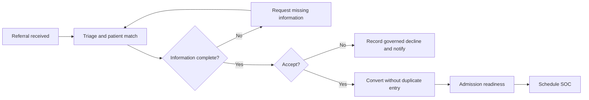
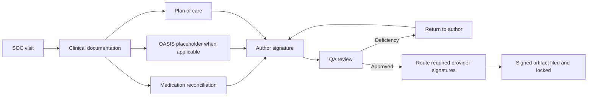
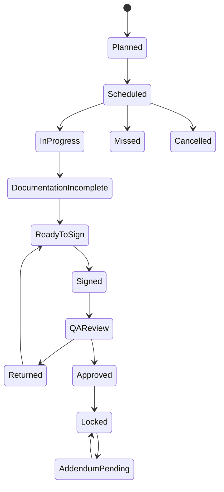
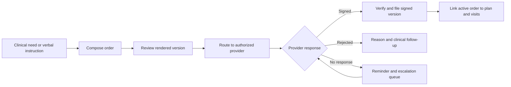
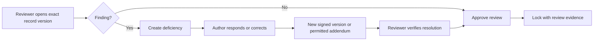

# Care Indeed Home Health EHR UI/UX Discovery Plan

**Source baseline:** `docs/ehr-development-inventory.md`  
**Phase:** UI/UX discovery only  
**Status:** Ready for information architecture, wireframes, and prototype testing; not approved for backend engineering or production clinical use  
**Prepared:** 2026-08-03

---

## 1. Purpose and guardrails

This plan translates the master EHR development inventory into a Care Indeed Home Health UI/UX discovery program. It defines the proposed information architecture, navigation, pageviews, reusable components, workflow maps, screen-level data needs, prototype sequence, and unresolved decisions.

The plan intentionally does **not** define a final clinical data model, regulatory interpretation, OASIS calculation or submission logic, billing rules, integration contracts, or production authorization model. Those require Care Indeed clinical, compliance, operations, security, and engineering approval.

### Discovery rules

1. Use synthetic data only. No PHI may appear in mockups, design files, usability recordings, or test fixtures.
2. Keep the patient identity and current episode visible whenever an action can change the legal chart.
3. Treat author, timestamp, status, provenance, signature, version, and lock state as first-class UI data.
4. Never imply that autosave equals signature, signature equals QA approval, or QA approval equals claim readiness.
5. Separate clinical warnings, incomplete documentation, operational tasks, and informational notices by severity and purpose.
6. Show destructive, irreversible, wrong-patient, break-glass, export, print, and amendment actions with explicit confirmation and audit notice.
7. Label unapproved clinical content and regulatory behavior as placeholders in prototypes.
8. Meet a WCAG 2.2 AA design target and test keyboard, screen-reader, zoom, contrast, error, and touch behavior.
9. Design desktop and tablet first for office and field workflows; validate phone layouts for route review and focused field tasks.
10. Do not begin backend implementation from this document. Convert approved discovery outcomes into controlled requirements and acceptance tests first.

### Priority legend

| Priority | Meaning |
|---|---|
| Critical | Required to demonstrate the first safe end-to-end home health workflow or administer its access and evidence. |
| High | Important for field efficiency, coordination, or operational readiness; follows the critical path. |
| Medium | Valuable workflow expansion that does not block initial discovery validation. |
| Future | Deferred until scope, integration, certification, or product strategy is decided. |

### Mockability legend

| Mock status | Meaning |
|---|---|
| Mock now | Structure, navigation, interaction, and representative states can be designed safely with synthetic data. |
| Mock with assumptions | Useful for discovery if every assumption is labeled and tested; content or rules are not approved. |
| Decision-gated | Do not prototype detailed calculations, regulatory logic, or production behavior until named decisions are approved. A shell or explanatory empty state is still acceptable. |

---

## 2. Experience principles

### 2.1 Safety before speed

- Persistent patient banner: legal name, preferred name, DOB, MRN, photo/avatar policy, current episode, branch, status, and high-severity clinical alerts.
- A visible context switcher when a patient has multiple episodes or certification periods.
- Wrong-patient protection before signature, order send, export, print, discharge, transfer, and medication changes.
- Clear distinction among draft, incomplete, ready for signature, signed, returned by QA, approved, locked, amended, superseded, and voided states.
- No color-only meaning. Every status uses text, iconography, and accessible descriptions.

### 2.2 One work item, one accountable next action

Every queue row and patient-chart task should identify the patient, episode, work type, owner, due date, age, severity, blocking reason, and next allowed action. Users should not need to open multiple pages merely to learn why work is blocked.

### 2.3 Progressive disclosure for dense clinical documentation

Show the minimum safe summary first, then reveal detail by section. Preserve a section navigator, completion state, last autosave, validation summary, and unresolved items while a long form is open.

### 2.4 Survey readiness by design

Evidence should be discoverable from normal work, not reconstructed later. Important records expose provenance, signatures, versions, review history, transmission history, and related deficiencies. Compliance users receive exportable evidence indexes, subject to approved export controls.

### 2.5 Field resilience

Design for intermittent connectivity without promising offline support until it is approved. Prototypes should include connection state, save state, reconnect guidance, conflict states, and a safe exit path. Never show a draft as safely synchronized unless the system has confirmed it.

---

## 3. Users, responsibilities, and landing experiences

| Persona | Default landing view | Primary work | Minimum-necessary emphasis |
|---|---|---|---|
| Intake coordinator | Referral intake queue | Triage referrals, collect missing information, accept/decline, prepare conversion | Referral records and intake documents; clinical chart only after authorized conversion |
| Scheduler | Schedule board | Assign visits, resolve conflicts, manage missed/rescheduled visits | Scheduling details and only the clinical context needed for safe assignment |
| RN / case manager | My day / patient worklist | SOC, skilled visits, care coordination, medication reconciliation, orders, care plan | Assigned patients and episode-specific clinical record |
| LVN | My day / patient worklist | Assigned skilled visits, documentation, escalation, order acknowledgement | Assigned visits and permitted chart sections; countersign rules remain configurable |
| PT / OT / SLP | My day / patient worklist | Evaluation, treatment, goals, progress, discharge/recert input | Assigned therapy episodes, therapy plan, relevant clinical record |
| PTA / OTA | My day / patient worklist | Visits under approved plan and supervision | Assigned visits, permitted plan content, supervision status |
| HHA | My day / task-focused visit view | Aide plan tasks, observations, escalation | Assigned visit plan and limited patient context |
| MSW | My day / patient worklist | Psychosocial assessment, coordination, resources | Assigned patient and relevant care-plan data |
| QA reviewer | QA review queue | Review documentation, return deficiencies, approve/close review | Records assigned for review plus evidence and revision history |
| DON / clinical manager | Clinical operations dashboard | Oversight, escalations, high-risk patients, staffing and deficiencies | Branch/discipline scope with auditable elevated access |
| Physician / authorized signer | Signature inbox | Review and sign or reject orders and plans | Only routed records and necessary supporting context |
| Compliance / privacy | Compliance dashboard | Audit review, access investigations, survey evidence | Audit and evidence scope; clinical access must be justified and logged |
| Administrator | Administration home | Users, access, branches, directories, templates, configuration | Separate privileged context and stronger confirmation for changes |
| Billing / authorization staff | Authorization work queue | Coverage, authorizations, billable-event readiness | Administrative and service data; detailed clinical access only when justified |
| Executive | Executive dashboard | Operational and quality trends | Aggregated/de-identified views by default |

Patient and representative portal experiences are **Future** until identity proofing, proxy access, release scope, consent, messaging, and patient-access strategy are decided.

---

## 4. Information architecture

### 4.1 Global navigation

Use a stable left navigation on desktop, a collapsible rail on tablet, and a task-focused bottom/overflow pattern on phone. Items are permission-filtered, but approved deep links must produce an access-denied state rather than silently redirect.

| Navigation item | Purpose | Primary users | Priority |
|---|---|---|---|
| Home | Role-specific workload, risks, and shortcuts | All workforce users | Critical |
| Patients | Patient search, lists, recently accessed records | Clinical, QA, authorized operations | Critical |
| Referrals | Intake queues and referral detail | Intake, clinical managers | Critical |
| Schedule | Team schedule, visit assignment, conflicts | Schedulers, clinicians, managers | Critical |
| Tasks | Cross-workflow accountable work inbox | All workforce users | Critical |
| QA | Review queues, deficiencies, rework | QA, clinical managers | Critical |
| Orders & Signatures | Orders, routing, outstanding signatures | Clinical, QA, authorized signers | Critical |
| Documents | Authorized cross-patient document work and batches | Intake, QA, HIM/compliance | High |
| Reports & Compliance | Operational, quality, survey, access evidence | Managers, compliance, executives | High |
| Admin | Users, permissions, directories, templates, configuration | Privileged administrators | Critical |
| Help | Context help, downtime guidance, support | All users | Medium |

Global utilities: organization/branch context, universal search, create action, task count, notifications, connectivity/save status, help, and user/security menu. A user with more than one authorized role may switch working context; the active role and branch remain visible and the switch is audited when it affects access.

### 4.2 Patient chart navigation

The patient chart is an episode-aware shell rather than a collection of unrelated pages.

| Group | Tabs / destinations |
|---|---|
| Overview | Summary, timeline, active risks, current care team, next work |
| Clinical | Diagnoses, allergies, medications, assessments, care plan, results |
| Visits | Schedule, visit history, visit notes, missed visits |
| Orders | Active orders, order history, signature tracking |
| Documents | Admission packet, uploaded documents, generated records, release/export history |
| Coordination | Contacts, representatives, providers, communication log, tasks |
| Quality | Deficiencies, reviews, completion status, related evidence |
| Record history | Signatures, amendments, versions, access/audit trail |

### 4.3 Patient chart shell

The shell remains visible across chart destinations and contains:

- Identity: legal/preferred name, pronouns if collected, DOB, MRN, and approved identity cue.
- Episode context: referral/admission status, SOC date, certification period, payer, branch, case manager, disciplines, and episode selector.
- Safety strip: allergies, code/emergency status if approved, infection precautions, communication needs, and other governed alerts.
- Work strip: unsigned records, overdue orders, unresolved QA deficiencies, missing signatures, and next scheduled visit.
- Action bar: new note, new order, medication reconciliation, upload document, communication entry, and more menu, filtered by permission and state.
- Context notice: read-only, break-glass, archived, discharged, legal hold, or downtime state when applicable.
- Breadcrumb/back behavior that returns users to their queue without losing filters.

No alert is shown in the safety strip until Care Indeed defines its source, severity, authoring authority, acknowledgement behavior, expiry, and audit rules.

---

## 5. Complete pageview inventory

The “data needed” column describes design-time information requirements, not an approved database schema.

### 5.1 Global and platform pageviews

| Pageview | Priority | Key data needed | Mock status |
|---|---|---|---|
| Login / SSO / MFA | Critical | Organization, identity-provider choices, MFA method, session/security notice, support path | Mock with assumptions |
| Account recovery | High | Approved recovery methods, identity proofing, lockout status, support escalation | Decision-gated |
| Role-aware home dashboard | Critical | Role, branch, assignments, tasks, due dates, risks, queue counts, recent activity | Mock now |
| Global patient search | Critical | Name, DOB, MRN, phone, address, payer, episode, branch, status, permitted match indicators | Mock now |
| Notifications center | High | Type, severity, patient/episode context, source, timestamp, read/acknowledged state, link | Mock with assumptions |
| Task inbox / work queue | Critical | Work type, patient, episode, owner, due date, priority, age, blockers, source, next action | Mock now |
| User profile and preferences | High | Name, credentials, discipline, branch, contact, notification and accessibility preferences | Mock now |
| Recently accessed patients | High | Patient identity cues, episode, last access, reason/source, access scope | Mock now |
| Emergency access / break-glass | Critical | Patient, requested scope, reason, duration, acknowledgement, reviewer notification | Decision-gated |
| Help / downtime / support | Medium | Page context, help topic, system status, downtime procedures, case reference | Mock now |

### 5.2 Patient chart pageviews

| Pageview | Priority | Key data needed | Mock status |
|---|---|---|---|
| Patient list | Critical | Patient, DOB, MRN, branch, status, episode, case manager, payer, risk/work indicators | Mock now |
| Patient chart summary | Critical | Identity, episode, care team, next visit, active risks, diagnoses, meds, orders, tasks, timeline | Mock now |
| Demographics | Critical | Legal/preferred identity, identifiers, sex/gender fields as approved, language, address, contact, communication needs | Mock with assumptions |
| Contacts / representatives | Critical | Person, relationship, legal authority, contact methods, permission, priority, effective dates | Mock with assumptions |
| Episodes / admissions | Critical | Referral link, status, service line, payer, branch, SOC/discharge, certification periods, disciplines | Mock with assumptions |
| Diagnoses / problems | Critical | Code/system/version, description, type, rank, onset, status, author, source, review date | Mock with assumptions |
| Allergies | Critical | Substance, reaction, severity, status, source, author, last reviewed, no-known status | Mock with assumptions |
| Medications | Critical | Normalized and display name, strength, dose, route, frequency, dates, status, source, prescriber, reconciliation state | Mock with assumptions |
| Care plan | Critical | Problems, goals, interventions, disciplines, frequency/duration, status, review history, linked orders | Mock with assumptions |
| Orders | Critical | Type, text/structured content, priority, effective dates, author, ordering provider, status, versions, signatures | Mock with assumptions |
| Visit history | Critical | Date/window, discipline, clinician, status, location, timing, note state, exceptions | Mock now |
| Notes | Critical | Note type, visit, author, created/service time, status, signature, QA, version/addenda | Mock with assumptions |
| Documents | Critical | Type, title, patient/episode, source, date, author/uploader, signature, lock, version, retention/access | Mock now |
| Signatures | Critical | Record, signer role, requested signer, status, requested/signed dates, authentication method, rejection reason | Mock with assumptions |
| Communication log | High | Date/time, participants, channel, purpose, patient/episode, author, follow-up, linked record | Mock now |
| QA deficiencies | Critical | Source record, rule/reviewer, category, severity, finding, owner, due date, status, response, closure evidence | Mock with assumptions |
| Patient audit trail | Critical | Actor, action, record, timestamp, device/session context as approved, reason, outcome, before/after reference | Mock with assumptions |

### 5.3 Home health workflow pageviews

| Pageview | Priority | Key data needed | Mock status |
|---|---|---|---|
| Referral intake queue | Critical | Source, received time, patient identity, requested disciplines, payer, owner, status, age, missing items | Mock now |
| Referral detail | Critical | Patient/referral demographics, source, diagnoses, payer, physician, services, documents, contacts, decisions, activity | Mock with assumptions |
| Eligibility / authorization review | High | Payer, plan/member data, coverage response, authorization, approved units/visits, dates, evidence | Decision-gated |
| Admission readiness | Critical | Required packet items, consents, orders, eligibility, physician, staffing, risk, missing/waived items | Mock with assumptions |
| Admission / SOC workspace | Critical | Referral, admission facts, required steps, assigned clinician, visit, assessment sections, signatures, QA state | Mock with assumptions |
| Admission packet | Critical | Approved forms, version/effective date, signer/authority, language, delivery, signature/witness, completion state | Decision-gated |
| OASIS workspace shell | Critical | Assessment type/version, patient/episode, assessor, sections, item completion, validations, correction/submission state | Decision-gated |
| Plan of care / 485-style builder | Critical | Diagnoses, orders, disciplines, frequencies, goals, interventions, safety, supplies, provider certification, versions | Mock with assumptions |
| Team visit scheduler | Critical | Patients, orders/frequencies, due windows, disciplines, clinicians, availability, geography, conflicts, authorizations | Mock with assumptions |
| Clinician daily route | High | Assigned visits, order, time window, address/map consent, contact, key safety cues, status, connectivity | Mock with assumptions |
| Skilled nursing visit note | Critical | Visit, assessments, vitals, interventions, education, response, coordination, orders, med changes, signatures | Mock with assumptions |
| Therapy evaluation / visit note | Critical | Discipline, visit/evaluation, functional measures, goals, interventions, response, plan, supervision, signatures | Mock with assumptions |
| HHA visit note | High | Assigned aide-plan tasks, completion/exceptions, observations, escalation, timing, signature | Mock with assumptions |
| Wound documentation | High | Wound identity/location, measurements, assessment, treatment, images/consent, trend, notifications | Decision-gated |
| Medication reconciliation | Critical | Sources compared, home/current lists, discrepancies, decisions, prescriber contact, unresolved issues, reviewer/signature | Mock with assumptions |
| Physician order creation | Critical | Patient/episode, order type/content, origin, urgency, effective dates, provider, related record, author/signature | Mock with assumptions |
| Physician signature tracking | Critical | Provider, order/plan, delivery method, sent/received timestamps, reminders, status, rejection, signed artifact | Mock with assumptions |
| QA review queue | Critical | Review type, patient/episode, source record, reviewer, age, priority, deficiencies, readiness, SLA target | Mock now |
| QA record review | Critical | Rendered record, structured data, validations, version, provenance, related orders, deficiency thread, decision | Mock with assumptions |
| Missed visit workflow | Critical | Scheduled visit, reason, attempts, notifications, reschedule, order/frequency impact, QA status | Mock with assumptions |
| Recertification workflow | Critical | Current/new period, eligibility, reassessments, orders, plan changes, required signatures, QA state | Decision-gated |
| Transfer workflow | Critical | Transfer reason/destination/date, clinical summary, notifications, documents, disposition, approvals | Decision-gated |
| Discharge workflow | Critical | Reason/date, goals/outcomes, final assessments, meds/instructions, notifications, summary, outstanding work | Decision-gated |

### 5.4 Administration, compliance, and platform pageviews

| Pageview | Priority | Key data needed | Mock status |
|---|---|---|---|
| User management | Critical | Identity, employment status, role, discipline/license metadata, branch, manager, access dates, MFA/session state | Mock with assumptions |
| Roles and permissions | Critical | Role, permission, scope, sensitive actions, conditions, conflicts, approver, effective dates, version | Decision-gated |
| Branch / location setup | High | Branch identity, service area, timezone, contacts, operating rules, active dates | Mock with assumptions |
| Payer setup | High | Payer/plan, identifiers, service rules, authorization, documentation and integration settings | Decision-gated |
| Physician / provider directory | High | Name, credentials, NPI/identifiers, organizations, addresses, contacts, signature channels, status | Mock with assumptions |
| Forms / templates admin | Critical | Template, purpose, discipline, version, effective dates, sections, validations, signature/lock rules, approval | Decision-gated |
| Clinical rules admin | High | Rule source, logic summary, severity, target workflow, version, approvers, effective dates, override behavior | Decision-gated |
| Audit log explorer | Critical | Actor, patient, action, object, time, reason, outcome, source/session, export case | Mock with assumptions |
| Security dashboard | High | Authentication, privileged access, break-glass, suspicious access, export/print events, incidents | Mock with assumptions |
| Backup / DR status | High | Environment, last backup/restore test, status, target, owner, evidence, incident/runbook links | Mock with assumptions |
| Interface monitor | High | Partner/interface, message type, patient match state, status, ACK, errors, retries, timestamps, owner | Mock with assumptions |
| Report builder | Medium | Approved dataset, filters, grouping, fields, access scope, suppression/export controls, schedule | Decision-gated |
| Compliance dashboard | Critical | Missing/late/unsigned items, OASIS status, order aging, QA findings, access exceptions, trends, drilldowns | Mock with assumptions |
| Survey evidence center | High | Request/control, evidence index, patients/time range, source records, versions, approvals, export history | Mock with assumptions |
| Integration/app registration | Future | App/client, scopes, owner, environment, credentials metadata, status, audit | Decision-gated |
| Patient/representative portal admin | Future | Proxy identity, relationship, consent, scope, effective dates, release and revocation | Decision-gated |

---

## 6. Detailed focus-area specifications

These specifications identify what should be learned through design; they are not final field lists.

### 6.1 Intake and referral workflow

**Primary users:** intake coordinator, intake manager, clinical manager.  
**Goal:** reach a traceable accept, decline, or pending decision without duplicate entry.

**Layout:** queue with saved views and aging indicators; referral detail with overview, people/providers, clinical request, payer/authorization, documents, activity, and decision panel.

**Core actions:** create/import referral, assign owner, request information, match possible patient, upload/classify documents, record contact attempt, accept, decline with governed reason, and convert to admission preparation.

**Safety and evidence:** possible-duplicate banner; provenance for imported values; visible missing information; restricted decline reasons; immutable decision event; conversion preview showing what will be created.

**Prototype scenarios:** new complete referral, missing physician order, possible duplicate patient, out-of-service-area request, payer unknown, accepted referral awaiting staffing.

### 6.2 Admission / Start of Care workspace

**Primary users:** intake, RN/case manager, scheduler, QA.  
**Goal:** coordinate readiness, SOC visit documentation, plan creation, signatures, and QA without presenting a false single “complete” state.

**Workspace lanes:** admission facts; prerequisites; admission packet; SOC visit/assessment; medication reconciliation; OASIS if applicable; plan of care; orders/certification; signatures; QA review.

**Core actions:** assign responsibility, schedule SOC, record prerequisite outcome, open required form, resolve blocker, route signature, submit to QA, return to author, finalize approved record.

**Status model:** preparation, ready to schedule, scheduled, visit in progress, documentation incomplete, ready for signature, signed, QA review, returned, approved, locked. The UI must show the status of each artifact and the aggregate workflow separately.

**Decision boundary:** required admission documents, California notices/consents, physician certification evidence, timing rules, waiver rules, and who may approve exceptions require policy mapping.

### 6.3 OASIS workspace placeholder

**Priority:** Critical if Medicare-certified home health is confirmed.  
**Safe discovery scope:** navigation shell, assessment header, section navigator, item completion display, validation summary, review/correction history, submission-status area, and provenance.

**Do not specify yet:** exact assessment version, item text, branching, skip logic, scoring, consistency rules, correction types, encoding/export, submission transport, acceptance/rejection messages, or timing enforcement.

**Prototype labels:** every OASIS screen must display “placeholder content — version and rules pending Care Indeed compliance approval.” Use invented item identifiers and synthetic examples rather than reproducing licensed or version-sensitive content.

**Required eventual states:** not started, in progress, locally complete, validation errors, ready for clinical review, corrected, export ready, submitted, accepted, rejected, and superseded. These names must be confirmed against the selected operational process.

### 6.4 Plan of care / 485-style workflow

**Primary users:** RN/case manager, therapists, QA, ordering/certifying provider.  
**Goal:** assemble a coherent, reviewable plan from approved clinical inputs and route the correct version for signature.

**Sections:** header/certification context, diagnoses, functional/safety status, medications/orders references, disciplines, visit frequency/duration, problems, measurable goals, interventions, supplies/equipment, precautions, coordination, discharge planning, provider certification, signatures, and history.

**Interaction model:** section navigation plus completeness; structured entries with an accessible rendered-document preview; compare current and prior versions; frequency conflict warnings; linked source records; explicit create-new-version behavior after routing.

**Safety and evidence:** no silent overwrites after signature routing; display which plan version governs a visit; distinguish proposed from ordered care; signature and transmission history always visible.

**Decision boundary:** approved plan content, certification wording, frequency notation, amendment process, recertification behavior, and provider signature requirements.

### 6.5 Visit scheduling

**Primary users:** scheduler, clinical manager, clinicians.  
**Views:** team day/week board, patient schedule, unassigned work, frequency compliance, conflicts, clinician day/route.

**Data:** ordered discipline/frequency, due window, authorization availability, clinician discipline/skills, availability, branch/service area, continuity preference, travel estimate, patient preferences, visit status, and exception reason.

**Core actions:** create from order, assign/reassign, drag with confirmation, bulk assign, reschedule, cancel, mark missed, notify affected parties, and document override reason.

**Safety:** warn on discipline/scope mismatch, overlapping visits, visit outside order/authorization, duplicate visit, and unresolved missed visit. Warning severity and override authority are decision-gated.

### 6.6 Skilled nursing visit note

**Primary users:** RN and LVN within approved scope; QA reviewer.  
**Shell:** visit header, patient safety strip, section navigator, last-save/sync state, required-items summary, previous relevant note comparison, orders/care-plan reference, signature panel.

**Candidate sections:** arrival/visit facts, focused assessment, vitals, symptoms, systems relevant to plan, interventions/procedures, medication review, wound reference, education and response, care coordination, physician notification, progress toward goals, plan/next visit, exceptions, attestation/signature.

**Safety:** changed/abnormal findings require governed follow-up prompts, not unapproved treatment recommendations; copy-forward is visibly attributed and requires review; edited fields after return from QA are highlighted; service time and documentation time are distinct.

**Prototype scenarios:** routine signed visit, incomplete required section, new medication discrepancy, physician notified, late-entry reason, QA return, offline draft conflict.

### 6.7 Therapy visit note

**Primary users:** PT/PTA, OT/OTA, SLP, supervising therapists, QA.  
**Candidate sections:** evaluation/treatment context, precautions, patient-reported status, approved measures, functional performance, interventions, assistance/cueing, response/tolerance, goals and progress, home program/education, equipment, coordination, plan, supervision/countersignature, signature.

Use discipline-specific templates within a shared note framework; do not force all therapy disciplines into one field set. Clearly show whether the user is documenting an evaluation, routine visit, reassessment, supervisory visit, recertification contribution, or discharge.

**Decision boundary:** standardized instruments and licensing, assistant supervision/countersignature, discipline-specific required content, plan modification authority, and therapy frequency rules.

### 6.8 Medication reconciliation

**Primary users:** RN/case manager and other approved clinicians; QA.  
**Goal:** compare sources and resolve discrepancies without erasing provenance.

**Layout:** source panel, normalized candidate list, current chart list, discrepancy workspace, unresolved issue summary, contact/notification log, review/signature history.

**Per medication:** display name and normalized identity when available, strength, dose, route, frequency, indication if approved, status, start/stop, prescriber, source(s), last confirmation, and discrepancy state.

**Discrepancy states:** possible duplicate, missing from chart, not in home, dose/route/frequency conflict, stopped/uncertain, allergy concern, and unable to verify. Clinical severity and response logic require governance.

**Safety:** do not silently merge sources; record the reconciler’s decision and source; keep unresolved items visible; require a reason for delete/discontinue/cannot-verify actions; separate medication documentation from e-prescribing.

### 6.9 Physician orders and signature tracking

**Order composer:** patient/episode header, originating event, order type, structured/plain-language content as approved, urgency, effective date, provider, read-back/verbal-order data if applicable, attachments, author attestation, and route.

**Signature tracking:** provider-centered and patient-centered queues with sent date, delivery method, days outstanding, attempts, next follow-up, status, signed version, rejection reason, owner, and escalation.

**Lifecycle candidate:** draft → internally reviewed if required → sent → pending signature → signed or rejected → filed/active → superseded/archived. Verbal-order and plan-of-care variants may need distinct paths.

**Safety:** rendered preview before send; immutable routed version; no backdating in UI; correction creates a new version; show related visits/plan; verify external signer identity and authority through the approved method.

### 6.10 QA review queues

**Primary users:** QA reviewer, QA manager, DON, authors resolving deficiencies.  
**Queue controls:** review type, branch, discipline, patient, episode, priority, age, due date, reviewer, status, deficiency category, and saved views.

**Review workspace:** side-by-side rendered record and structured validation summary; provenance and version; related plan/orders/visit; reviewer checklist; deficiency thread; author response; decision and next action.

**Actions:** claim/reassign, request correction, add deficiency, waive only with approved authority/reason, approve, escalate, and reopen according to policy.

**Safety:** distinguish automated checks from human findings; do not modify the clinician’s signed record from the QA workspace; show exactly which version was reviewed; block closure while required deficiencies remain open unless an authorized exception exists.

### 6.11 Document center

**Primary users:** intake, clinical, QA, HIM/compliance, authorized administrators.  
**Views:** patient documents, cross-patient work queue, unsigned/misclassified documents, generated packets, release/export history.

**Data:** document type, title, patient/episode, service/document date, source, uploader/author, received date, version, signature, lock, review, sensitivity, related order/note, retention state, and access history.

**Actions:** upload with malware-scan state, classify, preview, rotate/reorder where permitted, link, request signature, generate, correct metadata, create addendum/version, archive, and controlled export/print.

**Safety:** patient-match confirmation; quarantine/failed-scan states; watermarked previews if approved; no replacement of a signed artifact; export purpose and recipient capture; bulk-action guardrails.

### 6.12 Audit and access history

**Patient view:** understandable timeline of who accessed or changed the patient record, what action occurred, when, why if required, and the related artifact.

**Compliance explorer:** search by user, patient, branch, action, object, time, emergency access, export/print, outcome, and investigation case. Results support saved investigations and evidence export subject to strict permission.

**Change presentation:** structured change summaries with links to authorized version comparison; sensitive values may require masking. The audit UI cannot edit or delete source events.

**Decision boundary:** retention, device/IP visibility, workforce notice, suspicious-access rules, investigation workflow, evidence format, and who may inspect compliance activity.

### 6.13 Admin: users, roles, and permissions

**User lifecycle:** invited/provisioned, active, suspended, leave, terminated, archived. Show source of identity, branches, job role, clinical discipline, license/credential metadata if in scope, supervisor, patient-assignment constraints, access dates, MFA/session state, and last access.

**Permission model UI:** role template plus scoped exceptions; view/change/sign/approve/export/admin actions shown separately; branch, discipline, assignment, patient, and emergency constraints; effective dates and approver; before/after preview.

**Safety:** no self-escalation; step-up authentication for privileged changes; separation-of-duties warnings; affected-user preview; immediate revoke and session termination; required reason; complete admin audit.

The actual RBAC/ABAC matrix is decision-gated and must be approved before a realistic permissions prototype is treated as authoritative.

### 6.14 Admin: forms, templates, and clinical rules

**Template lifecycle:** draft, clinical review, compliance review, approved, scheduled, active, retired. A template version has an owner, purpose, service line, disciplines, effective dates, sections, conditional logic, validation, signature roles, lock/amendment behavior, and change summary.

**Design requirements:** preview across desktop/tablet/phone; synthetic test cases; dependency view; compare versions; list affected in-progress records before activation; preserve the template version attached to a legal record.

**Clinical-rule safety:** source/reference, owner, severity, target users, trigger summary, message, allowed action, override reason, effective dates, testing evidence, and monitoring. Business users should not edit executable logic through an unrestricted text box.

### 6.15 Compliance and operational dashboards

**Core tiles:** unsigned notes, late documentation, outstanding physician signatures, admission/SOC readiness, OASIS state, order/frequency exceptions, open QA deficiencies, missed visits, expiring authorizations, break-glass/access events, and survey-evidence readiness.

Each metric must show definition, data freshness, scope, exclusions, owner, threshold, and drilldown. Counts without an actionable underlying queue are not sufficient. Do not combine clinical risk with administrative lateness into one unlabeled “risk score.”

**Decision boundary:** metric definitions, targets, escalation rules, payer/branch segmentation, minimum cell size, executive de-identification, and survey packet contents.

### 6.16 Global task and notification experience

Tasks are durable, assigned work with a due date and completion evidence. Notifications are time-ordered awareness events. Clinical alerts are governed safety interventions. The UI must keep these concepts separate.

Provide a unified task inbox with source workflow, patient/episode, accountable owner, due/age, blocker, priority, and next action. Notification preferences cannot silence mandatory safety or security communications; which communications are mandatory is decision-gated.

---

## 7. End-to-end workflow maps

### 7.1 Referral to admitted episode

Key evidence at each transition: actor, timestamp, source, decision/reason, documents used, assigned owner, and resulting patient/episode identifiers.

### 7.2 SOC, plan, signature, and QA

The exact order may differ by policy. The prototype should test alternate routing without hard-coding regulatory timing.

### 7.3 Visit lifecycle

Cancelled, missed, late-entry, corrected, and voided behavior must be approved separately; the diagram is a discovery hypothesis.

### 7.4 Order and signature lifecycle

### 7.5 QA deficiency and amendment

---

## 8. Component inventory

### 8.1 Design-system foundations

| Component | Required behavior |
|---|---|
| App shell and role navigation | Permission-aware visibility, active branch/role, responsive collapse, access-denied handling |
| Patient identity banner | Persistent identity and episode context, safety cues, wrong-patient prevention |
| Page header / action bar | Status, ownership, last update, safe primary action, overflow actions |
| Search and patient match | Tolerant search, clear match cues, duplicate warning, keyboard navigation |
| Filtered work queue | Saved views, sorting, grouping, bulk-action boundaries, row-level next action |
| Status badge | Text/icon/color, accessible name, governed vocabulary |
| Timeline / activity feed | Actor, time, event, source, related record, filtering |
| Tabs / section navigator | Completion/errors, keyboard access, sticky location for long forms |
| Empty / loading / error state | Actionable language, retry/support, no leakage of inaccessible content |
| Confirmation / reason dialog | Patient/action summary, consequences, required reason, authentication step when needed |
| Toast and inline feedback | Durable errors remain in context; success confirms the exact result |

### 8.2 Clinical documentation components

| Component | Required behavior |
|---|---|
| Form section | Title, purpose/help, completion, validation, author/source, conditional visibility |
| Autosave and sync indicator | Local/remote state, timestamp, failure/retry, conflict warning; never ambiguous |
| Validation summary | Severity, section/field link, source (rule versus reviewer), resolution status |
| Clinical value field | Units, reference/expected context if approved, observed time, method/source, abnormal-state treatment |
| Coded concept picker | Code system/version, human display, favorites/search, inactive-code warning |
| Medication editor | Structured dose/route/frequency, source, status, uncertainty, reconciliation link |
| Allergy editor | Substance, reaction, severity, status, no-known handling, last review |
| Goal/intervention builder | Owner/discipline, target, status, review history, linkage to problem/order |
| Frequency/duration builder | Human-readable and structured representation, date window, conflict display |
| Order composer | Origin, author, provider, content, effective dates, preview, routing/version state |
| Signature panel | Signer identity/role, attestation, requested/actual timestamps, method, status, rejection |
| Locked-record banner | Why/when/by whom locked, permitted next actions, addendum/amendment entry |
| Version comparison | Exact versions, field/section changes, authorship, signatures, QA state |
| Deficiency panel | Finding, source, severity, owner, due date, discussion, resolution evidence |
| Document viewer | Page navigation, metadata, signature, version, source, safe print/export controls |

### 8.3 Home health components

| Component | Required behavior |
|---|---|
| Referral completeness checklist | Requirement/source, status, owner, evidence, exception reason |
| Admission readiness tracker | Artifact-level state, blocking versus nonblocking items, responsible person |
| Episode / certification-period selector | Clear effective dates and active context; prevents cross-period edits |
| Visit card | Patient, discipline, time window, clinician, status, note state, exceptions |
| Schedule conflict panel | Conflict reason, severity, affected orders/authorizations, authorized resolution |
| Route/day card | Minimum necessary patient context, contact/safety cue, connection state |
| OASIS shell navigator | Version placeholder, sections, completion, validation, correction/submission state |
| Source reconciliation grid | Side-by-side sources, discrepancies, accepted value, rationale, provenance |
| Physician-signature aging card | Provider, artifact/version, age, attempts, next follow-up, escalation |
| Survey evidence index | Requirement, source artifact, patient/time scope, version, approval/export history |

### 8.4 Security, privacy, and accessibility components

| Component | Required behavior |
|---|---|
| Access-denied state | Requested scope, safe next step, request-access path where approved, audit notice |
| Break-glass dialog/banner | Reason, scope, duration, acknowledgement, persistent elevated-access indicator |
| Sensitive action step-up | Reauthentication for approved high-risk actions without losing work |
| Export / print dialog | Scope preview, purpose/recipient, format, expiration/watermark controls as approved |
| Session timeout warning | Countdown, save guidance, extend/sign-out behavior, screen-reader announcement |
| Connectivity banner | Online/degraded/offline, affected capabilities, last sync, conflict entry point |
| Accessible error summary | Focus management, linked errors, plain language, non-color status |
| PHI-safe support capture | Context and diagnostics without uncontrolled clinical text or screenshots |

---

## 9. Cross-screen data requirements

The following data concepts recur across the experience and must be defined consistently during detailed requirements work.

| Data concept | Minimum UI representation | Key unresolved rule |
|---|---|---|
| Patient identity | Legal/preferred name, DOB, MRN, approved identity cue | Matching/merge rules and sensitive-patient handling |
| Episode/admission | Status, service line, branch, payer, dates, case manager, certification period | Episode and certification semantics |
| User/actor | Display name, role/discipline, organization, active status | Identity source and historical display after termination |
| Provenance | Source, author/performer, recorded and effective times, import path | Granularity and external-source trust |
| Record status | Draft through locked/amended/superseded states | State vocabulary and allowed transitions by record type |
| Signature | Signer, role/authority, attestation, method, requested/signed times | Legal/e-signature policy and external identity proofing |
| Version | Version ID/number, effective time, change reason, predecessor | Amendment/addendum/correction policy |
| QA review | Review type, reviewer, exact version, findings, decision, timestamps | Required review types and exception authority |
| Task | Source, accountable owner, due date, priority, blocker, completion evidence | SLA, reassignment, escalation, delegation |
| Alert | Source, severity, audience, acknowledgement/override, expiry | Clinical safety governance and fatigue monitoring |
| Document | Type, source, dates, version, signature, sensitivity, retention | Taxonomy, retention, legal-record status |
| Order | Type/content, origin, provider, author, effective dates, status, version | Verbal/read-back, activation, discontinuation, late signatures |
| Visit | Ordered/scheduled/service times, discipline, clinician, status, location, note | Visit types, EVV, missed/cancelled rules |
| Communication | Participants, channel, purpose, patient/episode, time, follow-up | Legal-record boundary and external messaging channels |
| Authorization | Payer, service, units/visits, dates, utilization, evidence | Billing/RCM ownership and payer-specific rules |
| Audit event | Actor, action, object, patient, time, reason, outcome, source context | Retention, masking, investigation access |

---

## 10. Record state and interaction standards

### 10.1 Draft, signature, QA, and lock

- **Draft:** editable by authorized users; autosave and synchronization state visible.
- **Incomplete:** draft with unresolved required data or governed validation.
- **Ready for signature:** validation passed for the selected workflow; not yet signed.
- **Signed:** authenticated attestation attached to an exact version; subsequent edits require the approved correction path.
- **In QA review:** exact signed version under review; QA cannot silently alter author content.
- **Returned:** deficiency assigned to an accountable author with a due date and visible changes required.
- **QA approved:** review completed for an exact version; any remaining exceptions are explicit.
- **Locked:** ordinary editing unavailable; addendum/amendment controls remain if authorized.
- **Amended/addended:** original remains available and linked to a separately attributed correction.
- **Superseded/voided:** retained with reason, actor, time, successor where applicable, and restricted display.

These are candidate universal terms. Detailed requirements may establish record-specific variants.

### 10.2 High-risk interaction patterns

Require a patient/action summary and confirmation for signing, routing an order, accepting a referral conversion, changing episode context with unsaved work, discharge/transfer, voiding, privileged-access changes, break-glass, and PHI export/print. Confirmation copy must state whether the result is reversible and what audit evidence will be created.

### 10.3 Copy-forward and defaults

Copied clinical content must identify its source record/date/author, remain visually distinguishable until reviewed, and never carry a prior signature forward. Defaults must be limited to low-risk fields approved by clinical safety review. Blank, unknown, not assessed, not applicable, and declined are distinct states.

---

## 11. Mock-now versus decision-gated scope

### Safe to mock now

- Global IA, role-aware navigation concepts, responsive shell, and patient chart shell.
- Referral, patient, visit, task, QA, order-signature, and document queues using synthetic states.
- Universal search, saved filters, queue drilldown, activity timeline, and return-to-queue behavior.
- Patient identity, episode selector, record status, provenance, version, signature, lock, and audit presentation.
- Admission readiness tracker and artifact-level workflow orchestration.
- Visit scheduler interaction, subject to labeled assumptions about warnings and overrides.
- Form shell, section navigation, autosave/sync/error/conflict states, validation summaries, and accessible error handling.
- QA side-by-side review, deficiency conversation, and exact-version comparison.
- Compliance dashboard drilldowns using clearly defined sample metrics, not claimed production calculations.

### Mock only with explicit assumptions

- Detailed demographics, contacts/representative authority, diagnoses, allergies, medication, care-plan, visit-note, order, and signature field sets.
- Clinician route/map behavior, connectivity, local draft behavior, and field-device workflow.
- Discipline-specific nursing and therapy content.
- Plan-of-care sections and rendered 485-style presentation.
- Scheduling frequency compliance, authorization warnings, and staff scope matching.
- Physician routing channels and reminder/escalation cadence.
- Audit event details, device/session metadata, and investigation flow.

### Decision-gated detail

- OASIS item content, version, branching, calculation, validation, correction, encoding, submission, and acceptance workflow.
- Admission packet contents; California, CMS, ACHC, payer, consent, notice, and signature requirements.
- Clinical alert logic, abnormal-value response, drug interaction content, and clinical decision support.
- Exact lock, late-entry, addendum, amendment, countersignature, QA waiver, and correction rules.
- Billing/claims, eligibility response, visit-to-bill rules, and authorization calculations.
- EVV capture, attestation, exception, geolocation, and payer/state behavior.
- Physician identity proofing, external portal, e-signature legality, verbal/read-back orders, and late signature handling.
- Wound image consent, measurement protocols, storage, annotation, and comparison logic.
- User permission matrix, break-glass scope, privileged access, and separation-of-duties rules.
- Patient/representative portal, record release, proxy access, and API experiences.

---

## 12. Decision register and open questions

### 12.1 Scope and operating model

| ID | Decision / question | Needed from | UI impact | Blocks |
|---|---|---|---|---|
| D-01 | Is the first product internal-only, or designed for external customers/tenants? | Executive/product/legal | Organization switching, branding, admin, configuration, support | Final IA and tenancy assumptions |
| D-02 | Is Medicare-certified home health the exact first-live service line? Which other service lines are included? | Executive/clinical/compliance | Workflow names, required artifacts, dashboards | Detailed clinical workflows |
| D-03 | Which branches, service areas, and California-specific operating variations are in the pilot? | Operations/compliance | Branch context, scheduling, forms, permissions | Pilot prototype content |
| D-04 | What is the minimum first-live patient journey and which roles participate? | Product/operations/clinical | Prototype sequence and MVP nav | Discovery acceptance |
| D-05 | Is ONC certification required, optional later, or out of scope? | Executive/product/compliance | Patient access, API/app admin, EHI export, certification evidence | Future-facing pageviews |

### 12.2 Clinical documentation and home health rules

| ID | Decision / question | Needed from | UI impact | Blocks |
|---|---|---|---|---|
| D-06 | Which OASIS version, assessment types, licensed content, correction process, and submission path apply? | Clinical/compliance/operations | Entire OASIS workspace | OASIS detail |
| D-07 | What admission/SOC packet and California/CMS/ACHC/payer evidence is required, by service line? | Compliance/clinical/legal | Readiness tracker, forms, signatures | Admission packet detail |
| D-08 | What are the approved nursing, therapy, HHA, MSW, supervisory, recert, transfer, and discharge note requirements? | Clinical leadership/compliance | Template sections and validations | Note detail |
| D-09 | What is the approved plan-of-care content, frequency notation, certification/recertification process, and change-order behavior? | Clinical/compliance | POC builder, scheduling, orders | POC detail |
| D-10 | Which standardized assessments or instruments may be used, and what licenses apply? | Clinical/legal | Form components and content | Instrument mockups |
| D-11 | Who may author, sign, countersign, review, return, approve, lock, addend, amend, supersede, or void each record type? | Clinical/compliance/legal | Action visibility and state transitions | Signature/lock realism |
| D-12 | Which findings create clinical alerts, required follow-up, escalation, or override reasons? | Clinical safety governance | Alert strip, form behavior, dashboards | Clinical safety behavior |
| D-13 | How are late entries, corrections, copy-forward, and imported data handled? | Clinical/compliance/legal | Note editing, provenance, version compare | Legal-record interactions |

### 12.3 Orders, signatures, scheduling, and field work

| ID | Decision / question | Needed from | UI impact | Blocks |
|---|---|---|---|---|
| D-14 | Which order types, verbal/read-back rules, ordering authorities, effective-date rules, and status transitions apply? | Clinical/compliance/legal | Order composer and lifecycle | Order detail |
| D-15 | Will physicians use a portal, secure link, Direct/integration channel, fax workflow, scanned return, or multiple routes? | Product/operations/security/legal | Signature inbox, tracking, identity proofing | External signature detail |
| D-16 | What reminder, escalation, overdue, rejection, and provider-delegation rules apply? | Operations/clinical/compliance | Signature queue and dashboard | Aging behavior |
| D-17 | What visit types, frequency windows, assignment qualifications, continuity preferences, cancellation/missed-visit rules, and override authorities apply? | Operations/clinical/compliance | Scheduler and visit lifecycle | Scheduling rules |
| D-18 | Is EVV built, integrated, or out of scope for each service line/payer? | Product/operations/billing/compliance | Visit start/end, location, exception flow | EVV screens |
| D-19 | Is offline documentation required? On which managed devices, with what conflict, storage, and timeout rules? | Product/security/clinical/IT | Sync state, field form design | Offline behavior |

### 12.4 Revenue cycle, integrations, and data

| ID | Decision / question | Needed from | UI impact | Blocks |
|---|---|---|---|---|
| D-20 | Will billing/claims be built or integrated? What is the MVP authorization boundary? | Executive/product/billing | Payer admin, authorizations, bill readiness | Revenue-cycle screens |
| D-21 | Which integrations are first: WellSky/Kinnser, labs, clearinghouse, HIE, identity, Google Workspace, payroll, accounting, EVV, others? | Product/IT/operations | Interface monitor, imported-data review, error queues | Integration pageviews |
| D-22 | Which legacy records migrate, with what identifiers, source provenance, and read-only history? | Operations/HIM/IT/legal | Chart history, imported banners, search | Migration UX |
| D-23 | What provider, payer, terminology, medication, and address directories are authoritative? | IT/clinical/billing | Pickers, source labels, admin | Directory workflows |
| D-24 | Will e-prescribing, results, imaging, or pharmacy history be in scope? | Product/clinical | Additional chart and reconciliation views | Future modules |

### 12.5 Security, privacy, QA, and evidence

| ID | Decision / question | Needed from | UI impact | Blocks |
|---|---|---|---|---|
| D-25 | What is the approved role/discipline/branch/assignment access matrix? | Security/privacy/HR/clinical | Navigation, fields, actions, search | Permission realism |
| D-26 | What requires break-glass, step-up authentication, dual approval, or separation of duties? | Security/privacy/compliance | High-risk action patterns | Privileged workflows |
| D-27 | What are retention, legal hold, amendment, release, export, and print rules by record type? | Legal/privacy/HIM/compliance | Document center, audit, lock, export | Record governance |
| D-28 | Which QA reviews are mandatory, what rules are automated, and who may waive or close findings? | QA/clinical/compliance | QA queues and dashboards | QA detail |
| D-29 | What evidence must Care Indeed produce for survey readiness, and in what package/index format? | Compliance/QA | Evidence center and dashboards | Survey output mockups |
| D-30 | Which audit events and metadata are visible to patients, workforce, managers, privacy, and administrators? | Privacy/security/legal | Patient/compliance audit views | Audit detail |
| D-31 | What accessibility accommodations, languages, translations, and alternative formats are required? | Compliance/HR/operations/product | Forms, documents, preferences | Content/design-system scope |
| D-32 | May AI process PHI or assist documentation? Under what approved service, BAA, review, attribution, and audit rules? | Executive/legal/security/clinical | Any AI affordance | All AI UI; default is absent |

---

## 13. Prototype and validation plan

### Phase 0 — Alignment and controlled assumptions

Deliverables: decision-register owners, approved personas, first-live journey, synthetic patient set, content disclaimer, and clinical/compliance review cadence.

Exit criterion: Care Indeed approves which assumptions may appear in prototypes and confirms that designs are not operational policy.

### Phase 1 — Navigation and patient safety shell

Prototype role-aware home, global search, patient list, chart shell, episode switching, access denied, break-glass placeholder, session/connectivity states, and responsive navigation.

Test: find the correct patient, recognize the active episode, return to a queue, identify read-only/locked state, and avoid a wrong-patient action.

### Phase 2 — Referral to SOC orchestration

Prototype referral queue/detail, duplicate matching, admission readiness, SOC workspace, document intake, missing-information workflow, and scheduling handoff.

Test: process complete and incomplete referrals, explain every blocker, convert without re-entry, and identify the accountable next owner.

### Phase 3 — Clinical documentation core

Prototype medication reconciliation, plan-of-care builder, skilled nursing note, therapy note, form navigation, autosave/sync/conflict, validation, signature, version comparison, and lock/addendum states. Use placeholder clinical content approved for discovery.

Test: complete a routine note, resolve an uncertainty, recognize copied content, sign the correct version, and recover from a save failure.

### Phase 4 — Orders, signatures, QA, and documents

Prototype order composer/preview, signature aging queue, provider response, QA queues/review, deficiency return, rendered-document viewer, and evidence history.

Test: trace one order version end to end, return a deficiency without altering the signed source, resolve it, and demonstrate the audit trail.

### Phase 5 — Scheduling and field experience

Prototype team schedule, unassigned visits, clinician route/day, missed visit, frequency/authorization warnings as labeled assumptions, and tablet/phone visit entry.

Test: assign/reschedule safely, identify an unqualified or conflicting assignment, handle a missed visit, and respond to degraded connectivity.

### Phase 6 — Administration and compliance

Prototype user lifecycle, permission-change preview, template lifecycle, audit explorer, compliance dashboard, and survey-evidence index.

Test: revoke access, detect a separation-of-duties risk, activate a versioned template safely, investigate access, and trace a dashboard count to source evidence.

### Phase 7 — Decision-gated modules

After approvals, add OASIS detail, admission packet content, recert/transfer/discharge rules, EVV, billing/authorizations, external physician signing, integrations, and patient/representative access.

---

## 14. Usability and safety research

### Representative tasks

1. Intake identifies and resolves a possible duplicate before converting a referral.
2. Scheduler assigns an SOC visit and understands all warnings and override requirements.
3. RN finds the governing plan, reconciles a medication discrepancy, completes a visit note, and signs the intended version.
4. Therapist distinguishes evaluation, treatment, reassessment, and discharge documentation.
5. QA reviewer identifies a deficiency, returns the exact version, and verifies the correction.
6. Physician or authorized signer reviews context, signs or rejects, and can tell which version was acted on.
7. Compliance user investigates emergency access and builds an approved evidence index.
8. Administrator terminates a user and confirms access and active sessions are revoked.

### Measures

- Task completion and critical-error rate.
- Wrong-patient, wrong-episode, wrong-version, and wrong-action near misses.
- Time to locate the accountable next action and its blocker.
- Validation-error comprehension and recovery.
- Signature, lock, QA, and synchronization-state comprehension.
- Keyboard-only and screen-reader task completion.
- Desktop/tablet/phone differences and field-connectivity recovery.
- User confidence calibrated against actual completion; overconfidence is a safety finding.

### Required reviewers

At minimum: intake, scheduler, RN/case manager, LVN, one representative from each therapy discipline in scope, QA, DON/clinical leadership, compliance/privacy, physician-order operations, billing/authorization if in scope, security, accessibility, and engineering architecture. Legal review is required for signatures, legal record, consent, release, retention, and external access behavior.

---

## 15. UI/UX deliverables and handoff criteria

### Discovery deliverables

- Approved sitemap and role-to-navigation matrix.
- Pageview inventory with owner, priority, mockability, state coverage, and decision dependencies.
- Patient chart shell and responsive behavior specification.
- End-to-end referral-to-SOC, visit, order/signature, QA, and amendment prototypes.
- Component library with accessibility and clinical-safety annotations.
- Screen-level data dictionary draft with provenance and status needs.
- Content inventory and controlled clinical/regulatory placeholder register.
- Decision log linked to prototype assumptions.
- Usability/safety findings, severity, owner, and resolution evidence.
- Traceability from inventory item → pageview/workflow → research finding → approved requirement.

### Screen readiness checklist

A screen is ready to leave discovery only when:

- Its user, purpose, entry/exit paths, patient/episode context, and minimum-necessary access are defined.
- Empty, loading, error, access-denied, read-only, offline/degraded, and stale-data states are addressed as applicable.
- Draft, validation, signature, QA, version, lock, correction, and audit behavior is explicit for legal-record actions.
- Every displayed field has a definition, source/provenance, status, author/time semantics, and sensitivity classification where applicable.
- Actions identify authorization, confirmation, failure, retry, reversal, notification, and audit behavior.
- Keyboard, focus, screen-reader, contrast, zoom, touch target, error, and responsive behavior have acceptance criteria.
- Clinical, compliance, privacy, security, operations, and accessibility reviewers have approved the relevant behavior.
- Unresolved assumptions remain linked to a decision owner and are not hidden in visual design.

### Gate before engineering implementation

Do not treat a high-fidelity prototype as an engineering specification. Before backend or production implementation, Care Indeed must approve detailed workflow requirements, the role/permission matrix, clinical content, OASIS scope and rules, signature and legal-record policy, QA/locking rules, billing/EVV boundaries, integrations, data definitions, nonfunctional requirements, acceptance tests, regulatory traceability, and clinical-safety risk controls.

---

## 16. Recommended immediate next actions

1. Name owners and target dates for D-01 through D-32, beginning with first-live scope, OASIS, admission content, role authority, order/signature, QA/lock, scheduling, EVV, and billing boundaries.
2. Hold a two-hour workflow-mapping session with intake, scheduling, RN/case management, QA, clinical leadership, and physician-order operations.
3. Create a synthetic scenario set covering complete referral, incomplete referral, duplicate patient, SOC, routine nursing visit, therapy evaluation, medication discrepancy, unsigned order, QA return, missed visit, and discharge placeholder.
4. Wireframe Phase 1 and Phase 2 before adding detailed clinical forms.
5. Establish a small UI safety review group and an assumption/change log for every prototype iteration.
6. Convert validated outcomes into controlled requirements; only then begin engineering estimation and architecture locking.

**Recommendation:** begin UI/UX discovery immediately, using the mockability boundaries in this plan. Continue the Care Indeed-specific regulatory and business requirements pass in parallel, and keep all decision-gated behavior visibly provisional.
