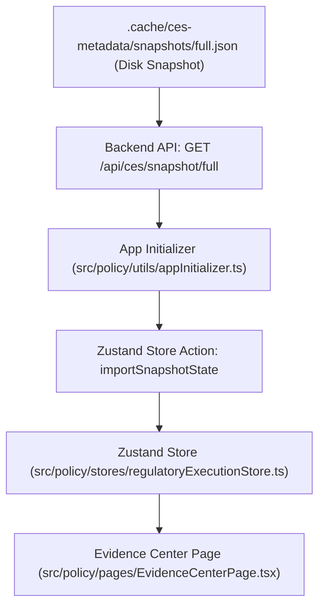

# Mock Evidence Center Hydration

This document describes the proven, verified frontend-backend hydration architecture for the Evidence Center.

## Hydration Architecture Map

## Core Components

1. **Backend Snapshot File**:
   - Location: `.cache/ces-metadata/snapshots/full.json`
   - Contains: Complete JSON mapping of `formStates`, `stepStates`, `minutesStates`, `evidence`, `approvals`, `completions`, `notes`, `certifications`, `eventInstancesById`, `eventInstanceIdsBySourceEventId`, `taskOverridesByEventId`, `taskAuditByEventId`, `generatedFormInstancesByEventId`, `signerTasksByFormInstanceId`.
2. **Backend API Endpoint**:
   - Route: `/api/ces/snapshot/full`
   - Purpose: Serves the full snapshot to the frontend client on initialization.
3. **Frontend App Initializer**:
   - Location: `src/policy/utils/appInitializer.ts`
   - Action: Asynchronously calls `EvidenceApi.loadSnapshot('full')` during app startup, casting and passing the data to the execution store.
4. **Zustand Execution Store**:
   - Location: `src/policy/stores/regulatoryExecutionStore.ts`
   - Action: `importSnapshotState` merges snapshot keys safely and recursively with the existing local state to avoid overwriting user progress.
5. **Evidence Center Explorer UI**:
   - Location: `src/policy/pages/EvidenceCenterPage.tsx`
   - Action: Reads evidence records directly from the hydrated store (`store.evidence`), displaying them hierarchically by Year, Quarter, Month, Event, and Task.

## Required Metadata Fields

For any evidence record to be visible and correctly structured in the Evidence Center explorer, it must include:
- `id`: Unique evidence identifier (e.g. `MOCK5-H1-EV-...`)
- `name`: Document label (e.g. `Brad Training Mock Test`)
- `folderPath`: Absolute folder hierarchy starting with Year (e.g. `2026 / Mock 5 H1 / Brad Training Mock Test`)
- `eventId`: Target event relation matching the execution timeline.
- `taskId`: Canonical task relation.
- `linkedFormInstanceId`: Parent form instance relation.
- `formId`: Root Care Indeed template ID (e.g. `CO-FM-021`).
- `status`: Set to `EVIDENCE_LOCKED` to index it as final immutable evidence.

## Proven Mock Folder Paths

- **Mock 5 Verified Path**:
  `2026 / Mock 5 H1 / Brad Training Mock Test`
- **Mock 6 Adaptation Guideline**:
  Use `2026 / Mock 6 / Brad Training Mock Test` (or the period-specific folder assigned to Mock 6) for H2 2026.
