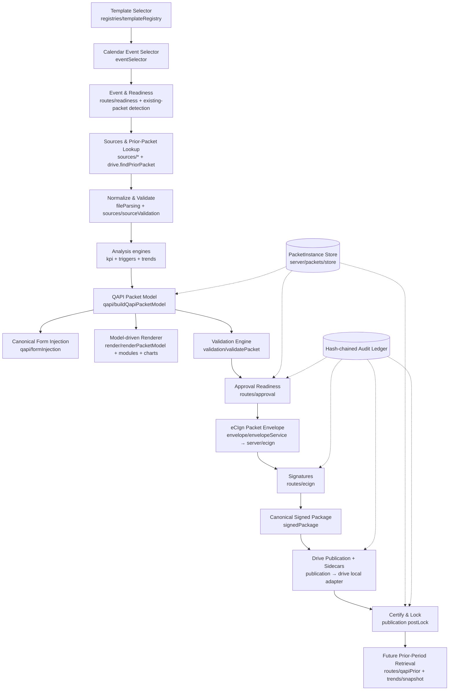

# Universal Packet Platform — Architecture (PRD §29 #13)

One event-driven platform; no bespoke per-event renderers. Layers: **contracts** →
**registries** → **engines** → **model builder** → **renderer** → **validation** →
**lifecycle/store** → **envelope/eCIgn** → **signed package** → **Drive publication** → **lock**.

**Dependency direction (enforced by architecture tests):** UI (`src/v6/screens/packets`) → domain
(`src/policy/packets`) → contracts. Domain must not import UI; server test/service code must not be
imported into the client build. Renderers live only under `src/policy/packets/render` (legacy
allowlisted). One rendering-profile registry unifies visual tokens.
