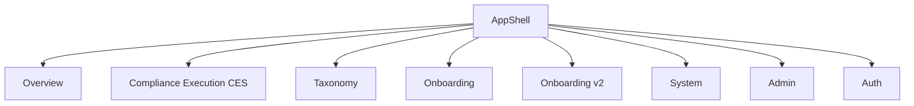

# V6 Application Route Map

This document is the **canonical route table** for the V6 CareIndeed Home Health Compliance Platform. It is also the **single coverage matrix** and the **host for the per-template state matrix** (see §6). Every other V6 doc must conform to the contracts here.

> **Canonical key rule (P1-1):** Identify every screen by its stable **hash-id**, never by route path or template name. Templates (`matrix`, `evidence`, `reports`, `detail`, `board`, `calendar`) are intentionally reused across 3–7 routes. Hash-ids are immutable even when display labels are renamed.

> **Repo (canonical):** All V6 artifacts live in `C:/AI/Git/training/HomeHealth/Policies_and_Procedures_V2` (`docs/v6/`, `scripts/check-designless.mjs`, `src/index.css`, `tailwind.config.js`). The live prototype reference is `C:/AI/Git/training/HomeHealth/Policies_and_Procedures/src/policy/pages/Redesign/index.html`.

> **Count:** **56 views = 54 router routes + 2 overlay/auth.** (Corrects the prior "54" undercount, which hid `events-board` and `login-page`.)

---

## 1. Top-Level Application Areas

The V6 architecture organizes all views into navigation groups rendered in the sidebar. Group names below are the **canonical group labels** used in the route table (§3) and must match `V6_PAGEVIEW_INVENTORY.md`.

| Group | Hash-ids in group |
|---|---|
| **Overview** | `dashboard`, `clinicians`, `clinician-detail`, `patients`, `patient-detail`, `master-calendar`, `staffing-calendar`, `brad` |
| **CES** | `ces-calendar`, `ces-board`, `events-board`, `workflows`, `workflow-swimlane`, `master-controls`, `audit-mode`, `evidence-center`, `ces-reports`, `mobile-incident`, `my-tasks` |
| **Taxonomy** | `framework`, `achc-survey`, `achc-crosswalk`, `policy-library`, `policy-detail`, `forms-library`, `form-viewer`, `ecign-workspace`, `artifact-viewer`, `generic-reference` |
| **Onboarding** | `journey-overview`, `journey-v1`, `module-player`, `appendix-f`, `supervisor`, `journey-admin`, `user-guide` |
| **Onboarding v2** | `onboarding-v2-dashboard`, `onboarding-v2-activate`, `onboarding-v2-batches`, `onboarding-v2-batch`, `onboarding-v2-audit`, `onboarding-v2-governance` |
| **System** | `policy-lifecycle`, `hubstaff`, `system-docs`, `help-center`, `governance` |
| **Admin** | `admin-groups`, `admin-roles`, `admin-permissions`, `admin-users`, `surveyor-viewer` |
| **Auth** | `login-page` |

---

## 2. Routing Architecture (P0/P1 contracts)

- **react-router 7 data routes** replace hash routing. Delete the two duplicate `hashchange` listeners; convert the `redesign-calendar-swimlane` CustomEvent and the `#personal-ops-panel` magic hash to React state/context (P1-3).
- **One path = one component.** No query-string routing. No bare top-level `/:param`.
- **No bare `/:policyId`** (P1-2). `policy-lifecycle` deep-link is `/policy-lifecycle/:policyId` only. A router-config test must fail on any route pattern exactly `/:param`.
- **Composer owns ALL route literal strings** and route registration (Stage B). Grok renders nav as placeholders only in Stage A and must not author path strings (P1-9).
- Route-level `lazy` + `Suspense` per top-level area; per-route `errorElement`; root + content-region error boundaries (P1-4).
- Nested routes + shared layouts (`Outlet`) for list→detail pairs and the forms viewer/eSign pair (P1-7).

---

## 3. Route Registry

Each entry: **path → hash-id (canonical key) → template → group.** Templates are shared; see §5 for the template→pages reuse map.

### Group: Overview

- **`/dashboard`** — hash `dashboard` — template `dashboard`
  - Command Center: primary hub showing critical census, visits, coverage, high-acuity metrics. Active by default.
- **`/clinicians`** — hash `clinicians` — template `profiles`
  - Clinician roster: caseload and credentials overview for active field staff.
- **`/clinicians/:clinicianId`** — hash `clinician-detail` — template `detail`
  - Clinician detail: licenses, active caseload, document check status. (Triggered from roster row.)
- **`/patients`** — hash `patients` — template `profiles`
  - Patient roster: clinical focus and schedule gaps.
- **`/patients/:patientId`** — hash `patient-detail` — template `detail`
  - Patient detail: care-plan status, coverage alerts, risk profile.
- **`/calendar`** — hash `master-calendar` — template `calendar`
  - Master Operations Calendar: certification locks, drills, huddles.
- **`/staffing-calendar`** — hash `staffing-calendar` — template `calendar`
  - Staffing Calendar: shift scheduling, visit conflicts, clinician availability.
- **`/iadministrator`** — hash `brad` — template `chat`
  - iAdministrator Brad: conversational co-pilot for decision support and policy-citation checks.

### Group: CES (Compliance Execution)

- **`/ces/calendar`** — hash `ces-calendar` — template `calendar`
  - CES Sprint Calendar: evidence-upload targets, lock milestones, surveyor packet releases.
- **`/ces/board`** — hash `ces-board` — template `board`
  - CES Kanban Board: compliance tasks across 6 functional lanes (Upcoming → Completed). Template is the shared `board` (BoardLane parameterized by column-config), **not** a one-off `kanban`.
- **`/ces/events`** — hash `events-board` — template `board`
  - Events Board: overdue / critical / at-risk operational events. **INFERRED_FROM_V6_SYSTEM** (no PNG). Inherit 4-col BoardLane config from `ces-board` + LIVE dashboard 4-col baseline.
- **`/workflows`** — hash `workflows` — template `matrix`
  - Workflows Library: matrix linking workflows to policies and compliance events.
- **`/workflows/:workflowId/swimlane`** — hash `workflow-swimlane` — template `board`
  - Workflow Swimlane: sequence controls intake → final packet lock (4-col board).
- **`/compliance/master-controls`** — hash `master-controls` — template `matrix`
  - Master Controls: platform controls mapped to operational risk categories.
- **`/audit`** — hash `audit-mode` — template `evidence`
  - Audit Mode: read-only surveyor checks and missing-evidence sweeps.
- **`/evidence`** — hash `evidence-center` — template `evidence`
  - Evidence Center: repository of files, hashes, eCIgn certs (~445 rows; virtualize per P1-6).
- **`/ces/reports`** — hash `ces-reports` — template `reports`
  - CES Reports: metrics on print activity, approvals, compliance posture.
- **`/calendar/event/:eventId/task/:taskId`** — hash `mobile-incident` — template `detail`
  - Mobile Incident Execution: mobile-optimized upload pane for field task completion.
- **`/my-tasks`** — hash `my-tasks` — template `board`
  - My Tasks: persona-gated task board for user-assigned compliance units.

### Group: Taxonomy (Regulatory Architecture)

- **`/framework`** — hash `framework` — template `framework`
  - Master framework binding top-level domains to regulatory authorities.
- **`/framework/achc-survey`** — hash `achc-survey` — template `achc-survey`
  - ACHC Survey Alignment: policies → ACHC standards and evidence checklists.
- **`/framework/achc-survey/crosswalk`** — hash `achc-crosswalk` — template `achc-crosswalk`
  - ACHC Crosswalk: CMS / Title 22 regulation crosswalk. **CANONICAL: distinct sub-PATH, NOT `?view=crosswalk` query param** (P0-3). Do not also ship a query-param variant.
- **`/library`** — hash `policy-library` — template `matrix`
  - Policy Library: repository of active agency policies (~269 rows; virtualize per P1-6). Public path reused with a **new V6 component** — gate must pass it (P0-1).
- **`/library/:policyId`** — hash `policy-detail` — template `detail`
  - Policy detail: print-friendly text pane with linked forms and version audits. (Template `detail`, not a legacy `policy-viewer`.)
- **`/forms`** — hash `forms-library` — template `matrix`
  - Forms Library: agency templates and digital checklist sheets. Public path reused with a **new V6 component** (P0-1).
- **`/forms/:formId`** — hash `form-viewer` — template `form-viewer`
  - Form Viewer: renders form sections, verifies field completion. **Read/fill ONLY.**
- **`/forms/:formId/esign`** — hash `ecign-workspace` — template `ecign`
  - eCIgn Signing workspace: signature collection, progress steps, certificate results. **CANONICAL signing path** — a distinct component from `form-viewer`; never disambiguate by a mode flag (P0-2). eCIgn brand navy `#1A3778` / orange `#F04B22` is an **authorized tokenized palette exception** (does not change the weight rule).
- **`/artifacts/:artifactId`** — hash `artifact-viewer` — template `reference-viewer`
  - Artifact Viewer: render a stored artifact with compliance metadata.
- **`/viewer/:referenceId`** — hash `generic-reference` — template `reference-viewer`
  - Reference Viewer: cite source details and highlight compliance mandates.

### Group: Onboarding (GAO Journeys)

- **`/journey`** — hash `journey-overview` — template `journey`
  - Journey Overview: learner progress map through GAO, role modules, clinical clearance.
- **`/journey/v1-journey`** — hash `journey-v1` — template `journey`
  - Journey Legacy: topic-based progress tracker for legacy curriculum.
- **`/journey/module/:moduleId`** — hash `module-player` — template `module-player`
  - Module Player: embedded SCORM/exam player or SkillsCheckoff rating matrix.
- **`/journey/appendix-f`** — hash `appendix-f` — template `docs`
  - Appendix F: reference/skills document. (Added to Area; previously missing.)
- **`/journey/supervisor`** — hash `supervisor` — template `journey`
  - Supervisor View: preceptor portal tracking clearances, HHA checkoffs, signing.
- **`/journey/admin`** — hash `journey-admin` — template `reports`
  - Onboarding Catalog Admin: syllabus manager (certifications, triggers, expirations).
- **`/journey/guide`** — hash `user-guide` — template `docs`
  - User Guide: contextual training manual and regulatory FAQ tables.

### Group: Onboarding v2 (Activation Engine)

- **`/onboarding-v2/dashboard`** — hash `onboarding-v2-dashboard` — template `dashboard`
  - Live view: batch activations, 5 clearance gates, audit states.
- **`/onboarding-v2/activate`** — hash `onboarding-v2-activate` — template `detail`
  - Activate Subject: activation trigger panel with pre-creation reconciliation. (Template `detail`.)
- **`/onboarding-v2/batches`** — hash `onboarding-v2-batches` — template `matrix`
  - Batches: roster of generated activation batches with unit completion counts.
- **`/onboarding-v2/batches/:batchId`** — hash `onboarding-v2-batch` — template `detail`
  - Batch View: subject details, 5 gate icons, checkoff items, timeline hashes.
- **`/onboarding-v2/audit`** — hash `onboarding-v2-audit` — template `evidence`
  - Audit Readiness: dossier verifying subject hash-chains and overrides.
- **`/onboarding-v2/governance`** — hash `onboarding-v2-governance` — template `reports`
  - **Display label "Onboarding Overrides"** to disambiguate from `/governance`. Management panel for active dual-signature overrides.

### Group: System

- **`/policy-lifecycle`** — hash `policy-lifecycle` — template `lifecycle`
  - Policy Lifecycle: DRAFT → REVIEW → APPROVED → PUBLISHED → ARCHIVED. **No bare `/:policyId`; deep-link is `/policy-lifecycle/:policyId` only** (P1-2).
- **`/hubstaff`** — hash `hubstaff` — template `reports`
  - Hubstaff: time-tracking integration flagging visits and documentation timelines.
- **`/system-documentation/:sectionId`** — hash `system-docs` — template `docs`
  - System Documentation: CES architecture and workflow engines. (Param renders a static list for MVP; param-driven loading deferred — P2-2.)
- **`/help/*`** — hash `help-center` — template `docs`
  - Help Center: operator guides and compliance articles. (Splat is post-MVP; single help view suffices initially — P2-1.)
- **`/governance`** — hash `governance` — template `reports`
  - Governance Center: policy-committee decisions and council packets.

### Group: Admin

- **`/admin/user-groups`** — hash `admin-groups` — template `matrix`
  - User Groups: group membership and scope management.
- **`/admin/roles`** — hash `admin-roles` — template `matrix`
  - Roles: RBAC role catalog.
- **`/admin/permissions`** — hash `admin-permissions` — template `matrix`
  - Permissions: permission matrix mapping roles to capabilities.
- **`/admin/users`** — hash `admin-users` — template `matrix`
  - Users: user directory and account administration.
- **`/surveyor/policy/:policyId`** — hash `surveyor-viewer` — template `detail`
  - Surveyor Policy Viewer: read-only external-surveyor view; audit compliance without exposing PHI. (Template `detail`.)

### Group: Auth

- **`/login`** — hash `login-page` — template `login`
  - Login: the only auth-entry screen. **INFERRED_FROM_V6_SYSTEM** (no PNG). Inherit glass surface + CareIndeed logo from the shell. **Wired in V6-3 / auth-last.** Migrate any FontAwesome login icons to `lucide-react` (P0-7).

---

## 4. Overlays & Personal Ops (NOT routes)

The prior "Area K: Prototypes & Overlays" listed overlays as fake `prototype://` routes. They are **overlay primitives**, built once in V6-0 (see `V6_DESIGN_VISUALIZATION.md` sec 5), not router routes. They are part of the 56-view count only as the 2 overlay/auth slots conceptually; in the router they are state, not paths.

- **`modal-system`** — VeilModal: full-screen overlays, confirm dialogs, attestation drawers.
- **`drawer-system`** — VeilDrawer: right-side slide-outs for task descriptions and evidence updates.
- **`popover-system`** — CommandPalette / Popover: tooltips, context menus, toast queues, Cmd/Ctrl-K palette over the VIEW registry.
- **`personal-ops`** — PersonalOpsDrawer: drawer open/close state (right drawer desktop, bottom-sheet mobile). **NOT a route** — formerly the `#personal-ops-panel` magic hash; convert to React state/context (P1-3).

All blocking/floating overlays: portal to `document.body`, focus-trap, return focus on close, `role=dialog` + `aria-modal`, body scroll-lock, close on Escape + backdrop, `inert`/`aria-hidden` background — one combined a11y + motion contract.

---

## 5. Template → Pages Reuse Map

~28 templates dispatched off a single `view.template` switch, fed by the shared kit (MetricTile, SurfaceCard, ToneBadge, DataTable, BoardLane) inside one AppShell/Sidebar/Topbar shell. **No screen may define a catalog primitive or fork a template.** State, responsive, and a11y contracts are specified **once per template** (~28), not per page (56).

| Template | Hash-ids using it |
|---|---|
| `dashboard` | `dashboard`, `onboarding-v2-dashboard` |
| `profiles` | `clinicians`, `patients` |
| `detail` | `clinician-detail`, `patient-detail`, `mobile-incident`, `policy-detail`, `onboarding-v2-activate`, `onboarding-v2-batch`, `surveyor-viewer` |
| `calendar` | `master-calendar`, `staffing-calendar`, `ces-calendar` |
| `chat` | `brad` |
| `board` | `ces-board`, `events-board`, `workflow-swimlane`, `my-tasks` |
| `matrix` | `workflows`, `master-controls`, `policy-library`, `forms-library`, `onboarding-v2-batches`, `admin-groups`, `admin-roles`, `admin-permissions`, `admin-users` |
| `evidence` | `audit-mode`, `evidence-center`, `onboarding-v2-audit` |
| `reports` | `ces-reports`, `journey-admin`, `onboarding-v2-governance`, `hubstaff`, `governance` |
| `framework` | `framework` |
| `achc-survey` | `achc-survey` |
| `achc-crosswalk` | `achc-crosswalk` |
| `form-viewer` | `form-viewer` |
| `ecign` | `ecign-workspace` |
| `reference-viewer` | `artifact-viewer`, `generic-reference` |
| `journey` | `journey-overview`, `journey-v1`, `supervisor` |
| `module-player` | `module-player` |
| `docs` | `appendix-f`, `user-guide`, `system-docs`, `help-center` |
| `lifecycle` | `policy-lifecycle` |
| `login` | `login-page` |

> **Orphan templates** (`gantt`, `survey-packet`, `personal-ops`): default to **DELETE** unless a registry view references them; no dead switch cases at merge (P2-3).

---

## 6. Canonical 56-Row Coverage / State Matrix

This is the **Definition of Done host**. DoD asserts **56/56 green**, and a test must equate the count of router-registered real routes to the count of `is-real-route` rows (54) + 2 overlay/auth = 56.

State coverage is the 6 categories specified once per template: **interaction / empty / loading / error / responsive / permission.** A page is not "covered" until its template's 6 categories are specified. All start at `0/6` and are filled during V6-0 (primitives/states) and Stage C.

| # | Path | Hash-id | Template | Group | Reference | State Cov | Done |
|---:|---|---|---|---|---|:--:|:--:|
| 1 | `/dashboard` | `dashboard` | dashboard | Overview | PNG | 0/6 | ☐ |
| 2 | `/clinicians` | `clinicians` | profiles | Overview | PNG | 0/6 | ☐ |
| 3 | `/clinicians/:clinicianId` | `clinician-detail` | detail | Overview | PNG | 0/6 | ☐ |
| 4 | `/patients` | `patients` | profiles | Overview | PNG | 0/6 | ☐ |
| 5 | `/patients/:patientId` | `patient-detail` | detail | Overview | PNG | 0/6 | ☐ |
| 6 | `/calendar` | `master-calendar` | calendar | Overview | PNG | 0/6 | ☐ |
| 7 | `/staffing-calendar` | `staffing-calendar` | calendar | Overview | PNG | 0/6 | ☐ |
| 8 | `/iadministrator` | `brad` | chat | Overview | PNG | 0/6 | ☐ |
| 9 | `/ces/calendar` | `ces-calendar` | calendar | CES | PNG | 0/6 | ☐ |
| 10 | `/ces/board` | `ces-board` | board | CES | PNG | 0/6 | ☐ |
| 11 | `/ces/events` | `events-board` | board | CES | INFERRED | 0/6 | ☐ |
| 12 | `/workflows` | `workflows` | matrix | CES | PNG | 0/6 | ☐ |
| 13 | `/workflows/:workflowId/swimlane` | `workflow-swimlane` | board | CES | PNG | 0/6 | ☐ |
| 14 | `/compliance/master-controls` | `master-controls` | matrix | CES | PNG | 0/6 | ☐ |
| 15 | `/audit` | `audit-mode` | evidence | CES | PNG | 0/6 | ☐ |
| 16 | `/evidence` | `evidence-center` | evidence | CES | PNG | 0/6 | ☐ |
| 17 | `/ces/reports` | `ces-reports` | reports | CES | PNG | 0/6 | ☐ |
| 18 | `/calendar/event/:eventId/task/:taskId` | `mobile-incident` | detail | CES | PNG | 0/6 | ☐ |
| 19 | `/my-tasks` | `my-tasks` | board | CES | PNG | 0/6 | ☐ |
| 20 | `/framework` | `framework` | framework | Taxonomy | PNG | 0/6 | ☐ |
| 21 | `/framework/achc-survey` | `achc-survey` | achc-survey | Taxonomy | PNG | 0/6 | ☐ |
| 22 | `/framework/achc-survey/crosswalk` | `achc-crosswalk` | achc-crosswalk | Taxonomy | PNG | 0/6 | ☐ |
| 23 | `/library` | `policy-library` | matrix | Taxonomy | PNG | 0/6 | ☐ |
| 24 | `/library/:policyId` | `policy-detail` | detail | Taxonomy | PNG | 0/6 | ☐ |
| 25 | `/forms` | `forms-library` | matrix | Taxonomy | PNG | 0/6 | ☐ |
| 26 | `/forms/:formId` | `form-viewer` | form-viewer | Taxonomy | PNG | 0/6 | ☐ |
| 27 | `/forms/:formId/esign` | `ecign-workspace` | ecign | Taxonomy | PNG | 0/6 | ☐ |
| 28 | `/artifacts/:artifactId` | `artifact-viewer` | reference-viewer | Taxonomy | PNG | 0/6 | ☐ |
| 29 | `/viewer/:referenceId` | `generic-reference` | reference-viewer | Taxonomy | PNG | 0/6 | ☐ |
| 30 | `/journey` | `journey-overview` | journey | Onboarding | PNG | 0/6 | ☐ |
| 31 | `/journey/v1-journey` | `journey-v1` | journey | Onboarding | PNG | 0/6 | ☐ |
| 32 | `/journey/module/:moduleId` | `module-player` | module-player | Onboarding | PNG | 0/6 | ☐ |
| 33 | `/journey/appendix-f` | `appendix-f` | docs | Onboarding | PNG | 0/6 | ☐ |
| 34 | `/journey/supervisor` | `supervisor` | journey | Onboarding | PNG | 0/6 | ☐ |
| 35 | `/journey/admin` | `journey-admin` | reports | Onboarding | PNG | 0/6 | ☐ |
| 36 | `/journey/guide` | `user-guide` | docs | Onboarding | PNG | 0/6 | ☐ |
| 37 | `/onboarding-v2/dashboard` | `onboarding-v2-dashboard` | dashboard | Onboarding v2 | PNG | 0/6 | ☐ |
| 38 | `/onboarding-v2/activate` | `onboarding-v2-activate` | detail | Onboarding v2 | PNG | 0/6 | ☐ |
| 39 | `/onboarding-v2/batches` | `onboarding-v2-batches` | matrix | Onboarding v2 | PNG | 0/6 | ☐ |
| 40 | `/onboarding-v2/batches/:batchId` | `onboarding-v2-batch` | detail | Onboarding v2 | PNG | 0/6 | ☐ |
| 41 | `/onboarding-v2/audit` | `onboarding-v2-audit` | evidence | Onboarding v2 | PNG | 0/6 | ☐ |
| 42 | `/onboarding-v2/governance` | `onboarding-v2-governance` | reports | Onboarding v2 | PNG | 0/6 | ☐ |
| 43 | `/policy-lifecycle` | `policy-lifecycle` | lifecycle | System | PNG | 0/6 | ☐ |
| 44 | `/hubstaff` | `hubstaff` | reports | System | PNG | 0/6 | ☐ |
| 45 | `/system-documentation/:sectionId` | `system-docs` | docs | System | PNG | 0/6 | ☐ |
| 46 | `/help/*` | `help-center` | docs | System | PNG | 0/6 | ☐ |
| 47 | `/governance` | `governance` | reports | System | PNG | 0/6 | ☐ |
| 48 | `/admin/user-groups` | `admin-groups` | matrix | Admin | PNG | 0/6 | ☐ |
| 49 | `/admin/roles` | `admin-roles` | matrix | Admin | PNG | 0/6 | ☐ |
| 50 | `/admin/permissions` | `admin-permissions` | matrix | Admin | PNG | 0/6 | ☐ |
| 51 | `/admin/users` | `admin-users` | matrix | Admin | PNG | 0/6 | ☐ |
| 52 | `/surveyor/policy/:policyId` | `surveyor-viewer` | detail | Admin | PNG | 0/6 | ☐ |
| 53 | `/login` | `login-page` | login | Auth | INFERRED | 0/6 | ☐ |
| 54 | *(overlay)* | `modal-system` | overlays | Overlay | — | 0/6 | ☐ |
| 55 | *(overlay)* | `drawer-system` | overlays | Overlay | — | 0/6 | ☐ |
| 56 | *(overlay)* | `popover-system` | overlays | Overlay | — | 0/6 | ☐ |

> **Real routes = 53 paths above (rows 1–53)** of the 54-route target. The 54th real route is the **root index redirect** to `/dashboard` (router config; not a screen). Rows 54–56 are overlay primitives (state, not paths). Total addressable views = 56.

---

## 7. Design Contracts Binding This Map

- **Typography LOCK (P0-6):** Roboto only, self-hosted at `wght 300;500` (drop 400; no Google Fonts CDN — CSP-blocked). **Weight 500 (`font-medium`) ONLY on:** page titles / `h1`–`h2` headers, sidebar/nav labels, status/ToneBadge text. Everything else (body, tables, KPI numbers, card titles, subheadings, chips) is **300 (`font-light`)**. **BANNED:** `font-semibold` / `font-bold` / `font-extrabold` / `font-black`, weights 600–900. The LOCK governs — **do NOT load Roboto 700**; build hierarchy via size/color/opacity/spacing/casing. Reference screenshots' bold look is a prototype defect, not a target.
- **Tokens (P0-5):** single token home is `src/index.css` (CSS custom properties); `tailwind.config` `theme.extend` references those vars. Delete the PLAN's `src/v6/theme/tokens.css`. **No raw hex** (`bg-[#..]`/`text-[#..]`) and **no stock-Tailwind palette classes** (`emerald-`/`amber-`/`slate-`/`violet-`/`blue-`/`red-`/`gray-`) for semantic state in component code.
- **Status semantics:** typed `STATUS → TONE → LABEL` map (`statusTone.ts`), never the substring regex; unknown status → slate + dev warning; tone conveyed by text+glyph, not color alone.
- **Designless gate (P0-1):** `scripts/check-designless.mjs` must NOT block the V6-native public routes `/library` and `/forms` (and `/print`, `/appendix`). Public-path reuse is intentional; the gate bans legacy **components** + **colors** + **compiled** legacy output, not reused public **paths**. Fix must land and pass on a router stub **before V6-1 sign-off.**
- **Component naming:** V6-native names; never reuse banned legacy identifiers (`CommandCenterLayout`, `PolicyViewer32`, `PolicyDetailPage`, `LibraryPage`, `FormViewer`, `FormPrintView`, `PrintPage`, etc.). `FormViewerV6`/`LibraryPageV6` are legal once the gate adds word boundaries.
- **Icons:** one family app-wide — `lucide-react`. FontAwesome/`fa-` banned and gate-listed. Replace `window.lucide.createIcons()` / `data-lucide` with `lucide-react` components.
- **Motion / a11y:** durations from the single registry in `src/index.css` (`--motion-fast 120ms` / `--motion-base 200ms` / `--motion-slow 280ms`); mandatory global `@media (prefers-reduced-motion: reduce)`. Exactly one `h1` per route (PageHeader emits it). DataTable is a semantic `<table>`, not a div CSS-grid. axe + responsive gates run in Stage C.

---

## 8. Authority & Cross-Doc Reconciliation

- `V6_IMPLEMENTATION_PLAN.md` + `V6_ORCHESTRATION_PROMPT.md` are authoritative for order/gates/owners. `V6_IMPLEMENTATION_SEQUENCE.md` is demoted to a non-authoritative screenshot-parity / visual-audit checklist.
- This file's route table, hash-ids, template names, and group labels are **canonical**; `V6_PAGEVIEW_INVENTORY.md`, `V6_DESIGN_VISUALIZATION.md`, and `v6-app-map.html` must conform (correct count to 56; adopt `/framework/achc-survey/crosswalk`; fix eCIgn to `/forms/:formId/esign`; render all 56; fix badge to 56).
