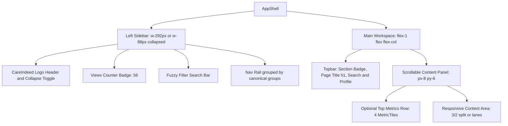
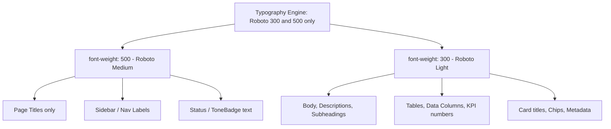
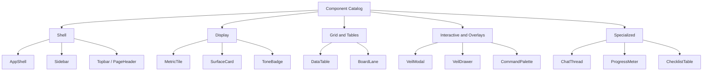

# V6 Design System & Visualization

This document is the **canonical design-system authority** for the V6 CareIndeed redesign: design tokens, the typography LOCK, the 14-family component catalog, component states, overlay dimensions, motion, icons, timestamps, and density. It is conformed to the V6 canonical synthesis and is consistent with `V6_IMPLEMENTATION_PLAN.md` (authoritative for build order/gates/owners), `V6_APP_MAP.md`, and `V6_PAGEVIEW_INVENTORY.md`.

> **Repo scope.** All V6 artifacts live in `C:/AI/Git/training/HomeHealth/Policies_and_Procedures_V2` (`docs/v6/`, `scripts/check-designless.mjs`, `src/index.css`, `tailwind.config.js`). The live prototype reference is `C:/AI/Git/training/HomeHealth/Policies_and_Procedures/src/policy/pages/Redesign/index.html` — read-only; never modified.

> **TRACKED TASK — regenerate companion artifacts.** `docs/v6/v6-app-map.html` and `docs/v6/V6_DESIGN.html` are **stale** and MUST be regenerated to match this doc and the canonical route table. Specifically: (1) render all **56** views and set the badge to 56; (2) consume `src/index.css` tokens (or be explicitly labeled non-canonical) — they currently style off `cdn.tailwindcss.com`, which violates the §7 ghost-design / CDN-asset rule; (3) reflect the typography LOCK (Roboto 300/500 only). Until regenerated, treat them as non-authoritative.

---

## 1. Application Layout Hierarchy

The application shell provides an immersive, structured workspace using a collapsible sidebar and clean topbar. Every screen is identified by its **stable hash-id** (the canonical key), never by path or template — templates (`matrix`, `evidence`, `reports`, `detail`, `board`, …) are intentionally reused across 3–7 routes each.

---

## 2. Layout Structure & Grid Systems

### App Shell & Sidebar
- **Expanded Sidebar Panel**: Width fixed at `292px`, built with restrained glass (`bg-white/70 backdrop-blur-xl`) and a `1px` hairline right border (`--border-hairline`, `rgba(0,65,66,0.10)`). It features:
  - Top header (48px) housing the CareIndeed brand logo (self-hosted local SVG — see §10) and the sidebar toggle button.
  - Interactive "Filter views…" input (left-aligned search icon, smooth border transition). This filter drives `visibleGroups` across all 56 views and is wrapped in `useDeferredValue`/`startTransition`.
  - Navigation grouped into the **canonical groups** (uppercase, tracking-wide): `Overview`, `CES`, `Taxonomy`, `Onboarding`, `Onboarding v2`, `System`, `Admin`, `Auth`. Group labels are display strings; routes are owned by the composer (never authored by the screen renderer).
- **Collapsed Sidebar Panel**: Width contracts to `88px`. It hides the search input, text labels, and group badges; the logo swaps to the compact mark; items render icon-only with hover **and focus** tooltips.
- **Active Navigation Items**: `bg-[--brand-teal] text-white shadow-[--shadow-rest]`. Non-active items are neutral and transition to the teal-50 hover surface. Nav label text is the only nav text permitted at weight 500.

### Topbar & Page Header
- **Topbar**: Horizontal flex row (64px) with the view-category badge, the **single `h1`** page header (Roboto Medium 500), and a short description paragraph (Roboto Light 300). `PageHeader` emits exactly one `h1` per route via a required `headingLevel` contract; no hardcoded `h3`, no skipped levels.
- **Page Actions**: Top-right cluster — Calendar, Notifications (pulsed indicator dot, honoring reduced-motion), and the User avatar drawer toggle.

### Grid Layouts
- **Universal Split Grid**: `3:2` on large screens (`xl:grid-cols-5`). Left (`xl:col-span-3`) hosts data tables/action lists; right (`xl:col-span-2`) hosts context rails, filters, auxiliary cards. Context rails engage at `lg`, not `xl` (no shrink-desktop sudden jump).
- **Kanban Board Grid**: Implemented through **BoardLane** as a horizontal-scroll fixed-min-width lane track (`flex overflow-x-auto`), parameterized by a column-config (proven on the 6/4/3/4-column variants). Stacks to one column only at mobile. Never `md:grid-cols-2` wrap; never `overflow-hidden`.
- **Metrics Row**: `grid grid-cols-1 md:grid-cols-2 xl:grid-cols-4` for 4 MetricTiles.

---

## 3. Typography LOCK

Typography is strictly controlled. **Roboto is the only font**, self-hosted at exactly two weights: `wght 300;500`. No Google Fonts CDN (CSP-blocked). Hierarchy is built via size, color, opacity, spacing, and casing — never via heavier weight.

### Core Rules
- **Weight 500 (`font-medium`) is permitted ONLY on:** page titles / `h1`–`h2` headers, sidebar/nav labels, and status / `ToneBadge` text.
- **Everything else is weight 300 (`font-light`):** body, tables, KPI numbers, card titles, subheadings, chips, descriptions, metadata.
- **Do NOT load Roboto 400 or 700.** Exactly two weights ship.
- **BANNED:** `font-semibold` / `font-bold` / `font-extrabold` / `font-black`; `font-weight` `600/700/800/900`; the fonts `Inter` and `Montserrat`.

### Reconciled ruling (resolves the LOCK-vs-load-700 contradiction)
**The LOCK governs.** The prototype's ~236 bold/extrabold/semibold usages are a **prototype defect, not a design target** — strip all of them. The reference screenshots' bold look is reproduced through size/color/opacity/spacing/casing, not weight. Do not load Roboto 700 to "match" them.

> **eCIgn brand exception is palette-only.** The eCIgn navy `#1A3778` / orange `#F04B22` is an authorized **palette** exception (tokenized, never raw hex). It does **not** grant any weight exception — eCIgn text still obeys 300/500.

---

## 4. V6 Design Tokens

**One token home: `src/index.css`** (CSS custom properties). `tailwind.config.js` `theme.extend` references those vars. The PLAN's alternate `src/v6/theme/tokens.css` is **deleted** — there is no second token source. (V2 `src/index.css` is currently a 13-line stub and must be authored.)

**Token rules (gate-enforced on source):**
- No raw hex (`bg-[#…]` / `text-[#…]`) in component code.
- No stock-Tailwind palette classes (`emerald-/amber-/slate-/violet-/blue-/red-/gray-`) for semantic state — use tone tokens.
- Status comes from a typed `STATUS -> TONE -> LABEL` map (`statusTone.ts`), **never** a substring regex. Unknown status falls back to **slate + a dev warning**.
- Tone is conveyed by **text + glyph**, not color alone.

### Token Categories
- **color** — brand teal / orange / neutral.
- **tones** — canonical **8-tone** set, each with full `bg / border / text / dot / bar`: `teal`, `orange`, `green`, `amber`, `slate` + `blue`, `violet`, `red`.
- **chart / dataviz** — `--chart-grid`, `--chart-teal-line`, `--chart-orange`, … (replaces the ~40 raw arbitrary hexes in the CES board).
- **surface / glass**, **text**, **border** (hairline `rgba(0,65,66,0.10)`, card `#E5E4E3`).
- **shadow** — exactly two: `--shadow-rest`, `--shadow-hover`.
- **radius** — `8 / 12 / 16 / 24 / 32` only.
- **spacing**, **typography** (family / weight 300+500 / size / tracking), **motion** (see §8), **z-index**, **breakpoint/container** (292 / 88 sidebar), **icon-size ramp**, **density**, **focus-ring**.

### Background & Surface Colors
- **Page Canvas**: `#F7FEFF` (pale atmospheric, light teal cast).
- **Base Container / Work Cards**: `#FFFFFF`.
- **Glass / Overlay Shell**: `rgba(255,255,255,0.72)` (shell overlays and system modals only).
- **Header Row**: `rgba(0,65,66,0.03)`.

### Canonical 8-Tone Set (semantics fixed; no screen invents a tone)
| Tone | Semantics | bg | border | text |
| --- | --- | --- | --- | --- |
| **teal** | ready / complete | `#F7FEFF` | `#C4F4F5` | `#00797D` |
| **orange** | attention / blocked | `#FFFAF7` | `#FFD5BF` | `#C74601` |
| **green** | pass / certified | `#E6F4ED` | `#A3D9B8` | `#006B3A` |
| **amber** | awaiting / pending | `#FFF8E6` | `#F0D9A3` | `#8A5C00` |
| **slate** | upcoming / backlog (+ unknown fallback) | `#FAF8F8` | `#F3F0EF` | `#524D4B` |
| **blue** | informational | tokenized | tokenized | tokenized |
| **violet** | special / review | tokenized | tokenized | tokenized |
| **red** | destructive / error | tokenized | tokenized | tokenized |

> `dot` and `bar` values exist for every tone in `src/index.css`. `blue/violet/red` ship with full token sets when first used.

### Borders, Shadows & Radii
- **Hairline border**: `1px solid rgba(0,65,66,0.10)` (`--border-hairline`).
- **Card edge border**: `1px solid #E5E4E3` (`--border-card`).
- **Card Shadow (Rest)** `--shadow-rest`: `0 8px 24px -16px rgba(0,65,66,0.10), 0 3px 10px -5px rgba(0,65,66,0.05)`.
- **Card Shadow (Hover)** `--shadow-hover`: `0 14px 36px -20px rgba(0,65,66,0.14), 0 8px 20px -12px rgba(0,65,66,0.08)`.
- **Radii**: `8 / 12 / 16 / 24 / 32` only. Arbitrary `box-shadow` and off-scale radii are banned.

### Spacing Scale
`4 / 8 / 12 / 16 / 20 / 24 / 32` (xs → 3xl).

---

## 5. Component Catalog (the single shared catalog)

This section is the **single source of truth** for shared components. **Two tiers:** leaf primitives + 14 composite families. **All are built and Opus-signed-off in V6-0 before any screen fan-out.** No screen may define or fork a catalog primitive.

**Leaf primitives:** `Button`, `Input`, `Select`, `Badge` (each ships its full state set once — see §6).

### The 14 composite families
1. **AppShell** — root layout binding Sidebar + Topbar around the workspace canvas. *Templates:* every route.
2. **Sidebar** — 4-tier-deep nav grouped by canonical groups; fuzzy filter; collapse 292↔88. *Templates:* shell.
3. **Topbar / PageHeader** — view badge, the single `h1`, sub-info, action cluster; required `headingLevel`. *Templates:* every route.
4. **MetricTile** — large metric (size, not weight) + small label, tone-bordered. *Templates:* `dashboard`, `reports`.
5. **SurfaceCard** — card with icon tile, status badge, title, description, optional ProgressMeter. *Templates:* `dashboard`, `detail`, `framework`, `journey`.
6. **ToneBadge** — tone dot + uppercase tag text (weight 500). Tone via text+glyph, not color alone. *Templates:* all status-bearing.
7. **DataTable** — semantic `<table>` (`th`/`caption`) or explicit ARIA grid for editable variants; status column renders text+glyph; single density token set. *Templates:* `matrix`, `evidence`, `reports`, `profiles`, `docs`. Virtualize only the documented-large lists (Policy Library ~269, Evidence ~445, Lifecycle ~279) while preserving keyboard nav and accessible headers.
8. **BoardLane** — horizontal-scroll lane track parameterized by column-config (6/4/3/4-col variants), empty-lane state, dnd-kit keyboard sensor. *Templates:* `board`.
9. **VeilModal** — centered modal; portal + focus-trap + return-focus + `role=dialog` + `aria-modal` + scroll-lock + Escape + backdrop. *Used by:* `modal-system`.
10. **VeilDrawer** — slide-out right drawer / bottom-sheet (mobile); same a11y contract as VeilModal; backs **personal-ops** (drawer open/close state, **not** a route). *Used by:* `drawer-system`, `personal-ops`.
11. **CommandPalette** — Cmd/Ctrl-K fuzzy search over the VIEW registry; same overlay a11y contract. *Used by:* `popover-system`.
12. **ChatThread** — conversational bubbles (User teal, Brad neutral). *Templates:* `chat`.
13. **ProgressMeter** — linear bar (2–8px), tone-aware. *Templates:* `dashboard`, `journey`, `lifecycle`, `module-player`.
14. **ChecklistTable** — matrix row checklist with pass/fail tone tags. *Templates:* `achc-survey`, `audit`/`evidence`.

### Component naming (V6-native only)
Use V6-native names. **Never** reuse banned legacy identifiers: `CommandCenterLayout`, `PolicyViewer32`, `PolicyDetailPage`, `LibraryPage`, `FormViewer`, `FormPrintView`, `PrintPage`, `GVGBPrintDocument`, `GVGBAppendixPrint`, `TravelightBG`, `DotGrid`, `GlobalDotBackground`, `v3Tokens`, `SharedPolicyDetailView`, `PolicyLibraryDocumentView`. V6 names such as `FormViewerV6` / `LibraryPageV6` are legal once the gate adds word boundaries (see §7).

---

## 6. Component States (spec once per template, ~28 specs cover 56 pages)

A pageview is **not covered** until its template's **6 state categories** are specified: **interaction · empty · loading · error · responsive · permission.** These are specified **once per shared template (~28)**, not per page (56). Every interactive primitive ships its full state set in V6-0; pages inherit.

- **Leaf primitives** ship `empty / loading / error / disabled / focus-visible` once.
- **DataTable**: empty / loading / error rows; visible focus; semantic header.
- **BoardLane**: empty-lane state.
- **Form field**: validation / dirty / error / disabled.
- **eCIgn step**: step-locked (no-skip) state.
- **Destructive actions**: ratified pattern (dedicated destructive `red` token OR confirm-modal) — never bare orange.
- **Focus**: replace prototype `outline-none` with a visible `focus-visible` ring on all interactive controls; icon-only buttons get accessible names; hover cards also open on focus.

---

## 7. Ghost Design Prevention & Acceptance Gates

The designless gate is `scripts/check-designless.mjs`. Its **architecture is correct** (scan compiled `dist/` as ground truth for colors/routes + a source stale-`.js` guard); only its content regexes need correction. Header comment must state: **public-path reuse is intentional; the gate bans legacy COMPONENTS + COLORS + COMPILED legacy output, not reused public PATHS.**

### Reworded legacy policy (resolves the highest-priority blocker, P0-1)
- **Ban legacy COMPONENTS, not reused public PATHS.** The public routes `/library`, `/forms`, `/print`, `/appendix` are intentionally reused with **new V6 implementations** and must pass the gate.
  - ✅ Allowed: a V6-native `LibraryPageV6` rendering at `/library`.
  - ❌ Banned: importing/mounting the legacy `LibraryPage` / `FormViewer` components, or compiling legacy output.
- **No `CommandCenterLayout`** (old split-pane shell). Use `V6Shell`.
- **No maroon / legacy CI-ION color scales** (`#8C1D40` / `--ci-color-maroon`, high-density grays).
- **Clean theme boundary**: all styling flows from `src/index.css` via utility tokens. No raw hex in React code; no V3 tokens / `ui-staging.css`.

### Gate corrections (must land and pass on a router stub before V6-1 sign-off)
1. **LEGACY_ROUTES (line 26)** — remove from the dist scan, OR convert to an allowlist that flags a reused path **only when a legacy COMPONENT identifier co-occurs on the same construct**.
2. **LEGACY_NAMES (line 25)** — add `\b` word boundaries so `FormViewerV6`/`LibraryPageV6` pass while exact legacy names reject; run the name scan on **source** `src/**/*.tsx` (minifiers mangle dist identifiers). Keep color/route/stale-js scans on `dist`.
3. **LEGACY_COLOR (line 24)** — keep the hex list (match anywhere) but require CSS-value/token context for the words `maroon|burgundy|wine|ci-ion`.

### New gate dimensions
- **Typography gate**: `FORBIDDEN_FONT /Inter|Montserrat/`; `FORBIDDEN_WEIGHT font-(semibold|bold|extrabold|black)` in source class literals + `font-weight:600|700|800|900` in dist CSS. Fail on any.
- **CDN / asset ban (dist)**: `cdn.tailwindcss.com`, `fonts.googleapis.com`, `fonts.gstatic.com`, `cdnjs.cloudflare.com`, `cdn.jsdelivr.net`, `cloudfront.net`, `@babel/standalone`, `placehold.co`, `fa-`/`font-awesome`. Build-time Tailwind; self-hosted Roboto/Lucide/logo.
- **a11y gate**: `@axe-core/playwright` (installed) as a Stage-C peer to `verify:designless`; per-route; serious+critical fail; assert exactly one `h1`/route, no skipped levels.
- **Responsive gate**: Playwright screenshots at 360/768/1024/1280/1536; machine-checkable — `document.scrollWidth <= viewport`, 44px touch targets, tables scroll-or-card-stack, boards horizontal-scroll, calendar agenda below laptop.
- **Parity gate**: SEQUENCE screenshot-parity + visual-audit checklist (Roboto 300/500, hairlines, two shadows, teal/orange, 292/88 sidebar) folded into Stage C alongside `verify:designless` — both mandatory.
- **Positive fixture**: a CI fixture of V6-canonical route strings + V6-native names that MUST pass, so the gate can never regress to blocking valid V6 routes/names.

### Prototype → production conversion (gate-enforced in V6 source)
No `hashchange` listeners, no `window.lucide.createIcons`, no `data-lucide` in V6 source. Hash routing → react-router 7 data routes; the `redesign-calendar-swimlane` CustomEvent and `#personal-ops-panel` magic hash → React state/context; icons → `lucide-react` components.

---

## 8. Overlay Dimensions & Motion

**One canonical motion language** in `src/index.css` (CSS vars) + `tailwind theme.extend`, referenced by every transition. No raw `ms`, no ad-hoc `duration-[n]`, no new cubic-beziers in screen code.

### Durations & Easings
- `--motion-fast` **120ms** — hover / press / tab / row.
- `--motion-base` **200ms** — cards / popovers / toasts / route content.
- `--motion-slow` **280ms** — drawers / sidebar width / bottom-sheet.
- `--ease-standard` `cubic-bezier(0.2,0.8,0.2,1)` — enter / move.
- `--ease-exit` `cubic-bezier(0.4,0,1,1)` — leave.
- **Fast ceiling:** no enter/exit > 300ms. Retire the prototype 600ms fade-in-up and 0.7s drawer. Hover-card close ≤ 200ms with a re-enter intent buffer (replaces the 1000ms close delay).

### Overlay presence (animate exit before unmount)
- Backdrop fade **200ms**.
- Drawer slide-in **280ms** `--ease-standard` / out **200ms** `--ease-exit`.
- Modal fade + scale `0.98→1` **200ms**.
- Popover / palette fade + `translateY(4px)` **120ms**.
- Toast unified at **3000ms** (single value — no 3000-vs-3500 split).
- Hover-lift `translateY(-2px)` reserved for elevatable cards only — never the active nav item or full-width panels. One press-scale token (~`0.98`).

### Reduced motion (mandatory, Stage-C axe gate)
Global `@media (prefers-reduced-motion: reduce)` in `src/index.css` collapses durations to ~`0.01ms` and sets `animation: none` on the infinite pulse.

---

## 9. Icons

**One icon family app-wide: `lucide-react`** (self-hosted; no CDN). FontAwesome / `fa-*` is **banned and gate-listed**; the login screen's FontAwesome glyphs migrate to `lucide-react`. Do not use `window.lucide.createIcons()` or `data-lucide` attributes. A single icon-size ramp is tokenized.

---

## 10. Assets

- **CareIndeed logo** (full + collapsed mark): self-hosted as optimized local **SVG** bundled with the app. The prototype's CloudFront URL is removed.
- Replace any `placehold.co` `onError` fallback with a local inline SVG.
- All fonts self-hosted (`woff2`, Roboto 300;500). JSX compiled at build time (no `@babel/standalone`). Tailwind compiled at build time (PostCSS), not the Play CDN.

---

## 11. Timestamps

Dates/timestamps via shared `formatDate` / `formatTimestamp` utils. Audit and eCIgn timestamps are stored **UTC / ISO-8601** and displayed with an **explicit timezone**. **Relative formats are banned on audit surfaces.**

---

## 12. Density

A single density token set (row height, cell padding, header treatment) governs DataTable and forms. A comfortable-vs-compact density toggle is offered for dense admin / evidence / audit tables. Buttons follow a fixed hierarchy: **primary** = teal solid, **secondary** = teal outline, **tertiary** = ghost; **orange is reserved for attention/urgency**, not a generic primary.

---

## 13. Buildability Note (cross-doc)

This doc covers the design system. The remaining cross-cutting blockers (route collisions on `/forms/:formId` vs `/forms/:formId/esign`; `achc-crosswalk` promoted to the path `/framework/achc-survey/crosswalk`; the 56-row canonical matrix = route table = coverage = state-matrix host; `events-board` and `login-page` as INFERRED_FROM_V6_SYSTEM) are owned by `V6_APP_MAP.md`, `V6_PAGEVIEW_INVENTORY.md`, and `V6_IMPLEMENTATION_PLAN.md`. Token, typography, component-catalog, states, and motion authority all live **here**.
