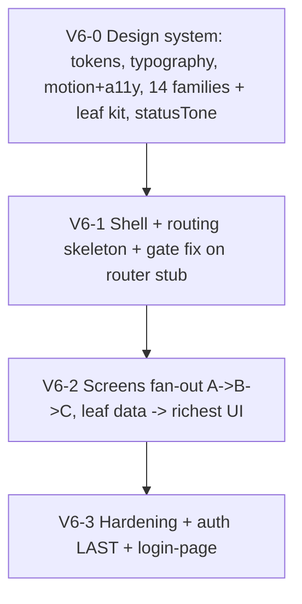
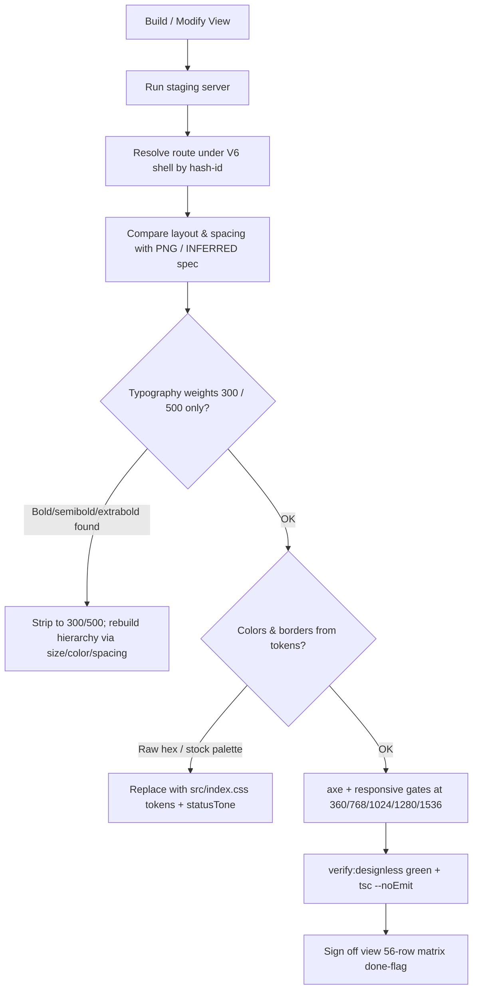

> [!IMPORTANT]
> **NON-AUTHORITATIVE — parity / visual-audit checklist appendix.**
> The single authority for build **order**, **phase gates**, and **owners** is
> [`V6_IMPLEMENTATION_PLAN.md`](./V6_IMPLEMENTATION_PLAN.md) (with
> `V6_ORCHESTRATION_PROMPT.md`). This document is a **screenshot-parity and
> visual-audit checklist** only. Where any ordering, gate, route, name, token, or
> typography statement here disagrees with the PLAN or the canonical contracts in
> [`V6_DESIGN_VISUALIZATION.md`](./V6_DESIGN_VISUALIZATION.md), **the PLAN wins**.
> Every phase below is mapped onto the PLAN's canonical phases **V6-0 → V6-1 →
> V6-2 → V6-3**; the numbered "phases" in this file are a parity narrative, not a
> competing schedule.

# V6 Implementation Sequence (Parity Checklist Appendix)

This document is the per-screen screenshot-parity and visual-audit checklist used
during **Stage C** of each screen, run **alongside** `npm run verify:designless`
(both mandatory). It does not define the build order — see the PLAN.

---

## 0. Mapping to the canonical phases (PLAN is law)

The PLAN runs four canonical phases. The canonical synthesis decomposes the work
into 18 implementation steps; those steps land inside the PLAN's phases exactly as
follows. **Primitives and leaf screens come before Dashboard/boards** (this file's
earlier ordering, which built Dashboard before the kit, was wrong and is corrected).

| PLAN phase | Owner | Canonical steps it contains |
|---|---|---|
| **V6-0 — Design system (build once, Opus sign-off)** | composer (build) + Opus (sign-off) | 1 conversion mandate · 2 tokens (single `src/index.css`) · 3 typography (self-host Roboto 300;500, strip bold) · 4 motion + a11y baseline on primitives · 5 full 14-family + leaf primitive kit · 8 shared data components (statusTone.ts) |
| **V6-1 — Shell + routing skeleton** | composer + Opus | 6 shell + routing skeleton (V6Shell, nested routes/Outlet, lazy+Suspense+errorElement) · 7 nav/routing wired (composer owns ALL route literals) · gate fix lands + passes on a router stub **before V6-1 sign-off** |
| **V6-2 — Screens (fan-out, A→B→C)** | gpt orchestrator · grok build · composer wire · Opus QA | 9 one representative page per template family · 10 template QA · 11 remaining pages per family (data-binding only) · 12 mock-data validation · 13 screenshot-parity sweep · 14 responsive + a11y pass · 15 logic reconnection per-screen Stage B (KEEP_MANIFEST only, no bulk include) · 16 cohesion pass |
| **V6-3 — Hardening** | Opus + composer | 17 auth/backend bootstrap (Cognito) + **login-page built LAST** · 18 hardening (error/loading/empty, axe gate, perf) |

**Phase-gate rule:** `npm run verify:designless` (build + corrected gate) must pass
gate-green between every merge; a red gate is never stacked on. No bulk
re-include of `src/policy/**` — re-include only the exact modules a screen wires,
per `CES_PROCESS_KEEP_MANIFEST`. Auth is **last**.

---

## 1. Build narrative (subordinate to the PLAN's V6-0 → V6-3)

### V6-0 · Design tokens, typography, motion, a11y, primitive kit

1. **Tokens (single home).** Author the full token registry in **`src/index.css`
   ONLY** (CSS custom properties); `tailwind.config.js` `theme.extend` references
   those vars. **Delete** the PLAN-draft alternate `src/v6/theme/tokens.css` — one
   token home. `src/index.css` is currently a 13-line stub and must be authored.
   Categories: color, the canonical 8-tone set (each with full bg/border/text/dot/bar),
   chart/dataviz tokens (`--chart-grid`, `--chart-teal-line`, `--chart-orange` —
   replacing the ~40 raw CES-board hexes), surface/glass, text, border (hairline
   `#004142`/10, card `#E5E4E3`), exactly-two shadows (rest, hover), radius
   (8/12/16/24/32 only), spacing, typography, motion, z-index, breakpoint/container
   (292/88 sidebar), icon-size ramp, density, focus-ring.
2. **No raw hex / no stock palette.** No `bg-[#..]`/`text-[#..]` and no stock
   Tailwind palette classes (`emerald-`/`amber-`/`slate-`/`violet-`/`blue-`/`red-`/`gray-`)
   for semantic state in component code — use tone tokens. Status comes from the
   typed `STATUS→TONE→LABEL` map (`statusTone.ts`), **never** a substring regex;
   UNKNOWN status falls back to slate + dev warning.
3. **Typography (self-host, two weights).** Self-host **Roboto at `wght@300;500`
   only** — drop 400, **do NOT load 700**, no Google Fonts CDN (CSP-blocked).
   Weight **500** (`font-medium`) is permitted ONLY on page titles / `h1`–`h2`
   headers, sidebar/nav labels, and status/ToneBadge text. Everything else (body,
   tables, KPI numbers, card titles, subheadings, chips) is **300** (`font-light`).
   **BANNED:** `font-semibold`/`font-bold`/`font-extrabold`/`font-black`,
   `font-weight` 600/700/800/900. Strip all prototype bold usages; build hierarchy
   via size/color/opacity/spacing/casing. Reference-screenshot bold is a prototype
   defect, not a target.
4. **Motion + a11y baseline on primitives.** Single motion language from the token
   registry (durations `--motion-fast 120ms` / `--motion-base 200ms` /
   `--motion-slow 280ms`; easings `--ease-standard` enter, `--ease-exit` leave; no
   enter/exit >300ms). Add a global `@media (prefers-reduced-motion: reduce)` block
   to `src/index.css` (durations ~0.01ms, `animation:none` on the pulse).
   focus-visible rings on all interactive controls; ARIA baseline.
5. **Full primitive kit (Opus sign-off before any screen).** Build the **single
   14-family catalog** (`V6_DESIGN_VISUALIZATION.md` sec 5) plus leaf primitives —
   two tiers: leaf (Button/Input/Select/Badge) + 14 composites (AppShell, Sidebar,
   Topbar/PageHeader, MetricTile, SurfaceCard, ToneBadge, DataTable, BoardLane,
   VeilModal, VeilDrawer, CommandPalette, ChatThread, ProgressMeter, ChecklistTable).
   **BoardLane is parameterized by column-config** and proven on all 4 board
   variants. Every primitive ships empty/loading/error/disabled/focus once; pages
   inherit. No screen may fork a catalog primitive. Use V6-native names only.
6. **Shared data components.** `DataTable` as a **semantic `<table>`** (th/caption;
   explicit ARIA grid for editable variants), status as text+glyph (never
   color-only), importing `statusTone.ts`.

### V6-1 · Shell + routing skeleton + gate fix

1. **Conversion mandate.** Hash routing → react-router 7 data routes; delete the
   duplicate `hashchange` listeners; convert the `redesign-calendar-swimlane`
   CustomEvent and the `#personal-ops-panel` magic hash to React state/context;
   replace `window.lucide.createIcons()`/`data-lucide` with `lucide-react`.
2. **Shell + skeleton.** `V6Shell` (sidebar/topbar/nav), nested routes with
   `Outlet`, route-level lazy + `Suspense` + `errorElement`, root error boundary;
   placeholder per not-yet-built screen so nav never dead-ends.
3. **Route literals are the composer's.** The **composer owns ALL route literal
   strings** and route registration (Stage B). grok renders nav as placeholders
   only in Stage A and must not author path strings.
4. **Gate fix must land + pass on a router stub BEFORE V6-1 sign-off** (see §3).

### V6-2 · Screens (the fan-out, A → B → C)

Screen order (leaf data → richest UI), per PLAN:
**Taxonomy → Policy Library → Policy Detail → Forms Library → Form Viewer → eCIgn
Workspace → Compliance Calendar → Dashboard → then the enumerated remaining
surfaces** (evidence/audit, admin ×4, framework/ACHC + crosswalk, workflows +
swimlane, onboarding/journey, onboarding-v2 ×6, CES calendar/board/events/reports,
profiles + details, system docs, help, governance, hubstaff, viewers, mobile-incident,
surveyor-viewer). The open-ended "remaining surfaces as scoped" bucket is replaced
by the explicit 56-row coverage matrix.

Per screen, the PLAN's 3-stage pipeline:

| Stage | Owner | Work |
|---|---|---|
| **A — Build UI** | grok | V6 screen + sub-components from its mockup, using V6 tokens/primitives; static with typed mock data. Nav as placeholders only — no path strings. |
| **B — Reconnect logic** | composer | Re-include only the specific preserved stores/services/types/data the screen needs (`tsconfig.app` + imports per `CES_PROCESS_KEEP_MANIFEST`); replace mock data with real selectors; register route literals. **No bulk `src/policy/**` include.** |
| **C — Verify** | Opus QA (+ secondary reviewer) | `verify:designless` green · **this file's visual-parity checklist** · axe + responsive gates · route resolves under V6 shell · no legacy imports/names/colors · CES process intact. |

### V6-3 · Hardening

1. Re-enable auth bootstrap in `main.tsx` (Cognito or env-gated bypass) — **last**.
2. **Build the login-page** (INFERRED; inherits glass surface + CareIndeed logo
   from the shell; only auth entry) here, wired with auth.
3. Error/loading/empty states, axe gate, perf, env config, README; CI runs
   `verify:designless`. Final full-app gate + parity sweep across all screens.

---

## 2. Canonical route table (parity reference)

Identify every screen by its **stable hash-id (canonical key)**, never by path or
template. One path = one component; no query-string routing; no bare top-level
`/:param`. **56 views = 54 router routes + 2 overlay/auth.**

| Path | hash-id | template | group |
|---|---|---|---|
| `/dashboard` | dashboard | dashboard | Overview |
| `/clinicians` | clinicians | profiles | Overview |
| `/clinicians/:clinicianId` | clinician-detail | detail | Overview |
| `/patients` | patients | profiles | Overview |
| `/patients/:patientId` | patient-detail | detail | Overview |
| `/calendar` | master-calendar | calendar | Overview |
| `/staffing-calendar` | staffing-calendar | calendar | Overview |
| `/iadministrator` | brad | chat | Overview |
| `/ces/calendar` | ces-calendar | calendar | CES |
| `/ces/board` | ces-board | board | CES |
| `/ces/events` | events-board | board | CES (INFERRED — no PNG; 4-col BoardLane from ces-board) |
| `/workflows` | workflows | matrix | CES |
| `/workflows/:workflowId/swimlane` | workflow-swimlane | board | CES |
| `/compliance/master-controls` | master-controls | matrix | CES |
| `/audit` | audit-mode | evidence | CES |
| `/evidence` | evidence-center | evidence | CES |
| `/ces/reports` | ces-reports | reports | CES |
| `/calendar/event/:eventId/task/:taskId` | mobile-incident | detail | CES |
| `/my-tasks` | my-tasks | board | CES |
| `/framework` | framework | framework | Taxonomy |
| `/framework/achc-survey` | achc-survey | achc-survey | Taxonomy |
| `/framework/achc-survey/crosswalk` | achc-crosswalk | achc-crosswalk | Taxonomy (CANONICAL: distinct sub-PATH, **not** `?view=crosswalk`) |
| `/library` | policy-library | matrix | Taxonomy |
| `/library/:policyId` | policy-detail | detail | Taxonomy |
| `/forms` | forms-library | matrix | Taxonomy |
| `/forms/:formId` | form-viewer | form-viewer | Taxonomy (read/fill ONLY) |
| `/forms/:formId/esign` | ecign-workspace | ecign | Taxonomy (CANONICAL signing path; distinct component; never a mode flag) |
| `/artifacts/:artifactId` | artifact-viewer | reference-viewer | Taxonomy |
| `/viewer/:referenceId` | generic-reference | reference-viewer | Taxonomy |
| `/journey` | journey-overview | journey | Onboarding |
| `/journey/v1-journey` | journey-v1 | journey | Onboarding |
| `/journey/module/:moduleId` | module-player | module-player | Onboarding |
| `/journey/appendix-f` | appendix-f | docs | Onboarding |
| `/journey/supervisor` | supervisor | journey | Onboarding |
| `/journey/admin` | journey-admin | reports | Onboarding |
| `/journey/guide` | user-guide | docs | Onboarding |
| `/onboarding-v2/dashboard` | onboarding-v2-dashboard | dashboard | Onboarding v2 |
| `/onboarding-v2/activate` | onboarding-v2-activate | detail | Onboarding v2 |
| `/onboarding-v2/batches` | onboarding-v2-batches | matrix | Onboarding v2 |
| `/onboarding-v2/batches/:batchId` | onboarding-v2-batch | detail | Onboarding v2 |
| `/onboarding-v2/audit` | onboarding-v2-audit | evidence | Onboarding v2 |
| `/onboarding-v2/governance` | onboarding-v2-governance | reports | Onboarding v2 (label "Onboarding Overrides") |
| `/policy-lifecycle` | policy-lifecycle | lifecycle | System (deep-link `/policy-lifecycle/:policyId` only; **no bare `/:policyId`**) |
| `/hubstaff` | hubstaff | reports | System |
| `/system-documentation/:sectionId` | system-docs | docs | System |
| `/help/*` | help-center | docs | System |
| `/governance` | governance | reports | System |
| `/admin/user-groups` | admin-groups | matrix | Admin |
| `/admin/roles` | admin-roles | matrix | Admin |
| `/admin/permissions` | admin-permissions | matrix | Admin |
| `/admin/users` | admin-users | matrix | Admin |
| `/surveyor/policy/:policyId` | surveyor-viewer | detail | Admin |
| `/login` | login-page | login | Auth (INFERRED — no PNG; glass surface + CareIndeed logo; wired in V6-3) |

**Overlays (not routes):** modal-system (VeilModal), drawer-system (VeilDrawer),
popover-system (CommandPalette/Popover), personal-ops (drawer open/close state).

---

## 3. Acceptance gates (run with `verify:designless` at every merge)

The gate (`scripts/check-designless.mjs`) is correct in **where** it looks (scan
compiled `dist/` as ground truth + source stale-`.js` guard); its content regexes
must be corrected. **These fixes must land and pass on a router stub BEFORE V6-1
sign-off.**

- **Ghost-design gate (P0-1).** Remove `LEGACY_ROUTES` (line 26) entirely, OR
  replace with an allowlist that flags a reused path only when a legacy COMPONENT
  identifier co-occurs on the same construct. The public route names
  `/library`, `/forms`, `/print`, `/appendix` are **intentionally reused with new
  V6 implementations and must PASS**. Add `\b` word boundaries to `LEGACY_NAMES`
  (line 25) so `FormViewerV6`/`LibraryPageV6` pass while exact legacy names reject;
  run the **name** scan on SOURCE `src/**/*.tsx`. Keep color/route/stale-js scans
  on `dist`. Tighten `LEGACY_COLOR` (line 24): keep the hex list, but require
  CSS-value/token context for the words `maroon|burgundy|wine|ci-ion`. Update the
  header comment: the gate bans legacy COMPONENTS + COLORS + COMPILED legacy
  output, not reused public PATHS.
- **Typography gate.** `FORBIDDEN_FONT /Inter|Montserrat/`;
  `FORBIDDEN_WEIGHT font-(semibold|bold|extrabold|black)` in source class literals
  + `font-weight: 600|700|800|900` in dist CSS. Fail on any.
- **CDN/asset gate.** Fail dist on `cdn.tailwindcss.com`, `fonts.googleapis.com`,
  `fonts.gstatic.com`, `cdnjs.cloudflare.com`, `cdn.jsdelivr.net`, `cloudfront.net`,
  `@babel/standalone`, `placehold.co`, `fa-`/`font-awesome`. Build-time Tailwind;
  self-hosted Roboto/Lucide/logo.
- **a11y gate.** `@axe-core/playwright` (already installed) as a Stage-C peer to
  `verify:designless`; per-route; serious+critical violations fail; exactly one
  `h1`/route, no skipped levels.
- **Responsive gate.** Playwright screenshots at 360/768/1024/1280/1536;
  machine-checkable: `document.scrollWidth <= viewport` (no h-scroll), 44px touch
  targets, tables scroll-or-card-stack, boards horizontal-scroll, calendar agenda
  below laptop.
- **Parity gate.** This file's screenshot-parity + visual-audit checklist (below)
  folded into Stage C **alongside** `verify:designless` — both mandatory.
- **Positive fixture.** CI fixture of V6-canonical route strings + V6-native names
  that MUST pass the gate, so it can never regress to blocking valid routes/names.

---

## 4. Screenshot comparison loop & visual-audit checklist (Stage C)

Each view, after build, must pass parity against its captured V6 PNG reference in
`Reference/V6_Final` (or its **INFERRED_FROM_V6_SYSTEM** spec where no PNG exists —
events-board, login-page).

### Visual-audit checklist
- [ ] **Fonts**: No Inter, no Montserrat. All text is Roboto, self-hosted at 300;500.
- [ ] **Weights**: Page titles / nav labels / status text are Roboto Medium (500).
      Everything else (body, tables, KPI numbers, card titles, subheadings, chips)
      is Roboto Light (300). **No** semibold/bold/extrabold/black; **no** weight 700
      loaded.
- [ ] **Borders**: Hairlines `#004142`/10; card borders `#E5E4E3`. No heavy dark borders.
- [ ] **Shadows**: Exactly two shadow tokens (rest, hover). Elevatable cards lift
      `translateY(-2px)` on hover with the hover-shadow token — never active nav or
      full-width panels.
- [ ] **Colors**: Brand teal/orange; status via tone tokens (teal=ready/complete,
      orange=attention/blocked, green=pass/certified, amber=awaiting/pending,
      slate=upcoming/backlog). No raw hex, no stock-Tailwind palette classes for
      state. No maroon/burgundy/wine/ci-ion. eCIgn navy `#1A3778` / orange `#F04B22`
      is the authorized tokenized palette exception — do not flag it, do not recolor
      it to app teal.
- [ ] **Status**: Conveyed by text+glyph (not color alone), from `statusTone.ts`;
      unknown → slate + dev warning.
- [ ] **Icons**: `lucide-react` only. No FontAwesome / `fa-` / `data-lucide` /
      `window.lucide`.
- [ ] **Motion**: Durations/easings from the token registry; no raw ms / ad-hoc
      `duration-[n]`; reduced-motion honored.
- [ ] **Sizing**: Sidebar expanded 292px, collapsed 88px.
- [ ] **a11y**: Exactly one `h1` (PageHeader); DataTable is a semantic `<table>`;
      overlays portal + focus-trap + return-focus + `role=dialog` + `aria-modal` +
      scroll-lock + Escape; visible focus-visible rings; 44px touch targets.
- [ ] **Responsive**: No body horizontal scroll; tables scroll-or-card-stack;
      boards horizontal-scroll; calendar agenda below laptop.
- [ ] **States**: The template's 6 state categories (interaction/empty/loading/
      error/responsive/permission) are present (specified once per template, ~28
      specs covering all 56 pages).

---

## 5. Strict coding guardrails

> [!WARNING]
> **Auth is built LAST (V6-3).** Do not seed authentication or backend logic
> during Stage A.
> - Stage A is **static** with typed mock data; logic is reconnected **per screen
>   in Stage B** per `CES_PROCESS_KEEP_MANIFEST` — never bulk-include `src/policy/**`.
> - Do not hook views to live Cognito / AWS tokens before V6-3.
> - Do not write `.js` files next to `.ts`/`.tsx` siblings under `src/` (Vite
>   module shadowing — `src/**/*.js` is gitignored; verify with `npm run build`).
> - Route literals are authored by the **composer** in Stage B only; grok renders
>   nav as placeholders. No hash routing, no `hashchange`, no `window.lucide`,
>   no `data-lucide` in V6 source.
> - One token home (`src/index.css`); no raw hex, no stock-Tailwind palette
>   classes for semantic state in component code.
